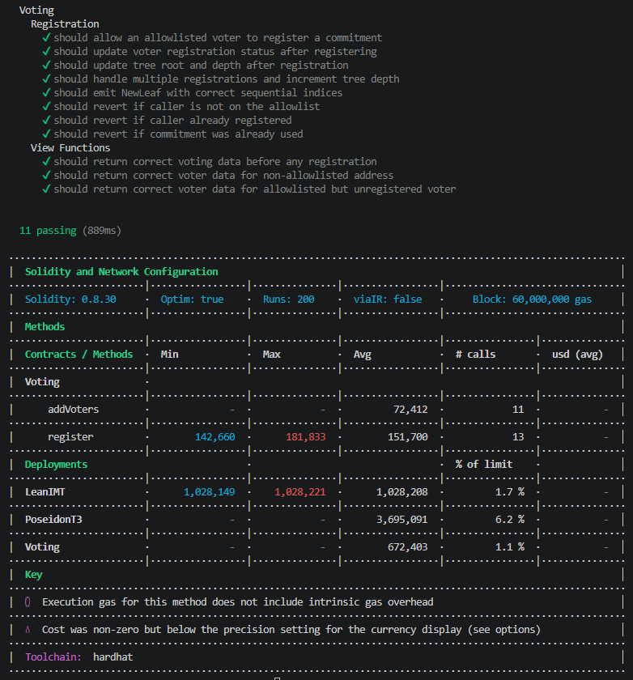

# ZK Voting

A private, Sybil-resistant voting system using zero-knowledge proofs. Voters can prove eligibility and vote exactly once without revealing who they are.

## Architecture

- **packages/circuits** - Noir ZK circuit (proves voter membership privately)
- **packages/hardhat** - Solidity smart contracts (Voting + Verifier)
- **packages/nextjs** - React frontend (register, generate proof, vote)

## Tech Stack

- Noir + Barretenberg (ZK proofs)
- Solidity + Hardhat (smart contracts)
- Next.js + wagmi + viem (frontend)
- LeanIMT (on-chain Merkle tree)
- Poseidon hash (ZK-friendly hashing)

## Getting Started

```
yarn chain     # Start local blockchain
yarn deploy    # Deploy contracts
yarn start     # Start frontend
```

## Tools Required

- Node.js >= 20.18.3
- Yarn v4.13.0
- nargo v1.0.0-beta.3 (WSL on Windows)
- bb v0.82.2 (WSL on Windows)

---

## Development Progress

### Phase 0: Project Scaffold ✅

**Goal:** Set up the monorepo with all required dependencies and tooling.

**What was done:**
1. Scaffolded a fresh project using `npx create-eth@latest` (Scaffold-ETH 2, v2.0.11)
2. Removed the default sample contract (`YourContract.sol`) — we build our own from scratch
3. Created the `packages/circuits` package using `nargo init --name circuits` in WSL
4. Installed ZK dependencies in `packages/hardhat`:
   - `@zk-kit/lean-imt.sol` — on-chain Incremental Merkle Tree for voter commitments
5. Installed ZK dependencies in `packages/nextjs`:
   - `@aztec/bb.js` — Barretenberg proving engine (browser ZK proof generation)
   - `@noir-lang/noir_js` — Noir circuit execution in JavaScript
   - `poseidon-lite` — ZK-friendly Poseidon hash function
   - `@zk-kit/lean-imt` — JS-side Merkle tree (mirrors on-chain tree)
   - `permissionless` — ERC-4337 smart account abstraction for gasless voting
6. Installed `nargo v1.0.0-beta.3` and `bb v0.82.2` in WSL Ubuntu
7. Verified `nargo compile` works on the default circuit
8. Updated `.gitignore` to exclude `packages/circuits/target/`

**How it was verified:**
- `yarn chain` — Local Hardhat blockchain starts on port 8545
- `yarn deploy` — YourContract (sample) deploys successfully
- `yarn start` — Next.js frontend launches and connects to local chain
- `nargo compile` — Noir circuit compiles successfully in WSL

---

### Phase 1: Voting Contract Structure ✅

**Goal:** Replace the sample contract with a Voting contract skeleton containing all the errors, events, state variables, and placeholder functions needed for the ZK voting system.

**What was done:**
1. Created `Voting.sol` — the main voting contract with:
   - **Errors:** `Voting__NotAllowedToVote`, `Voting__CommitmentAlreadyAdded`, `Voting__EmptyTree`, `Voting__InvalidRoot`, `Voting__InvalidProof`, `Voting__NullifierHashAlreadyUsed`
   - **Events:** `VoterAdded`, `NewLeaf` (registration), `VoteCast` (voting)
   - **State:** `s_question`, `s_yesVotes`, `s_noVotes`, `s_voters` (allowlist)
   - **Functions:** `addVoters()` (owner-only allowlist), `register()` (placeholder), `vote()` (placeholder), `getVotingData()`, `getVoterData()`
   - Commented-out sections for Merkle tree state and verifier + nullifiers — ready to uncomment later
2. Created `Verifier.sol` — placeholder `HonkVerifier` contract (always returns true). Will be replaced with the real Barretenberg-generated verifier later.
3. Defined `IVerifier` interface with `verify(bytes, bytes32[])` — the standard interface for ZK proof verification on-chain.
4. Updated deploy script to deploy `Voting` with owner address and a question string.
5. Removed old `YourContract.sol`.

**Contract Design Decisions:**
- Uses OpenZeppelin `Ownable` for access control on `addVoters()`
- Uses `@zk-kit/lean-imt.sol` LeanIMT for the Merkle tree (imported, activated when we build registration)
- Constructor takes `_owner` and `_question` (verifier added when we build voting)
- `vote()` accepts proof bytes + 4 public inputs (nullifierHash, root, vote, depth) matching the circuit layout

**How it was verified:**
```
yarn chain     → Hardhat node running on port 8545
yarn deploy    → Voting contract deployed successfully
               → "Do you support this proposal?" confirmed as voting question
               → 534,370 gas used
yarn start     → Frontend at http://localhost:3000
```

**Observed on Debug Contracts page (`localhost:3000/debug`):**

The Debug page auto-generates a UI for the deployed Voting contract. It has two sections:

📖 **Read Section** (query on-chain state, no gas needed):
| Function | Input | Output |
|----------|-------|--------|
| `getVotingData()` | none | `["Do you support this proposal?", 0, 0]` — (question, yesVotes, noVotes) |
| `getVoterData(address)` | any address | `true`/`false` — whether that address is on the allowlist |
| `s_question` | none | `"Do you support this proposal?"` |
| `s_yesVotes` | none | `0` |
| `s_noVotes` | none | `0` |
| `s_voters(address)` | any address | `true`/`false` |
| `owner()` | none | deployer address (first Hardhat account) |

✍️ **Write Section** (sends transactions, costs gas):
| Function | Input | Status |
|----------|-------|--------|
| `addVoters(address[])` | array of addresses | ✅ Working — adds addresses to allowlist |
| `register(uint256)` | commitment value | ❌ Reverts "Not implemented yet" (next phase) |
| `vote(bytes, bytes32, bytes32, bytes32, bytes32)` | proof + public inputs | ❌ Reverts "Not implemented yet" (later phase) |
| `renounceOwnership()` | none | inherited from OpenZeppelin |
| `transferOwnership(address)` | new owner address | inherited from OpenZeppelin |

> Note: Contract address is assigned at deploy time and may change on redeployment. The address shown on the Debug page is always the current deployed instance.

**Try it yourself:**
1. Make sure you're connected as the **owner** (Hardhat Account #0, e.g. `0xf39Fd6e51aad88F6F4ce6aB8827279cffFb92266`). If using MetaMask, import with private key (example): `0xac0974bec39a17e36ba4a6b4d238ff944bacb478cbed5efcae784d7bf4f2ff80`
2. In the **Write** section → `addVoters` → paste (example): `["0x70997970C51812dc3A010C7d01b50e0d17dc79C8"]` → click **Send**
3. In the **Read** section → `s_voters` → paste same address (example): `0x70997970C51812dc3A010C7d01b50e0d17dc79C8` → click **Read**
4. It should now show `true` — that address is on the allowlist

> ⚠️ All addresses above are examples from the default Hardhat accounts. Your actual addresses may differ depending on your setup.

---

### Phase 2: Voter Registration with LeanIMT ✅

**Goal:** Implement the `register()` function so allowlisted voters can submit a cryptographic commitment to the on-chain Merkle tree.

**What was done:**
1. Activated registration state variables in `Voting.sol`:
   - `s_hasRegistered` — tracks whether an address has already registered (prevents double-registration)
   - `s_commitments` — tracks used commitment values (prevents duplicate commitments across addresses)
   - `s_tree` — `LeanIMTData` struct from `@zk-kit/lean-imt.sol` (the on-chain Merkle tree)

2. Implemented `register(uint256 _commitment)`:
   - Checks caller is on the allowlist AND has not already registered
   - Checks commitment has not been used before
   - Marks commitment and address as used
   - Inserts commitment into the Lean Incremental Merkle Tree
   - Emits `NewLeaf(index, commitment)` event

3. Updated `getVotingData()` to also return `treeRoot` and `treeDepth`
4. Updated `getVoterData()` to also return `hasRegistered` status

5. Updated deploy script to deploy the required libraries:
   - `PoseidonT3` — ZK-friendly hash function library (3.7M gas)
   - `LeanIMT` — Merkle tree library linked to PoseidonT3 (1M gas)
   - `Voting` — linked to LeanIMT library (672K gas)

6. Wrote 11 unit tests covering:
   - Successful registration and event emission
   - Tree root/depth updates after registration
   - Multiple registrations with sequential leaf indices
   - Revert when caller not on allowlist
   - Revert when caller already registered
   - Revert when commitment already used
   - View function returns before/after registration

**How it was verified:**
```
npx hardhat compile    → Compiles successfully (warnings only for unimplemented vote())
npx hardhat test       → 11 passing (741ms)
```

**Test output with gas report:**



**Gas costs (from test report):**
| Operation | Gas |
|-----------|-----|
| `addVoters()` | ~72,412 |
| `register()` (first leaf) | ~142,660 |
| `register()` (second leaf) | ~181,833 |

**Observed on Debug Contracts page (`localhost:3000/debug`):**

📖 **Read Section** — updated returns:
| Function | Output |
|----------|--------|
| `getVotingData()` | `["Do you support this proposal?", 0, 0, <treeRoot>, <treeDepth>]` |
| `getVoterData(address)` | `[true/false, true/false]` — (isAllowed, hasRegistered) |

✍️ **Write Section** — `register(uint256)` now works:
| Function | Input | Effect |
|----------|-------|--------|
| `register(uint256)` | any uint256 commitment | Inserts into Merkle tree, marks voter as registered |

**Try it yourself:**
1. `addVoters` with an address (e.g. `["0x70997970C51812dc3A010C7d01b50e0d17dc79C8"]`)
2. Switch to that account in MetaMask
3. Call `register` with any number (e.g. `42`) — in the real flow this will be a Poseidon hash
4. Call `getVoterData` with that address → should show `[true, true]`
5. Call `getVotingData` → tree root is now non-zero, depth reflects the number of leaves

> ⚠️ All addresses above are examples. Commitment values in production will be Poseidon hashes of (nullifier, secret).

> ⚠️ If you get `OwnableUnauthorizedAccount` error, you're not connected as the owner. Only the deployer (Account #0) can call `addVoters`.