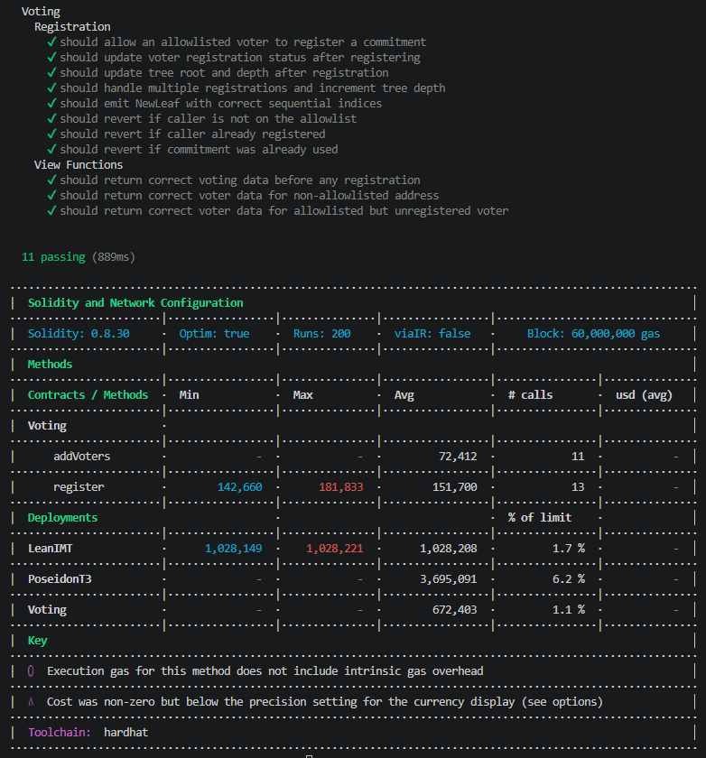

# ZK Voting

A private, Sybil-resistant voting system using zero-knowledge proofs. Voters can prove eligibility and vote exactly once without revealing who they are.

## Architecture

- **packages/circuits** - Noir ZK circuit (proves voter membership privately)
- **packages/hardhat** - Solidity smart contracts (Voting + Verifier)
- **packages/nextjs** - React frontend (register, generate proof, vote)
- **packages/blockchain** - Custom Go blockchain with an embedded EVM — a drop-in replacement for Hardhat (no wallets, no gas)

## Tech Stack

- Noir + Barretenberg (ZK proofs)
- Solidity + Hardhat (smart contracts)
- Next.js + wagmi + viem (frontend)
- LeanIMT (on-chain Merkle tree)
- Poseidon hash (ZK-friendly hashing)

## Getting Started

```
yarn chain     # Start local blockchain
yarn deploy    # Deploy contracts
yarn start     # Start frontend
```

## Switching Chain Backends (Hardhat ⇄ Custom Go blockchain)

The app runs against **either** backend with **no source changes** — you set three
environment variables and start the matching chain. This works because the Go node
in `packages/blockchain` is a generic EVM that speaks the same Ethereum JSON-RPC
subset Hardhat does, so from the frontend's point of view it is simply another
chain: a different id and a different RPC URL.

| | **Hardhat** (default) | **Custom Go blockchain** |
|---|---|---|
| `NEXT_PUBLIC_CHAIN_BACKEND` | `hardhat` (or unset) | `custom` |
| `NEXT_PUBLIC_CHAIN_ID` | `31337` | `9494` |
| `NEXT_PUBLIC_RPC_URL` | `http://127.0.0.1:8545` | `http://127.0.0.1:9545` |
| Chain to run | `yarn chain` | `make run` in `packages/blockchain` |
| Deploy command | `yarn deploy` | `yarn deploy --network custom` |
| Gas | normal EVM gas pricing | free — `gasPrice = 0` accepted |
| Contract logic | `Voting.sol` on Hardhat | the **same** `Voting.sol` bytecode in the node's EVM |

> The two backends are semantically identical **by construction**: the Go node executes
> the same compiled `Voting.sol` / `HonkVerifier.sol` inside an in-process EVM rather than
> reimplementing anything. Hardhat is the reference; the Go node is a drop-in replacement.
> `packages/nextjs/contracts/deployedContracts.ts` holds both chains' addresses side by
> side (keyed `31337` and `9494`), so switching never requires redeploying the other side.

Set the variables in `packages/nextjs/.env.local` (copy from `.env.example`). After
changing them you must **restart the frontend** (`yarn start`).

### Hardhat → Custom

```bash
# Terminal 1 — the Go node
cd packages/blockchain
make run                 # or `make run-cluster` for 1 sequencer + 2 replicas
                         # `make run-dev` additionally enables evm_*/hardhat_* methods

# Terminal 2 — deploy (once, or after any contract change)
yarn deploy --network custom

# packages/nextjs/.env.local — the "Custom" column above, then:
yarn start
```

### Custom → Hardhat

```bash
yarn chain               # terminal 1
yarn deploy              # terminal 2

# packages/nextjs/.env.local — the "Hardhat" column above, then:
yarn start
```

Zero source edits in either direction.

### Troubleshooting

- **`fetch http://127.0.0.1:8545 … eth_blockNumber` errors in custom mode** — the frontend
  is still set to `hardhat`, or it wasn't restarted after the env change. In `custom` mode
  nothing should touch :8545.
- **Contract reads return nothing** — `deployedContracts.ts` has no entry for the configured
  chain id. Run the deploy command for that mode.
- **`/blockexplorer` is empty** — the node isn't running, or `NEXT_PUBLIC_RPC_URL` points
  elsewhere. The explorer polls over HTTP; the custom node implements no WebSocket
  subscriptions by design.
- **The little faucet button next to the wallet is missing in custom mode** — expected. It
  funds through `eth_sendTransaction` with a node-held key, which the custom node does not
  implement. Gas is free there, so burners need no funding; the server-signed
  `/api/faucet` route still works if you want a balance anyway.

The node's design, milestone plan and RPC surface are documented in `00-MASTER.md`,
`packages/blockchain/RPC.md` and `packages/blockchain/README.md`.

## Tools Required

- Node.js >= 20.18.3
- Yarn v4.13.0
- nargo v1.0.0-beta.3 (WSL on Windows)
- bb v0.82.2 (WSL on Windows)

---

## Development Progress

### Phase 0: Project Scaffold ✅

**Goal:** Set up the monorepo with all required dependencies and tooling.

**What was done:**
1. Scaffolded a fresh project using `npx create-eth@latest` (Scaffold-ETH 2, v2.0.11)
2. Removed the default sample contract (`YourContract.sol`) — we build our own from scratch
3. Created the `packages/circuits` package using `nargo init --name circuits` in WSL
4. Installed ZK dependencies in `packages/hardhat`:
   - `@zk-kit/lean-imt.sol` — on-chain Incremental Merkle Tree for voter commitments
5. Installed ZK dependencies in `packages/nextjs`:
   - `@aztec/bb.js` — Barretenberg proving engine (browser ZK proof generation)
   - `@noir-lang/noir_js` — Noir circuit execution in JavaScript
   - `poseidon-lite` — ZK-friendly Poseidon hash function
   - `@zk-kit/lean-imt` — JS-side Merkle tree (mirrors on-chain tree)
6. Installed `nargo v1.0.0-beta.3` and `bb v0.82.2` in WSL Ubuntu
7. Verified `nargo compile` works on the default circuit
8. Updated `.gitignore` to exclude `packages/circuits/target/`

**How it was verified:**
- `yarn chain` — Local Hardhat blockchain starts on port 8545
- `yarn deploy` — YourContract (sample) deploys successfully
- `yarn start` — Next.js frontend launches and connects to local chain
- `nargo compile` — Noir circuit compiles successfully in WSL

---

### Phase 1: Voting Contract Structure ✅

**Goal:** Replace the sample contract with a Voting contract skeleton containing all the errors, events, state variables, and placeholder functions needed for the ZK voting system.

**What was done:**
1. Created `Voting.sol` — the main voting contract with:
   - **Errors:** `Voting__NotAllowedToVote`, `Voting__CommitmentAlreadyAdded`, `Voting__EmptyTree`, `Voting__InvalidRoot`, `Voting__InvalidProof`, `Voting__NullifierHashAlreadyUsed`
   - **Events:** `VoterAdded`, `NewLeaf` (registration), `VoteCast` (voting)
   - **State:** `s_question`, `s_yesVotes`, `s_noVotes`, `s_voters` (allowlist)
   - **Functions:** `addVoters()` (owner-only allowlist), `register()` (placeholder), `vote()` (placeholder), `getVotingData()`, `getVoterData()`
2. Created `Verifier.sol` — placeholder `HonkVerifier` contract (always returns true). Will be replaced with the real Barretenberg-generated verifier later.
3. Defined `IVerifier` interface with `verify(bytes, bytes32[])` — the standard interface for ZK proof verification on-chain.
4. Updated deploy script to deploy `Voting` with owner address and a question string.
5. Removed old `YourContract.sol`.

**Contract Design Decisions:**
- Uses OpenZeppelin `Ownable` for access control on `addVoters()`
- Uses `@zk-kit/lean-imt.sol` LeanIMT for the Merkle tree (imported, activated when we build registration)
- Constructor takes `_owner` and `_question` (verifier added when we build voting)
- `vote()` accepts proof bytes + 4 public inputs (nullifierHash, root, vote, depth) matching the circuit layout

**How it was verified:**
```
yarn chain     → Hardhat node running on port 8545
yarn deploy    → Voting contract deployed successfully
               → "Do you support this proposal?" confirmed as voting question
               → 534,370 gas used
yarn start     → Frontend at http://localhost:3000
```

**Observed on Debug Contracts page (`localhost:3000/debug`):**

The Debug page auto-generates a UI for the deployed Voting contract. It has two sections:

📖 **Read Section** (query on-chain state, no gas needed):
| Function | Input | Output |
|----------|-------|--------|
| `getVotingData()` | none | `["Do you support this proposal?", 0, 0]` — (question, yesVotes, noVotes) |
| `getVoterData(address)` | any address | `true`/`false` — whether that address is on the allowlist |
| `s_question` | none | `"Do you support this proposal?"` |
| `s_yesVotes` | none | `0` |
| `s_noVotes` | none | `0` |
| `s_voters(address)` | any address | `true`/`false` |
| `owner()` | none | deployer address (first Hardhat account) |

✍️ **Write Section** (sends transactions, costs gas):
| Function | Input | Status |
|----------|-------|--------|
| `addVoters(address[])` | array of addresses | ✅ Working — adds addresses to allowlist |
| `register(uint256)` | commitment value | ❌ Reverts "Not implemented yet" (next phase) |
| `vote(bytes, bytes32, bytes32, bytes32, bytes32)` | proof + public inputs | ❌ Reverts "Not implemented yet" (later phase) |
| `renounceOwnership()` | none | inherited from OpenZeppelin |
| `transferOwnership(address)` | new owner address | inherited from OpenZeppelin |

> Note: Contract address is assigned at deploy time and may change on redeployment. The address shown on the Debug page is always the current deployed instance.

**Try it yourself:**
1. Make sure you're connected as the **owner** (Hardhat Account #0, e.g. `0xf39Fd6e51aad88F6F4ce6aB8827279cffFb92266`). If using MetaMask, import with private key (example): `0xac0974bec39a17e36ba4a6b4d238ff944bacb478cbed5efcae784d7bf4f2ff80`
2. In the **Write** section → `addVoters` → paste (example): `["0x70997970C51812dc3A010C7d01b50e0d17dc79C8"]` → click **Send**
3. In the **Read** section → `s_voters` → paste same address (example): `0x70997970C51812dc3A010C7d01b50e0d17dc79C8` → click **Read**
4. It should now show `true` — that address is on the allowlist

> ⚠️ All addresses above are examples from the default Hardhat accounts. Your actual addresses may differ depending on your setup.

---

### Phase 2: Voter Registration with LeanIMT ✅

**Goal:** Implement the `register()` function so allowlisted voters can submit a cryptographic commitment to the on-chain Merkle tree.

**What was done:**
1. Activated registration state variables in `Voting.sol`:
   - `s_hasRegistered` — tracks whether an address has already registered (prevents double-registration)
   - `s_commitments` — tracks used commitment values (prevents duplicate commitments across addresses)
   - `s_tree` — `LeanIMTData` struct from `@zk-kit/lean-imt.sol` (the on-chain Merkle tree)

2. Implemented `register(uint256 _commitment)`:
   - Checks caller is on the allowlist AND has not already registered
   - Checks commitment has not been used before
   - Marks commitment and address as used
   - Inserts commitment into the Lean Incremental Merkle Tree
   - Emits `NewLeaf(index, commitment)` event

3. Updated `getVotingData()` to also return `treeRoot` and `treeDepth`
4. Updated `getVoterData()` to also return `hasRegistered` status

5. Updated deploy script to deploy the required libraries:
   - `PoseidonT3` — ZK-friendly hash function library (3.7M gas)
   - `LeanIMT` — Merkle tree library linked to PoseidonT3 (1M gas)
   - `Voting` — linked to LeanIMT library (672K gas)

6. Wrote 11 unit tests covering:
   - Successful registration and event emission
   - Tree root/depth updates after registration
   - Multiple registrations with sequential leaf indices
   - Revert when caller not on allowlist
   - Revert when caller already registered
   - Revert when commitment already used
   - View function returns before/after registration

**How it was verified:**
```
npx hardhat compile    → Compiles successfully (warnings only for unimplemented vote())
npx hardhat test       → 11 passing (741ms)
```

**Test output with gas report:**



**Gas costs (from test report):**
| Operation | Gas |
|-----------|-----|
| `addVoters()` | ~72,412 |
| `register()` (first leaf) | ~142,660 |
| `register()` (second leaf) | ~181,833 |

**Observed on Debug Contracts page (`localhost:3000/debug`):**

📖 **Read Section** — updated returns:
| Function | Output |
|----------|--------|
| `getVotingData()` | `["Do you support this proposal?", 0, 0, <treeRoot>, <treeDepth>]` |
| `getVoterData(address)` | `[true/false, true/false]` — (isAllowed, hasRegistered) |

✍️ **Write Section** — `register(uint256)` now works:
| Function | Input | Effect |
|----------|-------|--------|
| `register(uint256)` | any uint256 commitment | Inserts into Merkle tree, marks voter as registered |

**Try it yourself:**
1. `addVoters` with an address (e.g. `["0x70997970C51812dc3A010C7d01b50e0d17dc79C8"]`)
2. Switch to that account in MetaMask
3. Call `register` with any number (e.g. `42`) — in the real flow this will be a Poseidon hash
4. Call `getVoterData` with that address → should show `[true, true]`
5. Call `getVotingData` → tree root is now non-zero, depth reflects the number of leaves

> ⚠️ All addresses above are examples. Commitment values in production will be Poseidon hashes of (nullifier, secret).

> ⚠️ If you get `OwnableUnauthorizedAccount` error, you're not connected as the owner. Only the deployer (Account #0) can call `addVoters`.

---

### Phase 3: ZK Circuit — Commitment Scheme ✅

**Goal:** Write the Noir circuit that proves knowledge of a secret commitment without revealing the underlying values.

**What was done:**
1. Replaced the default placeholder circuit in `packages/circuits/src/main.nr` with the commitment scheme circuit:
   - **Public input:** `nullifier_hash` — the value that will be stored on-chain to prevent double-voting
   - **Private inputs:** `nullifier`, `secret` — known only to the voter
   - **Constraints:**
     - Recomputes `hash_1([nullifier])` and asserts it equals the public `nullifier_hash`
     - Computes `commitment = hash_2([nullifier, secret])` — this is the leaf value registered in the Merkle tree

2. Uses Noir's built-in Poseidon hash functions from `std::hash::poseidon::bn254`:
   - `hash_1` — single-element Poseidon hash (for nullifier → nullifier_hash)
   - `hash_2` — two-element Poseidon hash (for nullifier + secret → commitment)

**Circuit Design:**
```
┌─────────────────────────────────────┐
│           ZK Circuit                │
│                                     │
│  Private: nullifier, secret         │
│  Public:  nullifier_hash            │
│                                     │
│  assert hash_1(nullifier)           │
│         == nullifier_hash  ✓        │
│                                     │
│  commitment = hash_2(nullifier,     │
│                       secret)       │
│  (used for Merkle root in Phase 4)  │
└─────────────────────────────────────┘
```

**Why this matters:**
- The nullifier_hash is stored on-chain when voting — if someone tries to vote twice, the contract detects the duplicate nullifier_hash
- The secret ensures that even if nullifier is leaked, no one else can forge the commitment
- The circuit proves the voter knows the preimage of their commitment without revealing it

**How it was verified:**
```
nargo compile    → Compiles successfully (no errors)
                 → Produces target/circuits.json artifact
```

**What `target/circuits.json` contains:**

| Field | Description |
|-------|-------------|
| `noir_version` | Compiler version that produced the artifact (e.g. `1.0.0-beta.3`) |
| `hash` | Unique identifier for this specific circuit compilation |
| `abi` | Circuit interface — lists all parameters with their names, types (`field`), and visibility (`public`/`private`). Also includes `return_type` and `error_types` |
| `bytecode` | Base64-encoded gzipped ACIR (Abstract Circuit Intermediate Representation) — the compiled constraint system |

This JSON is used by:
- `noir_js` in the browser to execute the circuit and compute a witness
- `bb` (Barretenberg) to generate and verify proofs
- The Solidity verifier generator to produce an on-chain verification contract

**Next:** Phase 4 will extend this circuit to also prove that the commitment exists in the on-chain Merkle tree (membership proof).

---

### Phase 4: ZK Circuit — Merkle Root Verification ✅

**Goal:** Extend the circuit to prove the voter's commitment is actually in the on-chain Merkle tree (membership proof).

**What was done:**
1. Added `binary_merkle_root` dependency from zk-kit.noir to `Nargo.toml`:
   ```toml
   binary_merkle_root = { git = "https://github.com/privacy-scaling-explorations/zk-kit.noir", tag = "binary-merkle-root-v0.0.1", directory = "packages/binary-merkle-root" }
   ```

2. Extended `main.nr` with new inputs and Merkle root logic:
   - **New public inputs:** `root` (on-chain tree root), `vote` (yes/no choice), `depth` (tree depth)
   - **New private inputs:** `index` (leaf position), `siblings[16]` (path hashes)
   - **New constraints:**
     - Count non-zero siblings to determine actual path length
     - Assert depth ≤ 16 (max array length safety bound)
     - Convert `index` to 16 little-endian bits (determines left/right at each level)
     - Compute Merkle root using `binary_merkle_root(hash_2, commitment, siblings_num, index_bits, siblings)`
     - Assert computed root equals public `root` input
     - Bind vote to proof: `vote_field² == vote_field` (ensures it's 0 or 1 and prevents compiler warning)

**Full Circuit ABI (after compilation):**

| Parameter | Type | Visibility | Purpose |
|-----------|------|------------|---------|
| `nullifier_hash` | Field | public | On-chain nullifier (prevents double-voting) |
| `nullifier` | Field | private | Secret value hashed to produce nullifier_hash |
| `secret` | Field | private | Combined with nullifier to form commitment |
| `root` | Field | public | On-chain Merkle tree root to verify against |
| `vote` | bool | public | Voter's choice (bound to proof) |
| `depth` | u32 | public | Current tree depth |
| `index` | Field | private | Leaf position in tree (hidden for privacy) |
| `siblings` | [Field; 16] | private | Merkle path hashes (supports up to 65,536 voters) |

**Circuit Flow:**
```
┌──────────────────────────────────────────────────────┐
│                    ZK Circuit                         │
│                                                      │
│  1. Verify nullifier:                                │
│     assert hash_1(nullifier) == nullifier_hash  ✓    │
│                                                      │
│  2. Compute commitment:                              │
│     commitment = hash_2(nullifier, secret)           │
│                                                      │
│  3. Verify Merkle membership:                        │
│     Walk from commitment up the tree using           │
│     index_bits + siblings → computed_root            │
│     assert computed_root == root  ✓                  │
│                                                      │
│  4. Bind vote:                                       │
│     assert vote² == vote  ✓                          │
└──────────────────────────────────────────────────────┘
```

**Why the index is private:**
If the index were public, anyone could see which leaf (registration) is voting — breaking anonymity. Keeping it private means the proof only reveals "I'm in the tree" without showing where.

**Why vote is bound to the proof:**
Without binding, an attacker could intercept a valid proof and resubmit it with a different vote choice. Since `vote` is a public input baked into the proof, the proof is only valid for that specific vote.

**How it was verified:**
```
nargo compile    → Compiles successfully (no errors)
                 → Artifact size: ~792KB (vs ~58KB in Phase 3 — Merkle logic adds constraints)
                 → ABI confirms 4 public + 4 private inputs
```

**What `nargo compile` generates (`target/circuits.json`):**

The compilation produces a single JSON artifact that acts as the circuit's "binary". It contains everything needed to generate proofs and verify them:

| Field | Content | Used By |
|-------|---------|---------|
| `noir_version` | Compiler version (e.g. `1.0.0-beta.3`) | Compatibility checks |
| `hash` | Unique fingerprint of this circuit build | Cache invalidation |
| `abi` | Full interface — parameter names, types, visibility (`public`/`private`), return type | `noir_js` (to know what inputs to expect), frontend (to format inputs correctly) |
| `bytecode` | Base64-encoded gzipped ACIR (Abstract Circuit Intermediate Representation) | Everything below |

**How the artifact is used downstream:**

1. **`noir_js` (browser)** — Loads `circuits.json`, takes user inputs, and executes the circuit to produce a **witness** (the full set of variable assignments satisfying all constraints)
2. **`bb` (Barretenberg)** — Takes the bytecode + witness and generates a cryptographic **proof** (a compact object that proves the witness exists without revealing private inputs)
3. **`bb write_vk`** — Extracts a **verification key** from the bytecode (a compact summary of the circuit's constraints, generated once per circuit)
4. **`bb write_solidity_verifier`** — Takes the vk and generates a **Solidity contract** (`Verifier.sol`) that can verify proofs on-chain
5. **On-chain verifier** — The deployed contract calls `verify(proof, publicInputs)` and returns `true`/`false`

```
circuits.json (bytecode + ABI)
    │
    ├─→ noir_js.execute(inputs) → witness
    │       │
    │       └─→ bb.prove(bytecode, witness) → proof
    │
    ├─→ bb.write_vk(bytecode) → verification key (vk)
    │       │
    │       ├─→ bb.verify(vk, proof) → true/false (off-chain check)
    │       │
    │       └─→ bb.write_solidity_verifier(vk) → Verifier.sol
    │               │
    │               └─→ deployed on-chain → verify(proof, publicInputs) → true/false
    │
    └─→ Frontend loads ABI to format inputs correctly
```

**Next:** Phase 5 will generate the Solidity verifier contract from this circuit using Barretenberg (`bb`).

---

### Phase 5: Generate Solidity Verifier Contract ✅

**Goal:** Use Barretenberg (`bb`) to generate a real on-chain ZK proof verifier from the compiled circuit.

**What was done:**
1. Generated the verification key (vk) from the circuit bytecode:
   ```bash
   bb write_vk --oracle_hash keccak -b ./target/circuits.json -o ./target/
   ```
   - `--oracle_hash keccak` ensures hashing matches Ethereum's Keccak256 standard
   - Output: `target/vk` (1,760 bytes) — a compact summary of the circuit's constraints

2. Generated the Solidity verifier contract from the vk:
   ```bash
   bb write_solidity_verifier -k ./target/vk -o ./target/Verifier.sol
   ```
   - Output: `target/Verifier.sol` (1,883 lines) — full on-chain verifier using UltraHonk proving scheme

3. Replaced the placeholder `Verifier.sol` in `packages/hardhat/contracts/` with the real generated contract

4. Verified:
   - Hardhat compiles successfully
   - All 11 existing tests still pass
   - `NUMBER_OF_PUBLIC_INPUTS = 4` matches our circuit (nullifier_hash, root, vote, depth)

**Key properties of the generated verifier:**

| Property | Value |
|----------|-------|
| Circuit size | 32,768 gates (N) |
| Log circuit size | 15 (LOG_N) |
| Public inputs | 4 |
| Proving scheme | UltraHonk |
| Deployment gas | ~4,727,047 (~7.9% of block limit) |
| Verifier interface | `verify(bytes calldata _proof, bytes32[] calldata _publicInputs) → bool` |

**How the pipeline worked:**
```
main.nr → nargo compile → circuits.json (ACIR bytecode)
                              ↓
              bb write_vk → vk (verification key, 1.7KB)
                              ↓
              bb write_solidity_verifier → Verifier.sol (1,883 lines)
                              ↓
              Replaces placeholder in hardhat/contracts/
                              ↓
              Hardhat compile → HonkVerifier deployed on-chain
```

**Important notes:**
- The vk is embedded directly in the contract — no external data needed at verification time
- Every time the circuit changes, you must regenerate: compile → vk → Verifier.sol
- The `IVerifier` interface in the generated contract matches what `Voting.sol` expects
- The generated contract uses `pragma solidity >=0.8.21` (compatible with our hardhat config)

**How it was verified:**
```
bb write_vk          → VK saved (scheme: ultra_honk, circuit size: 19,278)
bb write_solidity    → Verifier.sol (1,883 lines)
hardhat compile      → 2 Solidity files compiled successfully
hardhat test         → 11 passing
```

**Next:** Phase 6 will implement the `vote()` function in Voting.sol, wiring proof verification with the real verifier contract.

---

### Phase 6: Implement vote() Function + End-to-End Proof Verification ✅

**Goal:** Implement the `vote()` function in Voting.sol and verify the entire ZK pipeline works end-to-end — from generating witness inputs, through proof generation, to off-chain verification.

**What was done:**

#### 1. Implemented `vote()` in `Voting.sol`

The core voting function that accepts a ZK proof and records a vote:

```solidity
function vote(
    bytes calldata _proof,
    bytes32 _nullifierHash,
    bytes32 _root,
    bytes32 _vote,
    bytes32 _depth
) external
```

**Logic flow:**
1. **Root validation:** Ensures root is non-zero (`Voting__EmptyTree`) and matches the current on-chain tree root (`Voting__InvalidRoot`)
2. **Proof verification:** Assembles `publicInputs[4]` array and calls `i_verifier.verify(proof, publicInputs)` — reverts with `Voting__InvalidProof` if invalid
3. **Nullifier check:** Ensures the nullifier hash has not been used before (`Voting__NullifierHashAlreadyUsed`) — prevents double-voting
4. **Vote counting:** Increments `s_yesVotes` or `s_noVotes` based on the vote input
5. **Event emission:** Emits `VoteCast(nullifierHash, voter, voteChoice, timestamp, yesVotes, noVotes)`

#### 2. Created `generate_prover_inputs.mjs` — Dummy Witness Generation

A Node.js script (`packages/nextjs/generate_prover_inputs.mjs`) that generates valid circuit inputs using the same Poseidon hash functions as the Noir circuit:

```bash
node packages/nextjs/generate_prover_inputs.mjs
```

**What it does:**
- Picks arbitrary private values (nullifier=42, secret=123)
- Computes `nullifier_hash = poseidon1([nullifier])`
- Computes `commitment = poseidon2([nullifier, secret])`
- Builds a depth-3 dummy Merkle tree with the commitment at index 2
- Walks up the tree computing intermediate nodes with `poseidon2`
- Outputs a valid `Prover.toml` with all inputs correctly computed

**Output:**
```
nullifier_hash = 12326503012965816391338144612242952408728683609716147019497703475006801258307
commitment     = 13354932457729771147254927911602504548850183657014898888488396374653942452945
root           = 14323779011469951618447924429445439226819608782236079685175267553238899867272
```

#### 3. Verified the Full ZK Pipeline End-to-End

Using the generated `Prover.toml`, ran the complete proof lifecycle:

```bash
# Step 1: Execute circuit → produce witness
nargo execute
# → Circuit witness successfully solved

# Step 2: Generate ZK proof from witness
bb prove --oracle_hash keccak -b ./target/circuits.json -w ./target/circuits.gz -o ./target/proof_output
# → Proof saved (scheme: ultra_honk, circuit size: 19,278)

# Step 3: Verify proof against verification key
bb verify --oracle_hash keccak -k ./target/vk -p ./target/proof_output/proof
# → Proof verified successfully ✅
```

**This confirms:**
- The Noir circuit constraints are satisfiable with real Poseidon hashes
- The commitment scheme (`hash_2(nullifier, secret)`) produces correct leaves
- The Merkle root computation matches between JS (poseidon-lite) and Noir (std::hash::poseidon::bn254)
- The generated `Verifier.sol` (Phase 5) is compatible with proofs produced by `bb`
- The full chain works: JS inputs → nargo witness → bb proof → bb verify

**vote() Function Flow:**
```
┌─────────────────────────────────────────────────────────┐
│                    vote() Function                        │
│                                                          │
│  1. Check root != bytes32(0)                             │
│     → Voting__EmptyTree                                  │
│                                                          │
│  2. Check root == s_tree.root()                          │
│     → Voting__InvalidRoot                                │
│                                                          │
│  3. Build publicInputs[4] from:                          │
│     [nullifierHash, root, vote, depth]                   │
│                                                          │
│  4. Call i_verifier.verify(proof, publicInputs)          │
│     → Voting__InvalidProof                               │
│                                                          │
│  5. Check nullifier not already used                     │
│     → Voting__NullifierHashAlreadyUsed                   │
│                                                          │
│  6. Store nullifier: s_nullifierHashes[nullifier] = true │
│                                                          │
│  7. Increment s_yesVotes or s_noVotes                    │
│                                                          │
│  8. Emit VoteCast(...)                                   │
└─────────────────────────────────────────────────────────┘
```

**How it was verified:**
```
hardhat compile  → Compiles successfully
hardhat test     → 11 passing (registration tests)
nargo execute    → Witness solved from generated Prover.toml
bb prove         → Real UltraHonk proof generated (14KB)
bb verify        → Proof verified successfully ✅
```

**Files added/modified:**
| File | Action |
|------|--------|
| `packages/hardhat/contracts/Voting.sol` | Implemented `vote()` function |
| `packages/nextjs/generate_prover_inputs.mjs` | Created — generates valid dummy witness inputs |
| `packages/circuits/Prover.toml` | Created — circuit inputs for proof generation |

**Next:** Phase 7 will build the frontend commitment creation component (generate nullifier + secret, compute Poseidon hash, call `register()`).

---

### Phase 7: Frontend — Voting UI & Commitment Registration ✅

**Goal:** Build the complete frontend voting interface that connects to the deployed smart contracts, allowing voters to register (create commitment + insert into Merkle tree), select their vote, and prepare for proof generation.

**What was done:**

#### 1. Created the Voting Page Layout (`app/voting/page.tsx`)

The main voting page orchestrates all components in a sequential flow:
1. Show/Add Voters (admin) → 2. View Stats → 3. Register → 4. Choose Vote → 5. Generate Proof → 6. Vote

#### 2. Created Voting Components (`app/voting/_components/`)

| Component | Purpose |
|-----------|---------|
| `VotingStats.tsx` | Reads on-chain state via `getVotingData()` — displays question, owner, contract address, yes/no vote counts with live progress bar |
| `VoteChoice.tsx` | Yes/No selector using Zustand store (`challengeStore`) — choice is bound to the ZK proof later |
| `ShowVotersButton.tsx` | Reads `VoterAdded` events, displays all registered voter addresses with status (allowed/revoked, registered/not) |
| `AddVotersModal.tsx` | Owner-only UI to batch-add voter addresses to the allowlist via `addVoters()` contract call |
| `LogStorageButton.tsx` | Debug utility — logs localStorage state (commitment, proof, burner wallet) to console |
| `ClearStorageButton.tsx` | Clears all stored commitment/proof data from localStorage |

#### 3. Created Core Voting Components (`app/voting/_components/`)

| Component | Purpose | Status |
|-----------|---------|--------|
| `CreateCommitment.tsx` | **Core Phase 7** — generates nullifier + secret using `Fr.random()`, computes Poseidon2 commitment, calls `register()` on-chain | ✅ Complete |
| `GenerateProof.tsx` | Proof generation (Phase 8 stub) — will use noir_js + bb.js to generate ZK proof in browser | ⏳ Stub |
| `VoteWithBurnerHardhat.tsx` | Burner wallet voting on Hardhat (Phase 9 stub) | ⏳ Stub |
| `VoteWithBurnerSepolia.tsx` | Smart account voting on Sepolia (Phase 10 stub) | ⏳ Stub |

#### 4. Created Supporting Infrastructure

| File | Purpose |
|------|---------|
| `services/store/challengeStore.ts` | Zustand state store — holds `commitmentData`, `proofData`, `voteChoice` across components |
| `utils/proofStorage.ts` | localStorage utilities — save/load commitment, proof, burner wallet, and transaction result per contract+user |
| `app/api/circuit/route.ts` | Next.js API route — serves `circuits.json` to the browser for client-side proof generation |
| `contracts/deployedContracts.ts` | Regenerated ABI — includes full `getVotingData` with all 7 return fields (question, owner, yesVotes, noVotes, nullCount, treeDepth, treeRoot) |

#### 5. UI/UX Redesign — FYP Branding

Transformed the default Scaffold-ETH theme into a modern FYP-branded interface:

| File | Changes |
|------|---------|
| `styles/globals.css` | Custom DaisyUI theme (indigo/purple/cyan gradient palette), glass morphism, hover-lift animations, gradient text utilities |
| `app/page.tsx` | FYP landing page with university + faculty logos, project title, team members, feature cards, tech stack |
| `components/Header.tsx` | Custom ZK Voting SVG logo, gradient branding, removed Faucet button |
| `components/Footer.tsx` | GitHub link, removed Faucet/BuidlGuidl/price display, kept Block Explorer |
| `app/debug/page.tsx` | Removed Scaffold-ETH description banner |
| `utils/scaffold-eth/getMetadata.ts` | Updated title/favicon to "ZK Voting" branding |
| `public/zk-logo.svg` + `public/favicon.svg` | Custom shield+checkmark logo (gradient, modern, no text) |
| `public/uni_logo.png` | University of Ruhuna logo |
| `public/engineering_logo.png` | Faculty of Engineering logo |

---

#### How Frontend Connects to Blockchain

The frontend communicates with deployed smart contracts through Scaffold-ETH 2's hook system, which wraps wagmi/viem under the hood:

```
┌─────────────────────────────────────────────────────────────────┐
│                     FRONTEND (Next.js)                           │
│                                                                  │
│  ┌─────────────────────────────────────────────────────────┐    │
│  │  Scaffold-ETH Hooks (wagmi + viem wrappers)             │    │
│  │                                                          │    │
│  │  useScaffoldReadContract()  → reads on-chain state       │    │
│  │  useScaffoldWriteContract() → sends transactions         │    │
│  │  useScaffoldEventHistory()  → listens to past events     │    │
│  │  useDeployedContractInfo()  → gets ABI + address         │    │
│  └──────────────────────┬──────────────────────────────────┘    │
│                         │                                        │
│  ┌──────────────────────▼──────────────────────────────────┐    │
│  │  deployedContracts.ts (Generated ABI + addresses)        │    │
│  │  - Contains full contract ABI (function signatures)      │    │
│  │  - Contains deployed address per chain ID                │    │
│  │  - Auto-generated by `yarn deploy`                       │    │
│  └──────────────────────┬──────────────────────────────────┘    │
│                         │                                        │
└─────────────────────────┼────────────────────────────────────────┘
                          │ JSON-RPC (HTTP/WebSocket)
                          ▼
┌─────────────────────────────────────────────────────────────────┐
│                 BLOCKCHAIN (Hardhat / Sepolia)                    │
│                                                                  │
│  ┌─────────────────┐  ┌──────────────────┐  ┌───────────────┐  │
│  │  Voting.sol      │  │  HonkVerifier.sol │  │  PoseidonT3   │  │
│  │  - addVoters()   │  │  - verify()       │  │  - poseidon() │  │
│  │  - register()    │  │                    │  │               │  │
│  │  - vote()        │  └──────────────────┘  └───────────────┘  │
│  │  - getVotingData │                                            │
│  │  - getVoterData  │  ┌──────────────────┐                     │
│  └─────────────────┘  │  LeanIMT          │                     │
│                        │  - _insert()      │                     │
│                        │  - _root()        │                     │
│                        └──────────────────┘                     │
└─────────────────────────────────────────────────────────────────┘
```

**Data flow for voter registration (CreateCommitment.tsx):**
```
1. Fr.random() → nullifier (cryptographically random field element)
2. Fr.random() → secret   (cryptographically random field element)
3. poseidon2([nullifier, secret]) → commitment (hash)
4. writeContractAsync("register", [commitment]) → TX sent to blockchain
5. Blockchain: Voting.register(commitment) → inserts into LeanIMT
6. Event: NewLeaf(index, commitment) emitted
7. Frontend: saves {nullifier, secret, commitment, index} to localStorage
```

**Key connection points:**

| Frontend Hook | Contract Function | What it does |
|--------------|-------------------|--------------|
| `useScaffoldReadContract("getVotingData")` | `Voting.getVotingData()` | Reads question, owner, votes, tree root/depth |
| `useScaffoldReadContract("getVoterData")` | `Voting.getVoterData(addr)` | Checks if address is voter + has registered |
| `useScaffoldWriteContract("register")` | `Voting.register(commitment)` | Inserts commitment into Merkle tree |
| `useScaffoldWriteContract("addVoters")` | `Voting.addVoters(addrs, statuses)` | Owner adds voters to allowlist |
| `useScaffoldEventHistory("NewLeaf")` | `event NewLeaf(index, commitment)` | Tracks all tree insertions (for Merkle proof) |
| `useScaffoldEventHistory("VoterAdded")` | `event VoterAdded(voter)` | Lists all added voters |

**Why `deployedContracts.ts` is critical:**
- Generated by `yarn deploy` — contains the ABI and deployed address
- Without the correct ABI, hooks can't encode/decode function calls
- Must be regenerated after any contract change (`yarn deploy --reset`)

---

#### CreateCommitment.tsx — The Core Phase 7 Logic

This is the most important component. It implements the cryptographic registration flow:

```typescript
// 1. Generate random field elements (cryptographically secure)
const nullifier = BigInt(Fr.random().toString());
const secret = BigInt(Fr.random().toString());

// 2. Compute Poseidon2 hash (same as Noir circuit uses)
const commitment = poseidon2([nullifier, secret]);

// 3. Convert to hex for Solidity
const commitmentHex = toHex(commitment, { size: 32 });

// 4. Send to blockchain
await writeContractAsync({
  functionName: "register",
  args: [BigInt(commitmentHex)],
});

// 5. Save to localStorage for proof generation later
saveCommitmentToLocalStorage({ commitment, nullifier, secret, index });
```

**Why Fr.random():**
- `Fr` is Barretenberg's finite field element class
- Generates a random value in the BN254 scalar field (the same field Noir uses)
- Ensures the values are valid circuit inputs (< field modulus)

**Why Poseidon2:**
- Same hash function used in the Noir circuit (`hash_2`)
- `poseidon-lite` library produces identical outputs to Noir's `std::hash::poseidon::bn254::hash_2`
- This ensures the commitment computed in the browser matches what the circuit will verify

**Why localStorage:**
- The nullifier and secret are needed later for proof generation (Phase 8)
- They cannot be recovered from the on-chain commitment (one-way hash)
- If lost, the voter cannot prove their membership — they cannot vote

---

#### Critical Files Summary

| File | Role | Why it matters |
|------|------|----------------|
| `app/voting/page.tsx` | Page orchestrator | Composes all voting components in correct order |
| `_components/CreateCommitment.tsx` | Registration logic | Fr.random() + poseidon2 + register() — the ZK commitment scheme |
| `_components/GenerateProof.tsx` | Proof generation | Uses noir_js + bb.js to generate ZK proof in browser |
| `_components/VotingStats.tsx` | Live stats display | Reads getVotingData() — shows votes, root, depth |
| `_components/VoteChoice.tsx` | Vote selector | Stores choice in Zustand — bound to proof |
| `services/store/challengeStore.ts` | Cross-component state | Shares commitment/proof/vote data between steps |
| `utils/proofStorage.ts` | Persistence layer | localStorage for commitment/proof survival across page reloads |
| `contracts/deployedContracts.ts` | ABI bridge | Auto-generated — connects frontend hooks to contract functions |
| `app/api/circuit/route.ts` | Circuit delivery | Serves circuits.json for browser proof generation |
| `styles/globals.css` | Theme/branding | Custom DaisyUI theme with modern FYP aesthetic |

**How it was verified:**
- Frontend compiles and serves at `localhost:3000`
- Voting page renders all components correctly
- Connected wallet shows voter status
- Owner can add voters via the AddVotersModal
- CreateCommitment button is enabled when wallet is allowlisted + not yet registered
- After registration, button shows "✓ Already registered for this vote"
- VotingStats updates live with tree root/depth after registration
- localStorage correctly persists commitment data

**Next:** Phase 8 will implement browser-side ZK proof generation using `noir_js` + `@aztec/bb.js` (UltraHonkBackend).

---

### Phase 8: Browser-Side ZK Proof Generation ✅

**Goal:** Replace the dummy proof stub with real ZK proof generation — the browser rebuilds the Merkle tree, creates a witness, and generates a cryptographic proof using UltraHonk, all client-side.

**What was done:**

#### 1. Implemented `generateProof()` in `GenerateProof.tsx`

The function that performs the entire proof pipeline in the browser:

```typescript
const generateProof = async (
  _root: bigint, _vote: boolean, _depth: number,
  _nullifier: string, _secret: string, _index: number,
  _leaves: any[], _circuitData: any,
) => { ... }
```

**8-step pipeline inside the function:**

| Step | What happens | Library used |
|------|-------------|--------------|
| 1. Compute nullifier hash | `poseidon1([BigInt(nullifier)])` | `poseidon-lite` |
| 2. Rebuild Merkle tree | Initialize `LeanIMT` with poseidon2, insert all on-chain leaves | `@zk-kit/lean-imt` |
| 3. Generate Merkle proof | `calculatedTree.generateProof(index)` → gets siblings | `@zk-kit/lean-imt` |
| 4. Pad siblings to 16 | Fill remaining slots with `"0"` (circuit expects `[Field; 16]`) | — |
| 5. Prepare circuit inputs | Build `input` object matching exact `main.nr` parameter order | — |
| 6. Create witness | `new Noir(circuitData).execute(input)` → runs circuit locally | `@noir-lang/noir_js` |
| 7. Generate ZK proof | `new UltraHonkBackend(bytecode).generateProof(witness, {keccak: true})` | `@aztec/bb.js` |
| 8. Format for Solidity | `encodeAbiParameters` to produce hex proof + publicInputs | `viem` |

#### 2. Fixed Duplicate API Fetch

The original code had a bug — it fetched `/api/circuit` twice (first to check `response.ok`, then again inside a try/catch). Cleaned up to a single fetch call.

#### 3. Copied `circuits.json` to `public/`

The API route (`/api/circuit`) serves the compiled circuit to the browser. It first checks `public/circuits.json`, then falls back to `../circuits/target/circuits.json`. Copied the compiled artifact to `public/` for reliable serving.

---

#### How Browser Proof Generation Works

```
┌─────────────────────────────────────────────────────────────────┐
│                    BROWSER (GenerateProof.tsx)                    │
│                                                                  │
│  Step 1: Compute nullifierHash                                   │
│    poseidon1([nullifier]) → nullifierHash                        │
│                                                                  │
│  Step 2: Rebuild Merkle tree from on-chain events                │
│    NewLeaf events → reverse → LeanIMT.insertMany()              │
│                                                                  │
│  Step 3: Get Merkle inclusion proof                              │
│    calculatedTree.generateProof(myIndex) → siblings[]            │
│    Pad to length 16 with zeros                                   │
│                                                                  │
│  Step 4: Prepare circuit inputs                                  │
│    { nullifier_hash, nullifier, secret, root, vote,             │
│      depth, index, siblings }                                    │
│    (exact order matching main.nr)                                │
│                                                                  │
│  Step 5: Execute circuit → witness                               │
│    Noir(circuitData).execute(inputs) → witness                   │
│    (runs all 4 circuit checks locally to verify inputs work)     │
│                                                                  │
│  Step 6: Generate ZK proof                                       │
│    UltraHonkBackend(bytecode).generateProof(witness)             │
│    → proof (~14KB) + publicInputs[4]                             │
│    (heavy crypto — takes a few seconds in browser)               │
│                                                                  │
│  Step 7: Format for Solidity                                     │
│    encodeAbiParameters([proof, publicInputs])                    │
│    → hex-encoded data ready for vote() call                      │
│                                                                  │
│  Step 8: Save to localStorage                                    │
│    { proof, publicInputs, voteChoice }                           │
│    → survives page reload, used by VoteWithBurner                │
└─────────────────────────────────────────────────────────────────┘
```

**Why rebuild the tree in the browser?**
- The smart contract stores the Merkle tree in an optimized format (frontier only)
- There's no efficient on-chain function to return Merkle proofs (siblings)
- So we fetch all `NewLeaf` events, reconstruct the full tree in JS, and generate the proof locally
- The zk-kit `LeanIMT` library in TypeScript mirrors the Solidity version exactly

**Why reverse the leaf events?**
- `useScaffoldEventHistory` returns events newest-first
- The Merkle tree must be built oldest-first (leaf 0 first, then leaf 1, etc.)
- Without reversing, the tree would have leaves in wrong positions → wrong root

**Circuit input order matters:**
The `input` object keys must match the parameter names in `main.nr` exactly:
```
main.nr:  nullifier_hash, nullifier, secret, root, vote, depth, index, siblings
input: { nullifier_hash, nullifier, secret, root, vote, depth, index, siblings }
```

**What the proof contains:**
| Output | Description |
|--------|-------------|
| `proof` | ~14KB `Uint8Array` — the cryptographic proof blob |
| `publicInputs[0]` | `nullifier_hash` — tracked on-chain to prevent double-voting |
| `publicInputs[1]` | `root` — the Merkle root the proof was generated against |
| `publicInputs[2]` | `vote` — the voter's choice (bound to the proof) |
| `publicInputs[3]` | `depth` — the tree depth at proof generation time |

---

#### File Changes Summary

| File | Action | Description |
|------|--------|-------------|
| `_components/GenerateProof.tsx` | Modified | Replaced dummy stub with real 8-step proof generation |
| `public/circuits.json` | Created | Copied from `circuits/target/` for browser access |

**How it will be verified (after `yarn chain` + `yarn deploy` + `yarn start`):**
1. Add yourself as voter → Register commitment
2. Select Yes/No vote choice
3. Click "Generate proof" → browser computes real ZK proof (takes a few seconds)
4. Button changes to "Proof already exists"
5. Check browser console for `witness generated successfully` and `proof generated successfully, size: ~14000 bytes`
6. Click "Log Local Storage" to see saved proof data

**Next:** Phase 9 will implement the burner wallet voting — create a fresh address, fund it, and call `vote()` with the generated proof.

---

### Phase 9: Burner Wallet Voting on Hardhat ✅

**Goal:** Implement the burner wallet mechanism so votes are cast from a fresh, unlinkable address — breaking the connection between the voter's registration identity and their vote.

**Why a burner wallet?**
If you vote from the same address you registered with, anyone can see on-chain: "Address X registered, then Address X voted Yes." That completely destroys privacy. The ZK proof guarantees you're eligible without revealing *who* you are — but only if the voting address is different from the registration address.

**What was done:**

#### 1. Implemented `generateBurnerWallet()` in `VoteWithBurnerHardhat.tsx`

```typescript
const privateKey = generatePrivateKey();         // fresh random key
const account = privateKeyToAccount(privateKey);  // derive address
const wallet = { privateKey, address: account.address };
```

- Uses viem's `generatePrivateKey()` — cryptographically random, never used before
- Saves to localStorage so the burner persists across page reloads
- No link to the registration wallet whatsoever

#### 2. Implemented `sendVoteWithBurner()`

Two-step process:

**Step A — Fund the burner (Hardhat only):**
```typescript
const testClient = createTestClient({ chain: hardhat, mode: "hardhat", ... });
await testClient.setBalance({ address: walletAddress, value: parseEther("0.01") });
```
- Uses Hardhat's `setBalance` cheat code — only works on local chain
- On a real network (Sepolia), this is handled by a paymaster instead (Phase 10)

**Step B — Call `vote()` with proof + public inputs:**
```typescript
await viemContract.write.vote([
  uint8ArrayToHexString(proofData.proof),   // ~14KB proof blob
  proofData.publicInputs[0],                // nullifier_hash
  proofData.publicInputs[1],                // root
  proofData.publicInputs[2],                // vote
  proofData.publicInputs[3],                // depth
]);
```
- Public inputs are in exact circuit order (matching `main.nr`)
- The proof was generated in Phase 8 and stored in localStorage
- The `uint8ArrayToHexString` helper converts the proof `Uint8Array` to a `0x`-prefixed hex string

#### Vote Flow Diagram

```
┌──────────────────────────────────────────────────────────┐
│                  BURNER WALLET VOTING                     │
│                                                          │
│  1. User clicks "Vote with burner wallet"                │
│     └→ If no burner exists, generateBurnerWallet()       │
│        └→ generatePrivateKey() → fresh address           │
│        └→ Save to localStorage                           │
│                                                          │
│  2. Fund the burner                                      │
│     └→ testClient.setBalance(0.01 ETH)                   │
│     └→ Hardhat cheat code — free gas for local testing   │
│                                                          │
│  3. Load proof from localStorage                         │
│     └→ proofData = { proof, publicInputs[4] }            │
│                                                          │
│  4. Call vote() from burner address                      │
│     └→ viemContract.write.vote(proof, inputs)            │
│     └→ Contract verifies proof → counts vote             │
│                                                          │
│  5. On-chain result:                                     │
│     └→ VoteCast event emitted                            │
│     └→ voter = burner address (unlinkable)               │
│     └→ nullifier_hash burned (no double-voting)          │
│     └→ yesVotes or noVotes incremented                   │
└──────────────────────────────────────────────────────────┘
```

**What an observer sees on-chain:**
| Visible | Hidden |
|---------|--------|
| Burner address `0xABC...` called `vote()` | Who owns `0xABC...` |
| Vote choice: "Yes" | Which leaf in the Merkle tree |
| Nullifier hash `0xef56...` | The nullifier/secret preimage |
| ZK proof blob (14KB) | The voter's real identity |
| Merkle root + depth | The leaf index |

**Privacy chain:**
```
Registration wallet → commitment on-chain (public)
                    ↕ (NO LINK — different addresses)
Burner wallet → vote on-chain (public)
                    ↕ (connected only by ZK proof — private)
```

#### File Changes

| File | Action | Description |
|------|--------|-------------|
| `_components/VoteWithBurnerHardhat.tsx` | Modified | Implemented `generateBurnerWallet()` + `sendVoteWithBurner()` |

**How it was verified:**
1. `yarn chain` → local blockchain running
2. `yarn deploy` → contracts deployed
3. `yarn start` → frontend at localhost:3000
4. Add voter → Register commitment → Select vote → Generate proof
5. Click "Vote with burner wallet" → burner created + funded + vote sent
6. VotingStats updates: Yes = 1 (or No = 1)
7. Hardhat console shows `Voting#vote` transaction from the burner address

**Note on what actually happened next:** The plan at the time was for Phase 10 to add Sepolia voting via ERC-4337 account abstraction (`VoteWithBurnerSepolia.tsx` was already scaffolded as a stub in Phase 7's table, above, anticipating this). That never happened. Instead, the team pivoted to building an entire **custom blockchain from scratch** — twice, as it turned out — because a public testnet couldn't deliver the two properties this project actually needed: real gas-free voting for unfunded burner wallets, and a chain the team fully controlled end-to-end for a national-election use case. Everything from here is that pivot and everything it led to: a first custom chain, the mobile app, the academic writeup, a from-scratch rewrite of the chain, the AWS deployment, and finally a real 4-validator Byzantine-fault-tolerant consensus protocol.

---

### Phase 10: Custom Blockchain — First Implementation (Stage 0–6) ✅ *(later superseded — see Phase 13)*

**Goal:** Build a purpose-made blockchain for the election — one where gas is free, there's no wallet friction, and the team controls the entire execution environment — rather than deploying to a public testnet.

**Why not just use Sepolia?** A public testnet still charges gas (even if "free" faucet ETH), still requires MetaMask, and gives no control over block timing, node topology, or the security stack around the RPC surface. For a system whose entire privacy model depends on unfunded, disposable burner wallets voting for free, a self-hosted chain removes an entire category of friction and cost at the source.

**What was done — the real arc, commit by commit:**

**Stage 0 — a ledger with no consensus (`11ddb19`, 2026-04-29).** A from-scratch Go module (`zk-blockchain`) with `internal/core/block.go` defining `Block{Index, Timestamp, Transactions, PrevHash, Hash}`, linked by SHA-256 over `index:timestamp:prevHash:txHashes`. Explicitly authority-based — the code's own comment states: *"Unlike Ethereum/Bitcoin, there is no mining, no nonce, and no difficulty… created by the authority (election admin)."* An in-memory `[]*Block` behind a `sync.RWMutex`, with `AddBlock`, `LoadFromBlocks`, and `ValidateChain` (hash correctness, prev-hash linkage, sequential index, non-decreasing timestamps). No API, no networking, no EVM yet — 1,547 lines across 11 files, 392 of them tests.

**API + networking (`22b5f9d`, `0306e79`, early May).** `internal/api/server.go` exposed the chain over plain HTTP. `internal/network/{broadcast,peers,sync}.go` added the first P2P layer — `BroadcastBlock` POSTs new blocks to peers, `SyncWithPeers` adopts a longer valid chain from a peer (longest-chain rule). Tested as a real 3-node cluster (`data_3001/3002/3003/`), not simulated in one process.

**"Security Implementation" (`8a1546a`, 05-17) — a real 7-layer security stack, not cosmetic.** 2,360 insertions across 17 files, backed by two design docs (`Security_Info.md`, `Encryption.md`): (1) TLS/HTTPS with self-signed ECDSA P-256 certs auto-generated per node, restricted cipher suites, TLS≥1.2; (2) SHA-256-hashed-IP rate limiting; (3) SHA-256 body checksums; (4) HMAC-SHA256 request authentication; (5) RSA-2048 signatures for admin non-repudiation; (6) the existing SHA-256 hash-chain; (7) AES-256-GCM storage-at-rest encryption. This is also where mutual-TLS between nodes originates — a decision that later became a real deployment blocker (see below).

**"Simulation Update" (`66b9ad5`, 05-18).** A 576-line in-process integration-test harness (`SIMULATION=true go run cmd/node/main.go`) spinning up 3 HTTPS nodes in one process and asserting the whole security stack end-to-end, ahead of a proper Go test suite covering the same ground.

**Storage hardening (`af2762f`, 06-15).** Migrated from JSON files to BoltDB (`blockchain.db`), added the first API documentation (`API.md`), and hardened middleware/RSA/TLS further.

**Embedded EVM (`02f98aa`, `225cb99`, 06-19) — the pivotal architectural change.** A standalone prototype package, `packages/evm-sandbox`, embedded `go-ethereum`'s EVM directly as a library: a `state.StateDB` over a fully in-memory `rawdb.NewMemoryDatabase()`, and `CreateStatelessEVM` building a `vm.EVM` with a spoofed `BlockContext` — no ETH transfers, a zero-hash `GetHash`, and (critically, and later a documented bug) **`Time: 1`, hardcoded and never advanced.** The `ChainConfig` explicitly set `IstanbulBlock: big.NewInt(0)`, with the code comment noting Istanbul's EIP-1108 optimizes the BN254 pairing precompile the project's UltraHonk/BN254 ZK verifier needs — this EVM was configured specifically to run the actual `Voting.sol`/`HonkVerifier.sol` bytecode, not a toy contract. This code moved into `packages/blockchain/internal/evm/{vm.go,contract.go}` the same day.

**Multi-candidate voting (`37634cf`, 06-24).** Rewrote `Voting.sol` (and the matching `Verifier.sol`/circuit) from a yes/no boolean to `MAX_CANDIDATES`, `s_candidates[]`, `setCandidates()`, per-candidate `s_voteCounts`, and a new 461-line admin page — the same shape the contract has today, now executed inside the Go node's embedded EVM too.

**A real typed bridge (`1082c0d`, "Stage 3 completed", 07-01).** `internal/evm/bridge.go` (415 lines) — `NewContractBridge`, `VoterIDToAddress` (deterministic address derivation from a plain string identifier — no wallets at all), `AddVoter`, `Register`, `Vote`, `GetVotingData`, `GetVoterData`, and `wrapErr` decoding custom Solidity errors like `Voting__NullifierHashAlreadyUsed` back into API responses. `internal/evm/replay.go` added deterministic replay of the persisted block log into fresh EVM state on restart. The actual compiled Hardhat artifacts (`Voting.json`, `HonkVerifier.json`, `LeanIMT.json`, `PoseidonT3.json`) were copied in and deployed at fixed nonces inside the embedded EVM.

**Full REST surface + design doc (`99d3457`, "Stage 4, 5 completed", same day).** A 1,312-line `BLOCKCHAIN_OVERVIEW.md`, and the REST API reaching its final shape: `/voting-data`, `/voter/{id}`, `/candidates`, `/vote-counts`, `/commitments`, plus admin lifecycle endpoints (`/set-question`, `/set-candidates`, `/start-registration`, `/start-voting`, `/end-election`, `/reset-election`).

**Real end-to-end proof of the whole pipeline (`4b51f32`, "stage 6 completed", 07-04).** `integration-test/run.mjs` (456 lines, Node.js) drove the actual HTTP API with a real ZK proof: commitment → register → Merkle update → UltraHonk proof → EVM verification → nullifier double-vote rejection → replay-after-restart. A `StartPeriodicSync` background goroutine was added for self-healing longest-chain sync, fixing what the code's own comment calls "Live Node Drift" (a peer that missed a broadcast could previously only catch up via a full restart).

**"Custom Blockchain Implementation Completed." (`7c84d9d`, 07-08).** The README gained a working "Switching Chain Backends" section (`NEXT_PUBLIC_CHAIN_BACKEND=hardhat|custom`), the Go node running plain HTTP on `:3001`, polled by the frontend with no MetaMask and no gas. `docs/CUSTOM_CHAIN_SWAP_PLAN.md` (388 lines) landed in the same commit — a readiness analysis, not a plan to abandon the chain, rating the crypto core "functionally ready" while flagging concrete defects: the public API had inherited the P2P listener's mTLS requirement, so **no browser could open a connection to the node at all**; `*big.Int` values like the Merkle root were serialized as bare JSON numbers, silently truncated past 2^53 by `JSON.parse`; and the `Time: 1` spoofed EVM timestamp from the embedded-EVM sandbox meant `Voting.sol`'s phase deadlines never actually expired on their own. Two same-day follow-ups (`271e127`, `3aaaaf3`) hardened the admin proxy and middleware further.

**Final architecture at completion:**

| Property | Value |
|---|---|
| Transport | Custom REST/JSON over HTTP — **not** Ethereum JSON-RPC (a deliberate choice; see Phase 13) |
| Consensus | None — single-admin authority chain, SHA-256 hash-linked, longest-valid-chain peer sync |
| EVM | Embedded, in-memory `go-ethereum` EVM executing the real compiled `Voting.sol`/`HonkVerifier.sol` bytecode |
| Identity | No wallets — `VoterIDToAddress(string)` deterministically derives an address from any allowlisted identifier |
| Security | mTLS/HTTPS, RSA-2048-signed admin requests, HMAC auth, SHA-256 checksums, IP rate limiting, AES-256-GCM at rest |
| Storage | BoltDB, with deterministic EVM-state replay on restart |

**How it was verified:** `integration-test/run.mjs`'s real proof-to-verification pipeline, a hand-rolled `middleware_test.go`, and the multi-node cluster test setup (`data_3001/3002/3003`) proving P2P broadcast and longest-chain adoption actually worked across independent processes.

**Files changed:** an entire new top-level Go module — `packages/blockchain/{cmd,internal/{core,api,network,security,evm,persistence},integration-test}` plus `packages/evm-sandbox/` (the EVM prototype later folded in), `docs/CUSTOM_CHAIN_SWAP_PLAN.md`, and `Security_Info.md`/`Encryption.md`/`BLOCKCHAIN_OVERVIEW.md`/`API.md`.

**What happened to this code:** none of it survived. Three weeks later, a single commit (`5769b76`, "M01 is done" — see Phase 13) deleted the entire tree — `internal/{api,core,evm,network,persistence,security/rsa.go}` and `packages/evm-sandbox/` wholesale — and started a from-scratch rewrite. This was a clean-slate replacement, not an incremental evolution: the swap plan's fixes had made this chain work, but a harder requirement had emerged in the meantime — the frontend's existing wagmi/viem tooling needed **real Ethereum JSON-RPC**, not a custom REST dialect, to avoid a second, parallel client implementation forever. Only `internal/security/tls.go` was salvaged into the rewrite.

**Next:** Phase 11 covers the mobile voter app, which landed on top of the *original* Hardhat-based contracts while this first custom chain was still the "alternative backend" — the two efforts were running in parallel, not sequentially.

---

### Phase 11: Mobile Voter App — Division-Aware Registration & Anonymous Voting ✅

**Goal:** Move the voter-facing half of the system off a browser and onto a real phone — biometric-gated key storage, QR-code enrollment by a field officer, and the same commit-then-prove-then-burner-vote flow the web app pioneered, now running on-device.

**What was done:**

**The initial drop (`20f4eb9`, "feat: mobile voter app + division-aware admin + e2e ZK voting", 2026-07-10) — a single 17,207-line, 56-file commit.** This was not incremental; it landed simultaneously:
- **The entire `packages/mobile` Expo/React Native app**: `app/{_layout,index,onboarding,register,vote,settings}.tsx`, `src/services/{api,chain,crypto,keystore,nativeProver,webviewProver,zkproof}.ts`, a bundled `assets/circuit.json`, and a 94-line `packages/mobile/README.md`.
- **`ElectionRegistry.sol`** — introduced in this exact commit (confirmed via `git log --follow`), as a lean, manually-populated division registry (`Ownable`, `addDivision(name, votingContract, gnOfficer)`, `getNationalVoteCount`, `getNationalResults`) — no factory logic yet.
- **Division-aware admin**: `01_deploy_divisions.ts`, `scripts/setDivisionPhase.ts`, a rewritten `app/voting/admin/page.tsx`, and new `app/gn/{page,register/page}.tsx`, `app/audit/page.tsx`, `app/results/page.tsx`, `hooks/useDivisions.ts`.
- **Phone-based OTP infrastructure** (`app/api/otp/{send,verify}/route.ts`, `services/otp/otpService.ts`) — later removed (see below).

**Mobile key management, as first committed (`src/services/keystore.ts`):**
```typescript
const AUTH_OPTIONS: SecureStore.SecureStoreOptions = {
  requireAuthentication: true,
  authenticationPrompt: "Unlock your voting identity",
  keychainAccessible: SecureStore.WHEN_UNLOCKED_THIS_DEVICE_ONLY,
};

export async function createIdentity(): Promise<`0x${string}`> {
  const privateKey = generatePrivateKey();
  const account = privateKeyToAccount(privateKey);
  await SecureStore.setItemAsync(KEY_PRIVATE, privateKey, AUTH_OPTIONS);
  await SecureStore.setItemAsync(KEY_ADDRESS, account.address, PUBLIC_OPTIONS);
  return account.address;
}
```
The key is generated on-device with viem, never transmitted, and stored hardware-backed and biometric-gated; only the public address (unguarded) is exposed for the QR code the voter shows a GN officer.

**Burner-wallet voting carried over from the web app, with a mobile-specific wrinkle.** Because Hermes (React Native's JS engine) mangles viem's automatic EIP-1559 gas-estimation RPC calls, `src/services/chain.ts` hand-builds and signs **legacy transactions** directly (`sendLegacyTx`) — fetching nonce and gas price manually rather than relying on wagmi's write hooks, a workaround the web app never needed.

**`081cbe4` — "fix faceid issue and bug fix" (07-11, one day later).** `requireAuthentication: true` needs native biometric entitlements that Expo Go's sandboxed dev client can't satisfy, breaking FaceID during development. Fixed by detecting the Expo Go environment and relaxing the requirement only there:
```typescript
const isExpoGo = Constants.executionEnvironment === ExecutionEnvironment.StoreClient;
const AUTH_OPTIONS: SecureStore.SecureStoreOptions = {
  requireAuthentication: !isExpoGo,
  ...
};
```

**`d5565cc` — "feat: add hashed-NIC registry to prevent duplicate voter registration" (07-12) — `NicRegistry.sol` is born.** The division-aware architecture had created a real gap: each division deploys its own independent `Voting` contract with its own allowlist, so nothing stopped one citizen registering in multiple divisions under different wallet addresses. The commit message states the fix precisely:

> New NicRegistry.sol contract stores only HMAC-hashed NICs, never raw values. Central registry (not per-division) so one person can't register twice across different divisions using different wallets. New /api/nic/hash endpoint hashes NIC server-side using a secret pepper, authenticated via GN wallet signature (60s replay window). Wired into GN registration flow: NIC hash reserved before addVoters() runs. 5 new contract tests added; full suite passes 54/54.

Raw NICs never leave the GN's device unhashed and are never persisted — only an HMAC digest (server-held pepper) is committed on-chain. The commit's own trailing note is candid about scope: *"Go blockchain (Track B) not yet updated — still needs equivalent check. Mobile voting flow not re-verified end-to-end"* — an acknowledged follow-up debt at merge time.

**`ff58b4d` — "mobile ui update, division adding, audit bug fixing" (07-12, same day).** Real design polish: a 425-line shared component library (`src/components/ui.tsx` — `GlassCard`, `GradientButton`, `FadeIn`, `StepIndicator`), a new `app/verify.tsx`, and — inferred from `ElectionRegistry.sol` gaining further changes here — this is roughly where the registry grew its `createDivision()` factory method (deploying a `Voting` contract internally rather than requiring one deployed externally first), since a later commit's test fixture already assumes it exists.

**`95e7e7a` — ElectionRegistry test/deploy fixes (07-15).** By this point `ElectionRegistry.createDivision()` deploys `Voting` internally, needing `LeanIMT` linked and a `_verifier` constructor argument its test fixture didn't have before. Also tightened `addVoters()` to Setup phase only (from "Setup + Registration"), reflected in an updated test name: *"GN cannot add voters during Registration phase (Setup only)."*

**`9559b3c` — "Remove the phone number verification step from the mobile voting flow" (07-19).** The vote screen's stage machine collapsed from `"otp-phone" | "otp-code" | "select" | "confirm" | ...` to `"auth" | "select" | "confirm" | ...` — both OTP screens deleted, replaced by a single auto-triggered biometric check:
```typescript
useEffect(() => {
  if (stage === "auth" && division) {
    const t = setTimeout(() => authenticateUser(), 300);
    return () => clearTimeout(t);
  }
}, [stage, division]);
```
Device biometrics — already gating the SecureStore keys since day one — became the sole voter-side authentication factor at vote time.

**How it was verified:** manual device testing through the full onboarding → GN QR scan → register → vote → verify loop; the NicRegistry contract test suite (54/54 passing, including 5 new duplicate-NIC tests); and repeated real-device runs to catch the Expo Go / FaceID environment mismatch.

**Files changed:** the entire new `packages/mobile` package; `packages/hardhat/contracts/{ElectionRegistry.sol, NicRegistry.sol}`; `packages/hardhat/test/{GNAndRegistry.ts, NicRegistry.ts}`; `packages/nextjs/app/{gn,audit,results}/**`, `app/api/{otp,nic/hash,verify-vote}/**`.

**Next:** Phase 12 is a short one — while the mobile app and the first custom chain were both taking shape, the team paused to write up the project formally for academic submission.

---

### Phase 12: Academic Documentation — Conference Paper & Final Report ✅

**Goal:** Step back from implementation and produce the formal academic record of the project — a conference paper suitable for submission, and a full final-year report — capturing the design rationale, literature context, and results in a form independent of the (still-evolving) codebase.

**What was done (`60d0947`, "Add conference paper and final report (132-page LaTeX with 65 figures)", 2026-07-26):**

- **`Conference paper/`** — a 686-line LaTeX paper (`main.tex`), compiled to a 349KB PDF, plus a `README.md` documenting the compilation steps and a figure-drawing guide for four placeholder diagrams. Notably, the guide's own architecture diagram (quoted below) describes the custom chain as a **"REST API, no gas"** system — confirming this paper was written while Phase 10's first custom blockchain was still the current one, before the Phase 13 rewrite to JSON-RPC:
  ```
  ┌───────────────────┐    ┌─────────────────────────────────────┐
  │   WEB APP         │    │        MOBILE APP                    │
  │   (Next.js)       │    │        (React Native / Expo)         │
  └───────────────────┘    └─────────────────────────────────────┘
                                      │
                           ┌──────────▼──────────┐
                           │ CUSTOM GO BLOCKCHAIN │
                           │ (embedded EVM,       │
                           │  REST API, no gas)   │
                           └─────────────────────┘
  ```

- **`Final Report/Report Template/`** — a complete University of Ruhuna final-year report template, populated with 9 chapters:

  | Chapter | Title |
  |---|---|
  | 1 | Introduction |
  | 2 | Literature Review |
  | 3 | System Architecture and Design |
  | 4 | Methodology: Development Journey |
  | 5 | Zero-Knowledge Circuit Implementation |
  | 6 | Smart Contracts and Custom Blockchain |
  | 7 | Application Development |
  | 8 | Testing, Results, and Evaluation |
  | 9 | Conclusion and Future Work |

  Plus front matter (abstract, acknowledgements, acronyms, cover page, university logo) and end matter (two appendices), and a `Images/` directory of 65 figures — architecture diagrams, the deploy-order diagram, division diagrams, an anonymity-set diagram, an attack/defense diagram, a blockchain decision tree, circuit data-flow and iteration diagrams, and more, each named descriptively (`fig_anonymity_set_diagram.png`, `fig_blockchain_decision_tree.png`, `fig_boltdb_storage.png`, …) — the BoltDB figure alone is a dated artifact confirming it was drawn against Phase 10's storage layer, before Phase 13 moved to Pebble.

**Why this matters beyond the paperwork:** Chapter 2 (Literature Review) and Chapter 6 (Smart Contracts and Custom Blockchain) are where the project's design decisions first got written down and justified against prior work, rather than living only in code comments and commit messages — the same academic rigor later shows up as named theory (the Byzantine Generals Problem, CAP theorem, e-voting cryptography properties) once the BFT consensus phase (Phase 15) arrives.

**How it was verified:** the LaTeX compiles cleanly (`pdflatex main.tex`, run twice for cross-references) for both the conference paper and the final report template.

**Files changed:** `Conference paper/{main.tex, README.md, Conference Paper ZK voting.pdf, Conference Paper Template (1).docx}`, `Final Report/Report Template/{Chapters/ch_1.tex .. ch_9.tex, Front_matters/**, End_matters/**, Images/** (65 files)}`, plus two evaluation-guideline PDFs.

**Next:** Phase 13 is the big one — three weeks later, the entire Phase 10 custom blockchain was deleted and rebuilt from zero, this time as a real Ethereum-JSON-RPC-speaking EVM node, across 14 tracked milestones.

---

### Phase 13: Custom Blockchain V2 — A Rewrite from Zero, in 14 Milestones ✅

**Goal:** Replace Phase 10's REST-based custom chain with a real, generic, production-ready **permissioned EVM chain speaking the Ethereum JSON-RPC subset** the app's wagmi/viem tooling already expects — so the same frontend code works against Hardhat or this chain with zero source changes, and a contract change never has to touch a single line of Go.

**Why a rewrite, not a patch:** `docs/blockchain-v2/00-MASTER.md` §1 records the locked decision (2026-07-29): generic EVM + Ethereum JSON-RPC (not REST); rewrite in place in `packages/blockchain`, salvaging only `internal/security/tls.go`; a 3-node topology (1 sequencer + 2 read replicas); no-wallet auth only in custom-chain mode. The new chain is **chain ID 9494** (vs. Hardhat's 31337), auto-mine with one transaction per block, **free gas** (`gasPrice=0` accepted, `eth_gasPrice → 0x0`), genesis-prefunding the 20 standard Hardhat mnemonic accounts at 10,000 ETH each, built on `go-ethereum` v1.16.x for storage (Pebble/rawdb), execution (`vm.EVM`/`state.StateDB`), and block replication (RLP over mTLS).

**A note on process:** the 14 milestones were largely executed by an AI coding agent without a local Go toolchain — most gates read "code complete, verified in-sandbox by non-Go means (viem/Node harnesses, bytecode interpreters, property tests), then re-run and confirmed by a human separately." This is stated explicitly in nearly every milestone doc and is itself a real fact about how this phase of the project was built.

---

#### M01 — Teardown, Module Layout, Config, Logging, Health (`5769b76`)

**Goal (quoted):** *"Clean slate with production scaffolding: v1 code removed (salvage kept), new layout from MASTER §4, env config, structured logging, graceful shutdown, health endpoint, upgraded deps."*

**What was done:** The entire Phase 10 tree was deleted — `internal/{api,core,evm,network,persistence}`, `assets/`, `integration-test/`, `PLAN.md`, `API.md`, `BLOCKCHAIN_OVERVIEW.md`, `CONTRACT_CHANGE_CHECKLIST.md`, and `packages/evm-sandbox/` entirely (71 files, +3,084/−10,495) — with only `internal/security/tls.go` moved to `internal/p2p/tls.go` for later reuse. All 14 milestone spec docs plus `00-MASTER.md` and `01-AUTH-DESIGN.md` were committed to `docs/blockchain-v2/` in this same commit, planning the whole rewrite before writing code. New: `internal/config/config.go` (301 lines) parsing every env var with `Config.Validate()` returning all errors joined, not just the first; `internal/rpc/health.go` serving `GET /health` → `{"status":"ok","role":"primary","chainId":9494,"height":0}`; `cmd/node/main.go` rewritten to wire config → logging → HTTP server with graceful shutdown on SIGINT/SIGTERM.

**How it was verified:** `make vet && make test && make build`, then `make run &` and `curl localhost:9545/health`, a clean-shutdown log check via `kill`, and `git grep -l "typed bridge\|bolt" internal/ | wc -l` asserting `0` — no v1 leftovers remained.

**Files changed:** `internal/{config,rpc/health.go}`, `cmd/node/main.go`, `Makefile`, `.env.example`; wholesale deletion of the Phase 10 tree.

---

#### M02 — Storage, Chain Config, Genesis + Prefunds (`bb046a8`)

**Goal (quoted):** *"Durable geth-native storage (Pebble via `rawdb`) and a deterministic genesis block that prefunds the 20 Hardhat test accounts. After this milestone the node has a persistent, reopenable chain of height 0."*

**What was done:** `internal/storage/storage.go` opens Pebble through geth's `rawdb.Open`. `internal/state/chainconfig.go` builds a `params.ChainConfig` with **every fork active from block 0 through Cancun and Prague** — no Clique, no Ethash, since the node seals its own blocks. `internal/state/genesis.go` hardcodes the 20 Hardhat mnemonic addresses at 10,000 ETH each, `BaseFee: big0`, `ExtraData: []byte("zkchain-genesis")`; on reopen it verifies the stored genesis hash still matches, refusing to boot on config drift. Base fee is pinned to 0 "at genesis and forever" — deliberately not using `misc.CalcBaseFee` — the free-gas foundation everything downstream depends on.

**How it was verified:** a determinism test (two fresh temp dirs produce identical genesis hashes); a reopen test (create → close → open, head and a prefunded balance both survive); a config-drift test (reopening with a different `CHAIN_ID` errors as expected). Gate: `make test`, `make run &`, `make reset && make run &` re-creates an identical genesis hash.

**Files changed:** `internal/storage/storage.go`, `internal/state/{chainconfig,genesis,statedb}.go`, `go.mod` (go-ethereum pinned to v1.16.8).

---

#### M03 — Sequencer: Tx Validation, EVM Execution, Block Sealing (`dc8aba0`)

**Goal (quoted):** *"The heart of the node: accept a signed transaction, execute it in the EVM against current state, seal exactly one block, persist block + receipts + state atomically. Auto-mine, no mempool, no forks."*

**What was done:** `internal/chain/sequencer.go` defines `Sequencer` — a single `sync.Mutex` writer around `SubmitTx`, `Call` (a throwaway StateDB copy returning a typed `RevertError`), `EstimateGas` (a naive `gasUsed*1.1` at this stage, fixed properly in M08), and `MineEmptyBlock`. `validate.go` performs stateless and stateful checks (signer recovery, nonce, gas limit, balance ≥ value+fee, intrinsic gas). `execute.go` builds the `vm.BlockContext` (`Coinbase` zero, `BaseFee: 0`, post-merge PREVRANDAO) and runs `core.ApplyMessage`. `seal.go` builds the header and persists **atomically** in a single rawdb batch before publishing a `NewBlockEvent` (later consumed by M10's replication). The revert policy: a reverting transaction produces **no block at all** — matching Hardhat's own auto-mine-rejects-reverts behavior.

**How it was verified:** table-driven Go tests — deploy/read across a reopen, a revert producing no new block, bad nonces, wrong chain id, a 0-balance sender succeeding at `gasPrice=0` while a value transfer from the same account fails, strictly-increasing timestamps under rapid submission, and multi-event-per-tx log-index/bloom correctness. Gate: `make vet && make test`, ≥80% coverage target for `internal/chain/`.

**Files changed:** `internal/chain/{sequencer,validate,execute,seal}.go` + tests (new package).

---

#### M04 — JSON-RPC Server + Read Methods (`1ff0909`)

**Goal (quoted):** *"Standards-compliant JSON-RPC over HTTP with every read method from MASTER §9, verified byte-shape-compatible against a live Hardhat node by a differential test harness."*

**What was done:** `internal/rpc/server.go` wraps geth's own `rpc.NewServer()` for the `eth`/`net`/`web3` namespaces, with CORS, request logging, and a per-IP rate limiter (100 rps / burst 200, localhost exempt). `eth_read.go` implements `eth_chainId`, `eth_blockNumber`, `eth_syncing`(false), `eth_accounts`([]), balance/code/storage/nonce reads, block reads, `eth_call` (reverts mapped to JSON-RPC error code 3, carrying `data`), `eth_estimateGas`, `eth_gasPrice`→`0x0`, `eth_maxPriorityFeePerGas`→`0x0`, `eth_feeHistory` (all-zero), and the `net`/`web3` methods. A **differential test harness**, `e2e/diff/diff.mjs` (Node + viem), runs identical calls against both a real `hardhat node` and this node and diffs the JSON, reused through M08.

**How it was verified (25 files, +3,039/−19):** `make diff` reported **12 passed, 0 failed, 2 skipped** (deferred to M05). The harness itself caught a real bug: `eth_accounts` was initially diffed for exact equality, but Hardhat legitimately returns 20 unlocked accounts while this node correctly returns none — fixed by diffing by shape, not value. `RPC.md` (102 lines) was created as the living compatibility matrix.

**Files changed:** `internal/rpc/{server,eth_read,convert,errors,ratelimit}.go`, `internal/chain/read.go`, `e2e/diff/`, `RPC.md`.

---

#### M05 — Write Path: `eth_sendRawTransaction`, Tx Queries, Revert Errors (`bf9c404`)

**Goal (quoted):** *"Full write cycle over RPC with Hardhat-identical error semantics — after this milestone viem can deploy and interact with arbitrary contracts on the node."*

**What was done:** `internal/chain/txlookup.go` derives full transaction/receipt fields from raw rawdb storage. `eth_write.go` implements `eth_sendRawTransaction` (decode → `SubmitTx` → hash, with validation failures mapped to Hardhat-style `-32000` text and reverts to `{code:3, ...}` with no block mined), `eth_getTransactionByHash`, `eth_getTransactionReceipt` (returning JSON `null` for unknown hashes, since viem polls on exactly this). New harnesses: `e2e/shape-check.mjs` (viem's own formatters run over this node's real JSON — 36/36 pass) and `e2e/smoke-deploy.mjs`, which deploys the **actual compiled `PoseidonT3 → LeanIMT → HonkVerifier → Voting`** stack and calls `setCandidates`/`startRegistration`/`register`/`getVotingData` — proving the EVM handles real Poseidon and a large verifier contract ahead of M08.

**How it was verified:** in-sandbox, `make shape-check` 36/36 across receipts, all 3 tx types, and event decoding; the real library-linker resolved every placeholder in the real `LeanIMT`/`Voting` artifacts with byte length unchanged. Three real bugs were found and fixed during review: a missing error-mapping fallback path, `accessList: null` marshaled instead of `[]` for legacy transactions, and a stale doc comment. `make diff-write` and `make smoke` were left for the human gate.

**Files changed:** `internal/chain/txlookup.go`, `internal/rpc/eth_write.go`, `e2e/{shape-check.mjs, diff/write.mjs, smoke-deploy.mjs}`.

---

#### M06 — `eth_getLogs` (`922f234`)

**Goal (quoted):** *"Event queries powering the audit page, `/api/verify-vote`, `/api/merkle-path` (NewLeaf history) and the block explorer."*

**What was done:** `internal/chain/logs.go` implements filtering by block range/hash, address (single or array), and positional topics (null = wildcard, inner array = OR), using each header's stored **bloom filter to skip non-matching blocks** before precise matching. A `LOG_RANGE_LIMIT` env var (default 100,000 blocks) caps query span as DoS protection. go-ethereum's own `eth/filters` package was deliberately not reused — it needs a background bloom-bit indexer this node has no equivalent object for.

**How it was verified — the most heavily verified milestone of the fourteen,** because a silent bloom false-negative would drop votes from the audit page with no visible error: (1) a hand-assembled log-emitting bytecode fixture executed under an independent EVM implementation to confirm topic ordering; (2) viem driven through the app's actual 5 real `getLogs` call sites against a recording server; (3) `make shape-check` extended, 41/41; (4) **the reference Ethereum bloom filter reimplemented independently and property-tested against this Go implementation across 30,000 randomized blocks with zero false negatives**, cross-checked against a second independent matcher across 60,721 log/filter pairs, confirming the bloom fast path skips 65.5% of blocks. Four real bugs were found this way, including an undocumented semantic decision (surplus topic positions beyond a log's actual topic count) resolved in favor of matching go-ethereum's own behavior and pinned by a test.

**Files changed:** `internal/chain/logs.go`, `internal/rpc/eth_logs.go`, `internal/config/config.go` (`LOG_RANGE_LIMIT`), `e2e/diff/logs.mjs` (13 check groups), `RPC.md`.

---

#### M07 — Dev/Compat Methods (`be94476`, joint with M08)

**Goal (quoted):** *"The small set of non-standard methods needed for (a) the Hardhat contract test suite to run against the node and (b) faucet/tooling parity. All gated behind `DEV_RPC=true` except where noted."*

**What was done:** `internal/rpc/dev.go` implements `evm_increaseTime`, `evm_setNextBlockTimestamp`, `evm_mine`, `hardhat_setBalance` (+ `anvil_setBalance` alias). Because state may only mutate inside a block, `setBalance` is implemented as a **system-op block** — an empty block whose header `extraData` encodes `sysop:setBalance:<addr>:<hex>`, re-applied identically on replica sync and audit replay. `evm_snapshot`/`evm_revert`, `hardhat_impersonateAccount`, `debug_*`, `trace_*` are explicitly not implemented (documented as unused by the app).

**How it was verified:** `make diff-dev` passed **20/20** against a live `hardhat node`. The harness caught real behavioral differences: `evm_mine` returns a decimal `"0"` not hex; there is no real `anvil_setBalance` on Hardhat at all (ours-only); and `evm_increaseTime` was silently ineffective whenever the head sat ahead of wall clock — flagged and carried forward to be properly fixed in M09.

**Files changed:** `internal/rpc/dev.go`, `internal/chain/sequencer.go` (sysop application), `e2e/diff/dev.mjs`.

---

#### M08 — `yarn deploy --network custom`; Full Hardhat Test Suite Green on the Node (`be94476`)

**Goal (quoted):** *"The flagship EVM-compat gate: the unmodified deploy scripts and the whole Hardhat contract test suite run against our node. After this, 'contract changes never touch Go' is proven, not claimed."*

**What was done:** A `custom` network entry added to `hardhat.config.ts` (the same one documented at the top of this README); `scripts/runHardhatDeployWithPK.ts` fixed to allow the `custom` network through its local-network allowlist without an encrypted-key prompt.

**How it was verified — the headline evidence of the whole rewrite:** deploying all 9 contracts via unmodified `hardhat-deploy` produced **byte-identical gas consumption between `hardhat node` and this node for every single contract**, including the 4.7M-gas HonkVerifier (PoseidonT3 3,695,091; LeanIMT 1,028,221; HonkVerifier 4,726,613; Voting 1,992,910; ElectionRegistry 3,392,544; NicRegistry 337,595; each division's Voting 2,086,320) — proof both EVMs executed the identical opcode path, and deployed addresses matched too. `npx hardhat test --network custom` ran **55/55 green** in ~6 seconds, including all 18 `revertedWithCustomError` assertions. One real bug was found and fixed: `eth_estimateGas` under-reported for any call earning gas refunds (`core.ExecutionResult.UsedGas` is net-of-refunds, but a transaction must be funded gross), and `Voting.resetElection()` landed exactly on EIP-3529's refund cap, producing 7 opaque, undecodable "out of gas" failures — fixed by replacing the naive `1.1x` pad with a proper binary search matching geth's own approach.

**Files changed:** `packages/hardhat/hardhat.config.ts`, `scripts/runHardhatDeployWithPK.ts`, `e2e/smoke-deploy.mjs`.

---

#### M09 — Restart Recovery + `cmd/audit` Replay Verification (`6e346ca`)

**Goal (quoted):** *"Prove durability and verifiability: the node resumes exactly where it stopped, and an independent tool re-derives the entire state from the block list — the 'anyone can recheck the election' property."*

**What was done (20 files, +2,678/−147):** `cmd/audit/main.go` — a standalone binary that opens the data directory read-only and replays every block from genesis on a fresh in-memory state, verifying state root, receipt root, tx root, bloom, gas used, parent linkage, and timestamp monotonicity per block, with `-from N` for incremental audits. `internal/state/head.go` adds boot-time head/state integrity verification, failing fast with a pointer at `cmd/audit` if state is corrupt. `internal/chain/sequencer.go` fixed M07's carried-over clock bug: on restart, the dev-time offset is seeded from `head.Time - now` so a chain that used `evm_increaseTime` doesn't crawl forward one second per block afterward.

**How it was verified — the strongest empirical evidence in the whole rewrite:** run against the real data directory M08's gate produced (55 passing tests, 3 runtime-deployed divisions): **`AUDIT OK height=787 stateRoot=0x8ce1fd46… blocks=787 txs=774 gas=1,410,021,337 elapsed=419ms (1,878.5 blocks/s)`.** An incremental audit from block 400 reached the identical head state root while replaying only half the chain — proof the replay overlay genuinely reads historical trie nodes rather than recomputing from scratch. A restart correctly recovered a head that was ~2h56m ahead of wall clock (accumulated `evm_increaseTime` from the Hardhat test suite) rather than losing it. One real bug was found by the audit's own first run — `receipt.Type` is a derived field that a legacy-only test fixture happened to never exercise honestly — fixed, and a new test (`TestAuditFixtureCoversEveryTransactionType`) now guarantees the fixture includes every transaction type going forward.

**Files changed:** `cmd/audit/main.go`, `internal/chain/{replay,restart_test,seal,sequencer}.go`, `internal/state/{genesis,head}.go`, `internal/storage/overlay.go`, `packages/blockchain/README.md` (new — the ops runbook begins here).

---

#### M10 — Replication: 1 Primary + 2 Read Replicas over mTLS (`62aac06`)

**Goal (quoted):** *"The 3-node production topology: a sequencer that pushes sealed blocks to verifying replicas; replicas serve all read RPC locally and transparently forward writes. Replica count is pure config — nothing in code assumes '2'."*

**What was done:** Built on the M01-salvaged `tls.go`. Wire protocol over HTTPS+mTLS: `POST /p2p/block` (the primary pushes every sealed block; a replica verifies parent linkage, **re-executes the block fully via the same code path `cmd/audit` uses**, and requires the resulting state root to match the header — a mismatch returns 409 and logs `CRITICAL state root mismatch`, the system's tamper-evidence property), plus `GET /p2p/blocks` (catch-up pull) and `GET /p2p/head`. A replica forwards writes verbatim to the primary; the primary uses fire-and-forget pushes with retry/backoff so one slow replica never blocks sealing.

**How it was verified:** `e2e/cluster-test.mjs` covers 5 scenarios — 3 nodes start and converge; a write submitted *via a replica* (forwarded) lands and appears on all 3; a killed replica catches up on restart to a matching state root; reads are identical across all 3 nodes; and a hand-crafted block with a deliberately wrong state root is rejected with 409.

**Files changed:** `internal/p2p/{tls,server,client,replica}.go`, `Makefile` (`gen-certs`, `run-cluster`), `e2e/cluster-test.mjs`.

---

#### M11 — Next.js on the Custom Chain: Reads + Env Plumbing + v1 Cleanup (`832fc76`)

**Goal (quoted):** *"The web app runs against the Go node with env changes only; all read surfaces work. Stale v1 REST code is removed. Hardhat mode must remain pixel-identical."*

**What was done:** `utils/customChain.ts` defines the viem chain object for id 9494; the dev faucet's chain guard became an allowlist (`FAUCET_CHAIN_IDS`, default `31337,9494`). Every Phase 10 leftover was deleted once `git grep` confirmed no remaining imports: the old REST `services/chain/*`, 12 entirely-dead `/voting` page components (the `/voting` route is now just a "download the app" page), the old RSA-signing admin proxy, and the old `app/chain-explorer/` (superseded by fixing up the existing scaffold-eth block explorer instead).

**What the implementation found beyond the spec:** the scaffold-eth block explorer's data hook used a WebSocket connection, but this node implements no `eth_subscribe` by design — rewired to HTTP polling. A per-chain contract-address bug was found live, not by reading code: the NicRegistry address env var held a value matching **neither** deployment, meaning GN registration silently pointed at a dead address even in Hardhat mode — fixed by resolving addresses from the generated `deployedContracts.ts` keyed by chain id, with the env var demoted to an optional override.

**Files changed:** `utils/{customChain,serverChain}.ts`, `scaffold.config.ts`, `app/api/faucet/route.ts`, deletions across `services/chain/`, `app/api/admin/`, `app/chain-explorer/`, `app/voting/_components/`.

---

#### M12 — No-Wallet Admin/GN Auth + Signing Relay (`a12080c` + `b8773eb`, "M12" and "M12 p2")

**Goal:** per `01-AUTH-DESIGN.md` — admin and GN officers authenticate with credentials instead of MetaMask in custom-chain mode, with a server-side relay signing their transactions on their behalf; Hardhat mode is untouched. (This is the exact relay pattern documented in this README's architecture and covered in depth by the project's own architecture guide.)

**What was done — split into two deliberate passes.** Pass 1 built the server half: `services/auth/{crypto,session,accounts,rateLimit,relayPolicy,relayExecutor,auditLog}.ts`, `middleware.ts` (a no-op in Hardhat mode), `app/api/{auth,relay,gn-accounts}/**`. GN account keys are AES-256-GCM sealed at rest, passwords bcrypt-hashed, sessions via `iron-session`. 112 tests covered the encryption envelope, cross-division GN rejection, revert decoding, and fail-closed behavior on a missing session secret. Pass 2 (41 files, +3,918/−256) built the client half: `hooks/useElectionWriter.ts` (the single write seam — wagmi in Hardhat mode, `/api/relay` in custom mode), `hooks/useElectionAuth.ts`, `app/login/page.tsx`, and a GN account creation UI wiring password generation to an automatic on-chain `setGNOfficer` call.

**What the verification pass caught beyond the spec:** `addVoters` was unreachable for the admin in custom mode (the relay whitelist gave it to the `gn` role only) — resolved deliberately, not widened, since giving the admin that path would have bypassed the paired duplicate-NIC check; the NIC-hashing endpoint authenticated GN officers by wallet signature, which a custom-mode GN (who has no wallet) can't produce — fixed to accept the session cookie instead, re-verified against the live on-chain officer on every call.

**How it was verified:** 247 combined unit/component tests, plus a full click-through gate with MetaMask uninstalled — admin login through a complete election lifecycle, GN account creation and division-scoped enrollment, a 5-wrong-passwords lockout, and a grep of the account store confirming no plaintext private key is ever written to disk.

**Files changed:** `services/auth/**`, `middleware.ts`, `app/api/{auth,relay,gn-accounts,nic/hash}/**`, `hooks/{useElectionWriter,useElectionAuth,useGnDivision}.ts`, `app/{login,voting/admin,gn}/**`.

---

#### M13 — Mobile Voter App on the Custom Chain *(delivered inside `da1457e`, no standalone commit)*

**Goal (quoted):** *"The Expo app completes register → proof → anonymous vote against the Go node purely via env config. Any code change here is a finding — first suspect the node, only patch mobile if the node is provably spec-correct."*

**A note on process:** unlike every other milestone, M13 has no standalone commit — its spec was written in the M07/M08 commit, then substantively delivered together with M14's final verification pass.

**What was done:** an env-only switch (`EXPO_PUBLIC_RPC_URL`, `EXPO_PUBLIC_CHAIN_ID=9494`) against the mobile app's existing hand-rolled legacy-transaction path (Phase 11's `chain.ts`). 36 offline test cases start a real HTTP JSON-RPC server and inspect the literal bytes the app sends, asserting no forbidden RPC method ever appears and that a genuine `gasPrice=0` from the node is honored (the 1-gwei fallback fires only on an RPC *error*, never a legitimate zero).

**Three source changes, each logged as a "finding" per the milestone's own rule, not silently patched:** `vote.tsx` treated a faucet-funding failure as fatal, aborting the vote before it was even attempted — which defeated the entire "unfunded burner can vote" property the custom chain exists to prove; fixed to a best-effort attempt that never blocks the actual (fee-free) transaction. The identical fix was applied to `register.tsx`. And `config.ts`'s chain-id parsing produced `NaN`/`0` for a malformed or empty env value with no diagnostic — the same bug class M11 found and fixed on the web side, now guarded identically on mobile.

**How it was verified — device-level, not automatable:** register transaction mined with a `NewLeaf` log; vote from a genuinely zero-balance burner succeeds with `status 1, gasPrice 0` ("the gas-problem proof"); a double-vote attempt surfaces the decoded `Voting__NullifierHashAlreadyUsed` error through the node's revert data; and the Merkle path served by `/api/merkle-path` matches the on-chain root.

**Files changed:** `packages/mobile/{app/register.tsx, app/vote.tsx, src/config.ts, src/services/api.ts, e2e/mobile-chain-check.mjs}`.

---

#### M14 — E2E Suite, Swap Drill, Docs, Final Gate (`da1457e`, "M14 is done and verified")

**Goal (quoted):** *"Automated whole-system proof + the operational story: one script demonstrates a complete election on the custom chain including a real ZK proof; switching backends is drilled both directions; docs are final."*

**What was done (37 files, +6,395/−170):** `e2e/election.mjs` (1,057 lines) — a full headless election against a fresh node: deploy → admin lifecycle via raw owner-key transactions → GN adds a voter → register a commitment → build a real Merkle path → **generate a genuine UltraHonk proof** (reusing the same proving code path as the mobile WebView) → vote from an unfunded burner → assert the vote count, nullifier consumption, and double-vote rejection → restart the node → assert state survived → run `make audit` — all wired as `make e2e`. `packages/hardhat/test/DivisionEnrolment.ts` covers the `ElectionRegistry.createDivision()` path M08 had flagged as untested. `docs/blockchain-v2/RESULT.md` and `docs/ELECTION-GUIDE.html` were finalized, and `deployedContracts.ts` gained dual chain-id entries (9494 alongside 31337), confirming both backends really do coexist without redeploying the other.

**The final acceptance gate ran six items:** a fresh full election E2E pass; a live replication cluster test; a manual Hardhat-mode walkthrough (MetaMask + mobile); a manual custom-mode walkthrough (password auth + mobile); a hardhat→custom→hardhat swap drill asserting only env files changed (`git status` clean); and `go test ./...` / `hardhat test` against both networks / `yarn next build`, all green.

**Benchmark results, from `docs/blockchain-v2/RESULT.md`:**

| Metric | Result |
|---|---|
| Deploy (`yarn deploy`) | 6.2 s |
| Witness generation | 145 ms |
| UltraHonk proof generation | 3.1 s |
| Vote submit → receipt | 16 ms |
| Audit speed | 1,594.5 blocks/s (40 blocks in 25 ms) |
| Swap time (hardhat ⇄ custom) | ~2 minutes, config-file updates only |

These are consistent with M09's own audit measurement (787 blocks in 419 ms, 1,878.5 blocks/s) — both land in the same 1,500–3,200 blocks/s range depending on chain length, confirming the replay tool's throughput isn't a one-off.

**Files changed:** `e2e/{election.mjs, lib/**}`, `packages/hardhat/test/DivisionEnrolment.ts`, `docs/{ELECTION-GUIDE.html, blockchain-v2/RESULT.md}`, `00-MASTER.md` (milestone table flipped to done), `deployedContracts.ts`.

---

#### Milestone summary

| Milestone | Title | Status |
|---|---|---|
| M01 | Teardown, module layout, config, logging, health | done |
| M02 | Storage, chain config, genesis + prefunds | done |
| M03 | Sequencer: validation, execution, sealing | done |
| M04 | JSON-RPC server + read methods | done |
| M05 | Write path: sendRawTransaction, revert errors | done |
| M06 | `eth_getLogs` | done |
| M07 | Dev/compat methods | done |
| M08 | `hardhat-deploy` + full contract test suite on node | done |
| M09 | Restart recovery + `cmd/audit` replay | done |
| M10 | Replication: primary + 2 replicas over mTLS | done |
| M11 | Next.js on custom chain; v1 cleanup | done |
| M12 | No-wallet admin/GN auth + relay | done |
| M13 | Mobile app on custom chain | done (delivered inside M14) |
| M14 | E2E suite, swap drill, final docs/gate | done and verified |

**Next:** the AWS deployment work (Phase 14) actually ran concurrently with M02 through M04, not after — the two efforts are presented separately here for clarity, but real infrastructure was being stood up on AWS while this rewrite was still in progress. Phase 15 covers the final architectural upgrade: turning this single-sequencer chain into a real 4-validator Byzantine-fault-tolerant cluster.

---

### Phase 14: AWS Infrastructure & CI/CD — From a Laptop to a Real Deployment ✅

**Goal:** Take everything built so far off `localhost` and onto real, redundant AWS infrastructure — a VPC with a load-balanced blockchain cluster and a web server, deployed and redeployed by GitHub Actions rather than by hand — condensed into two intense days (2026-07-30 → 2026-07-31) squeezed between M02 and M04 of the blockchain rewrite.

**What was done, in the order it actually happened:**

**`ccabbdc` "infra changes" and `b17ce56` "infra: add ALB, CloudWatch, multi-AZ subnets for production setup" (07-30, 20:45).** `infra/terraform/main.tf` grew by 152 lines in one commit: an Application Load Balancer spanning two public subnets across two availability zones, two target groups (one for the web instance, one round-robining across the blockchain nodes), path-based routing (`/chain-api/*` → the chain target group, everything else → web), and CloudWatch log groups plus alarms. This is the exact ALB/target-group topology the project still runs today.

**`ec759b3` "ci: 4 workflows - infra, deploy, test, build-apk" (07-30, 20:56).** Four GitHub Actions workflows, literally renamed from an earlier numbered scheme (`01-terraform.yml → infra.yml`, `02-ansible.yml → deploy.yml`, `03-test.yml → test.yml`, `04-build-apk.yml → build-apk.yml`) and cleaned up — `infra.yml` runs `terraform validate → plan → apply`; `deploy.yml` generates an Ansible inventory from live Terraform outputs and runs the blockchain/web roles; `test.yml` runs the Hardhat contract test suite; `build-apk.yml` triggers an EAS cloud build for the mobile app.

**A real, and honestly documented, sizing scramble (`f596989`, `9ecc2ed`, `635cf21`, `2de3d42`, `7435942`, `493361f`, `0780e15` — all 07-30, in rapid succession).** The first deploy attempts hit real AWS account limits and real Linux permission errors, fixed live: node count reduced from 4 to 3 to fit an 8-vCPU account limit (later restored to 4 once the limit was raised — see Phase 15); Ansible's blockchain role initially failed on a handler-ordering bug, fixed alongside splitting the deploy into 4 parallel jobs for speed; `/opt/zk-voting` had to be created as `root` *before* the `ubuntu` user's `git clone` could write to it — fixed twice, once by pre-creating the directory and once more by cloning as root and `chown`-ing afterward; instance sizes were bumped from the free-tier default to `t3.small` (2GB RAM) for the blockchain nodes and `t3.medium` (4GB) specifically for the web instance, because a Next.js production build was OOM-killing itself on anything smaller; and P2P peer configuration was temporarily stripped from the systemd unit entirely, since certificates didn't exist yet at that point in the rollout and nodes needed to run standalone until they did.

**`bbf1fd7` "fix: next.config output=standalone for faster production startup" and `2012974` "infra: codify all manual fixes" (07-31, 00:55–00:56).** Everything discovered by hand in the first live deploy got written back into the automation: nginx reverse-proxying every server (both blockchain nodes and the web instance) on port 80, Next.js switched to `output: "standalone"` so the production server starts in milliseconds instead of needing a full `next start` boot, and `/nginx-health` endpoints added everywhere the ALB's health checks needed one — 124 lines changed across the Ansible blockchain and web roles plus `main.tf` in one commit, turning a day of manual SSH fixes into a repeatable playbook.

**`872f1bf` "infra: automate mTLS P2P - SAN cert generation + PEERS in systemd" (07-31, 07:29).** The P2P peer list stripped out the day before came back, this time properly automated: a Subject-Alternative-Name certificate generation step covering every node's private IP, run once and distributed to all four nodes, with the systemd unit's `PEERS` environment variable populated automatically by the inventory generator rather than hand-edited.

**`4d9ddf2`, `9906d63` (07-31) — fixing the automation's own ordering bugs.** All nodes were moved into a single Ansible job so the mTLS certificate fetch-and-copy step could run against the same GitHub Actions runner instead of racing across parallel jobs; peer ports were fixed to always be `4001`; and the certificate-generation role was moved to run *after* the blockchain role specifically because the blockchain role wipes and recreates its own data directory on every deploy — running certs first meant every redeploy silently destroyed them.

**`171897d`, `5fa4ade` (07-31) — closing the loop to mobile.** The mobile app was pointed at the real production ALB URL instead of a developer's LAN IP, and the EAS build pipeline gained a `eas init --force` step so a fresh CI runner (with no local EAS project state) could build the APK without a human first running interactive setup.

**How it was verified:** each fix in this phase was verified the hard way — by actually deploying to AWS, hitting the real failure, and fixing it live, then re-running the same GitHub Actions workflow until it went green end-to-end (Terraform apply → Ansible deploy → a reachable ALB URL serving both the web app and the blockchain's `/chain-api` path).

**Files changed:** `infra/terraform/{main.tf, outputs.tf}`, `infra/ansible/roles/{blockchain,certs,web}/**`, `infra/scripts/gen_inventory.py`, `.github/workflows/{infra,deploy,test,build-apk}.yml`, `packages/nextjs/next.config.js` (`output: "standalone"`), `packages/mobile/eas.json`.

**Next:** the last major architectural phase — upgrading the single-sequencer chain this infrastructure now hosts into a real 4-validator Byzantine-fault-tolerant cluster.

---

### Phase 15: BFT Consensus — From Solo Sequencer to a 4-Validator Byzantine Cluster ✅

**Goal:** Replace the single-writer "primary + read replicas" chain from Phase 13 with a real Byzantine-fault-tolerant consensus protocol — four co-equal validators (`authority`, `jvp`, `unp`, `sjb` — operator-facing labels, not a protocol concept; see this project's own architecture guide for that distinction) that vote on every block, so no single machine can stop the election and no single party can decide its contents, while keeping the existing solo mode as a byte-for-byte-identical fallback behind one environment variable.

**Why:** under the Phase 13 design, if the primary node died, the chain stopped outright — replicas could copy blocks but had no mechanism to propose one. And even while it ran, whoever controlled the primary unilaterally decided the chain's contents; replicas could only detect a bad block after the fact, never prevent one. Neither is acceptable for a national-scale vote. Both design docs — `packages/blockchain/CONSENSUS.md` and `02-BFT-CONSENSUS.md` — were written in full as part of this phase.

**The math, derived rather than asserted:** with N validators, quorum Q, and f tolerated faults, liveness requires `Q ≤ N−f` and safety requires `2Q−N > f` (any two quorums must share at least one honest member). Together these give `N > 3f`. To survive one fault, N=4 is the minimum, giving `Q = ⌈2N/3⌉ = 3`. Three validators is provably insufficient: with N=3, Q=2, any two quorums overlap in exactly one member — if that member is the traitor, it can sign into two conflicting quorums and fork the chain.

---

#### bft-P0 — Split Block Assembly From Persistence, Add the Candidate API (`ef21dd8`)

**Goal:** groundwork only, no behavior change. The chain's write path executed and persisted a block in one critical section, leaving no way for a proposer to build a *candidate* block that might later be discarded — exactly what a consensus round requires.

**What was built:** `internal/chain/seal.go`'s block assembly was extracted into a standalone `finalizeBlock` (everything that determines the block hash, minus persistence) so a candidate is byte-identical to what the old write path would have sealed. `internal/chain/candidate.go` (335 lines) added `BuildCandidate`/`BuildEmptyCandidate`/`BuildSysOpCandidate`, executing against a copy-on-write scratch overlay and returning an *unpersisted* block; `VerifyCandidate` reuses the same replay path `cmd/audit` and replica sync already trusted. Commits still only ever happen through one function, preserving exactly one durable write path.

**How it was verified:** tests pin the two invariants everything downstream depends on — a candidate hashes identically to the block the old path would have sealed, and building a candidate leaves the chain head and on-disk key count completely untouched.

**Files changed:** 13 files, +1,872/−33 — `internal/chain/{candidate,follow,seal,sequencer}.go`, `internal/config/consensus.go` (new), `internal/rpc/proposer.go` (new — the write seam: reads still come from the sequencer, writes go through a configurable writer).

---

#### bft-P1 — Consensus Primitives: Validator Set, Signing, Seal Store (`8fbebfe`)

**Goal:** build the independently-testable primitives the engine will later assemble, with no engine yet.

**What was built:** `internal/consensus/validators.go` — the fixed, ordered validator registry; `ProposerAt` is a pure function (`members[(height+round) % N]`), so every validator computes the same answer with zero communication. `internal/consensus/message.go` — the four message types (PROPOSAL, PREPARE, COMMIT, ROUND-CHANGE) and their signing pre-image, domain-separated by a version string, chain ID, and message type — type separation is load-bearing: without it, a replayed PREPARE could be reinterpreted as a COMMIT and reach quorum with zero real commits. `Round` is deliberately zeroed for COMMIT specifically so late commits still aggregate correctly after a round change. `internal/consensus/seals.go` — the commit-certificate sidecar, stored separately from the block header entirely (never packed into `extraData`, which would change the block hash and fork the chain from its own history), written before the block is applied so the existing atomic-write guarantee covers it for free.

**How it was verified:** the sidecar-isolation claim is tested against a real five-block chain, not asserted by reading the storage schema — write certificates over every block, then confirm a full audit replay still passes and every certificate reads back correctly.

**Files changed:** 9 new files, +1,791/0 — `internal/consensus/{errors,message,seals,validators,wire}.go` and their test files.

---

#### bft-P2 — The IBFT Engine, With Five Criteria Proven in Process (`2b8563d`)

**Goal:** build the actual consensus state machine and prove it correct in-process, against real chains, before ever touching a real network socket.

**What was built:** `internal/consensus/engine.go` (1,008 lines) — a single event-loop goroutine owning *all* round state; HTTP handlers only enqueue work. This is a deliberate correctness choice, stated directly in the commit: the safety argument depends on an honest validator broadcasting a commit for at most one block per height, and under one owning goroutine that's a property of the code itself, not a discipline every future edit has to remember to preserve.

**Two real bugs were found by the tests at this stage.** A deadlock under the quiescence rule: a node with an empty transaction queue stopped its round timer, so if only one validator held a pending write, it called for a round change entirely alone and never reached quorum — permanently. Fixed by tracking peer activity: any consensus message from any peer, for the current height, re-arms the timer, since it's evidence someone is actively trying to make progress. And a false test assumption: independently-assembled certificates for the same block are *not* byte-identical across validators (each finalizes on the first quorum of signatures it personally observes) — the test asserted equality where the correct property is "every certificate verifies and names at least Q distinct validators," and was rewritten accordingly.

**Five acceptance criteria, proven in-process against real chains, quoted from the commit itself:**

> 1. four validators finalize with at least 3 distinct signers
> 2. any one validator down, including the authority, and the chain still advances
> 3. two down and the height freezes — nothing anywhere is ever finalized below quorum; restoring one resumes progress
> 4. a round change rotates past a dead proposer, and eight blocks are proposed by at least three different validators
> 5. an equivocating proposer sending two different blocks for one height cannot fork the cluster

**Files changed:** 5 new files, +2,692/0 — `internal/consensus/{engine,roundstate}.go` and a four-engine/four-chain test harness.

---

#### bft-P3 — Consensus Over the Real mTLS Link, Seals Endpoint, `zk_` Namespace (`3f6a27c`)

**Goal:** put the P2 engine on the wire — real mTLS transport, real HTTP endpoints, real RPC surface — purely additively, so a solo node registers none of it.

**What was built:** `/p2p/consensus` and `/p2p/commitseals`, registered only when a consensus receiver exists — a solo node returns 404 for a path that was never written. `ConsensusTransport` runs one goroutine per peer with a bounded queue and deliberately **no retries** — a stale consensus message is worthless, and the actual recovery mechanism is the round change, which needs no help. `MultiPrimary` generalizes Phase 13's single-primary follower to pull from whichever peer has the highest head; every pulled block still lands through the same full-re-execution path, so a catching-up validator verifies independently rather than trusting a peer's word. `internal/rpc/zk.go` adds `zk_getCommitSeals` (validator addresses are recovered server-side from the signatures, not read from config, so a scrutineer never has to trust the serving node) and `zk_consensusStatus`.

**Files changed:** 11 files, +1,630/−18 — `internal/p2p/{consensus_test,multiprimary,transport}.go`, `internal/rpc/{forward,zk}.go`.

---

#### bft-P4 — Node Wiring and the Four-Validator Cluster Gate (`da36f7d`)

**Goal:** wire everything into the real node binary, and build the process-level acceptance gate that runs four actual binaries — not four in-process mocks.

**What was built:** `cmd/node/consensus.go` assembles the validator: transport over the existing mTLS peer set, the seal store, the engine, and a dynamic forwarder. A build-tagged equivocation-demo binary was added specifically so the misbehaving code path never compiles into a production build.

**Two more real bugs surfaced only on the real four-process cluster, invisible to the in-process tests.** Status was never published on a fully idle engine (quiescence means an idle cluster fires no select case, so the "current proposer" field stayed empty forever, and the dynamic forwarder read that as "handle locally," causing every node to silently hoard its own transactions) — fixed by publishing status once before the event loop starts. And linear round backoff starting from round 0 made a full validator rotation cost `1+2+3+4` timeouts with no sane ceiling — fixed to flat backoff for the first full rotation (every validator gets one fair turn) and linear only after that.

**Seven acceptance criteria, run against real binaries via `systemctl`-style process control, quoted from the commit:**

> 1. four up, every block carries >= 3 distinct signers
> 2. authority killed, height advances, still at full quorum, proposership rotates away from the dead node
> 3. authority restarted, re-executes what it missed, and a block is then finalized that could not have reached quorum without it
> 4. two killed, height FREEZES for 15s, the write is refused rather than mined by a minority
> 5. one restored, progress resumes
> 6. eight writes see all four validators propose
> 7. `cmd/audit` re-executes every block and reproduces every state root

**Files changed:** 12 files, +1,106/−40 — `cmd/gencerts/main.go`, `cmd/node/{consensus,replication}.go`, `e2e/bft-cluster-test.mjs` (393 lines).

---

#### bft-P5 — Deployment, CI, and CONSENSUS.md (`dfe9a76`, `3fab6cc`, `78101b2`, `f7f4684`, `417493f`)

**Goal:** make the upgrade deployable, continuously tested, and formally documented.

**What was built:** `infra/scripts/gen_inventory.py` now emits a full-mesh BFT topology by default — every node gets its own peer list and validator RPC URLs, where solo mode only ever gave the primary one. Signing keys are written to a `0600` file on disk by the Ansible blockchain role, appearing in neither `ps -e` nor `systemctl show`, sourced from `VALIDATOR_KEY_NODE1..4` GitHub secrets — a validator with no key **stops the deploy** rather than booting insecurely. A new standalone `.github/workflows/blockchain-test.yml` runs three jobs on every `packages/blockchain/**` change: `unit`, `bft-consensus` (the real four-process cluster gate), and `solo-compatibility` (proving the old mode is still untouched). `CONSENSUS.md` (552 lines) documents the protocol, the signing pre-image, the quorum-intersection safety proof, the RPC surface, and revert-to-solo instructions in full. `infra/DEPLOY-BFT.md` is a one-time rollout runbook flagging two real traps: the Ansible branch variable had to be pointed at this feature branch or a deploy would silently ship the old solo code, and the blockchain role wipes its own data directory on every redeploy, so the rollout has to use the *full* deploy workflow with contract redeployment enabled, never "nodes-only." `02-BFT-CONSENSUS.md` (773 lines) is the explanatory companion — deriving the quorum math from scratch, explaining what a validator key is (not an account: no funds, never on-chain), and tracing one vote end-to-end from tap to finality.

**The failure-injection demo, quoted from `infra/DEPLOY-BFT.md`:**

> **One validator down:** stop the authority's node. Cast a vote from the web app — **it lands**. The proposer is no longer the authority; the commit seals show three signatures, none from it.
>
> **Two validators down:** stop a second node. A vote fails after ~24 seconds with `consensus did not reach quorum for this transaction; it was not mined — safe to resubmit`. Heights on the two survivors freeze. **Nothing anywhere is ever finalized with fewer than three signatures.**
>
> **Restore one:** it re-executes everything it missed, verifying each block itself, then rejoins voting; the pending vote lands.
>
> **The audit still passes:** stop a node, run `cmd/audit`, restart it — every block re-executes to the same state root. Consensus decided ordering and finality; it never touched execution.

**How the whole upgrade was verified, end to end:** in-process engine tests (criteria 1–5) against four real chains; `make bft-cluster-test` running four actual binaries over real mTLS on real sockets (criteria 1–7, literally killing and reviving OS processes); `make cluster-test` with `CONSENSUS_MODE` unset proving solo mode is completely unchanged; all three as separate CI jobs gated on any blockchain change; and the same kill-one/kill-two/restore/audit sequence run for real against the four deployed AWS validators.

**Files changed across the whole phase:** `packages/blockchain/{CONSENSUS.md, 02-BFT-CONSENSUS.md, internal/{chain,config,consensus,p2p,rpc}/**, cmd/{node,gencerts}/**, e2e/bft-cluster-test.mjs}`, `infra/{DEPLOY-BFT.md, scripts/gen_inventory.py, ansible/roles/blockchain/**}`, `.github/workflows/blockchain-test.yml`.

---

## Where the project stands today

Fifteen phases, two complete blockchain implementations (one deliberately discarded), a mobile app, a full academic writeup, a real AWS deployment, and a genuine 4-validator Byzantine-fault-tolerant consensus protocol — all traceable to real commits, real tests, and real design docs rather than after-the-fact narrative. The system currently runs on `feature/bft-consensus`: a phased Solidity election contract, a Noir/UltraHonk zero-knowledge circuit proving voter eligibility without identity, a from-scratch Go EVM node speaking real Ethereum JSON-RPC under BFT consensus, a Next.js web server for admin/GN operations and a no-wallet signing relay, and an Expo mobile app carrying the actual vote from a biometric-gated key to an anonymous burner-wallet transaction — deployed on AWS behind a load balancer, provisioned by Terraform, configured by Ansible, and continuously tested by GitHub Actions.