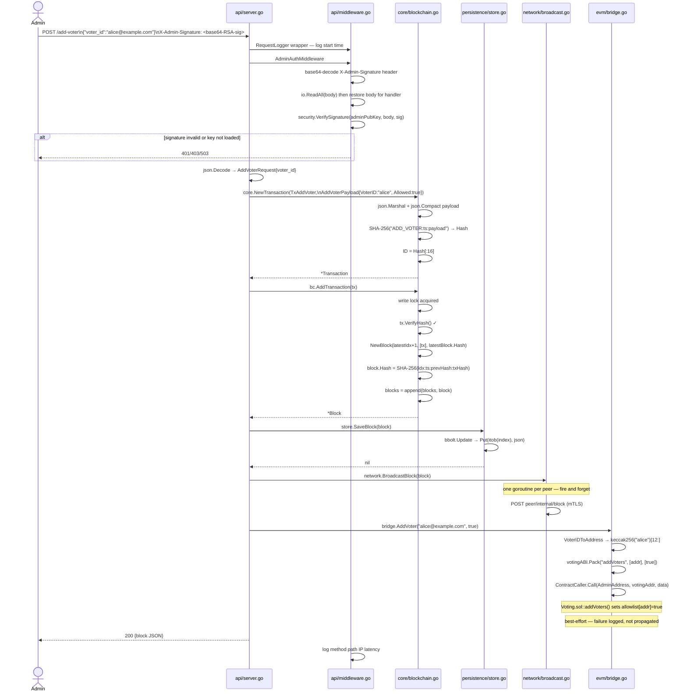
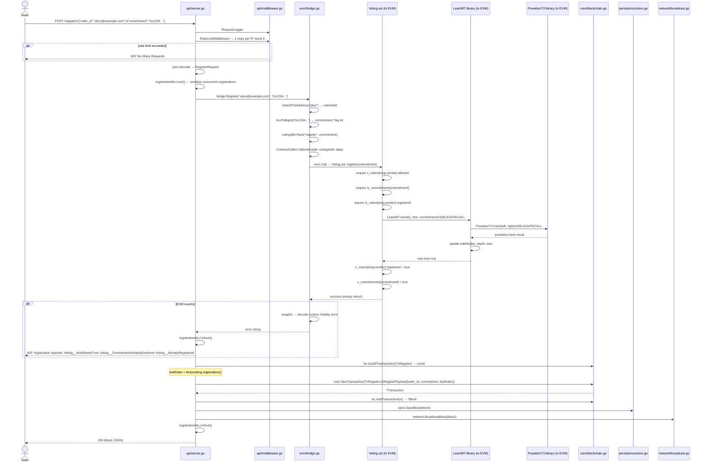
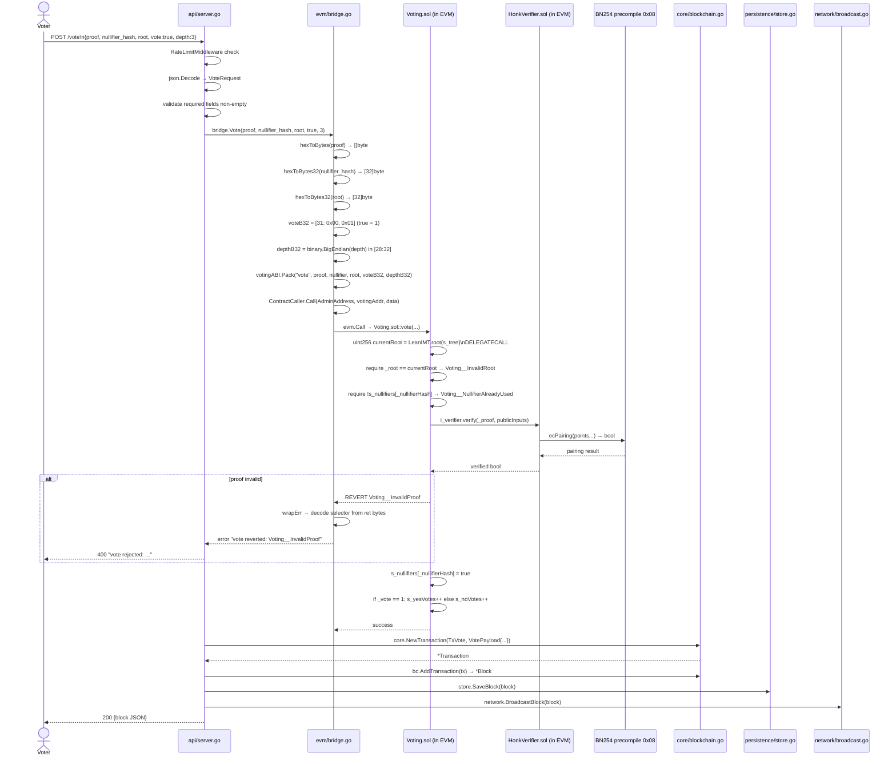
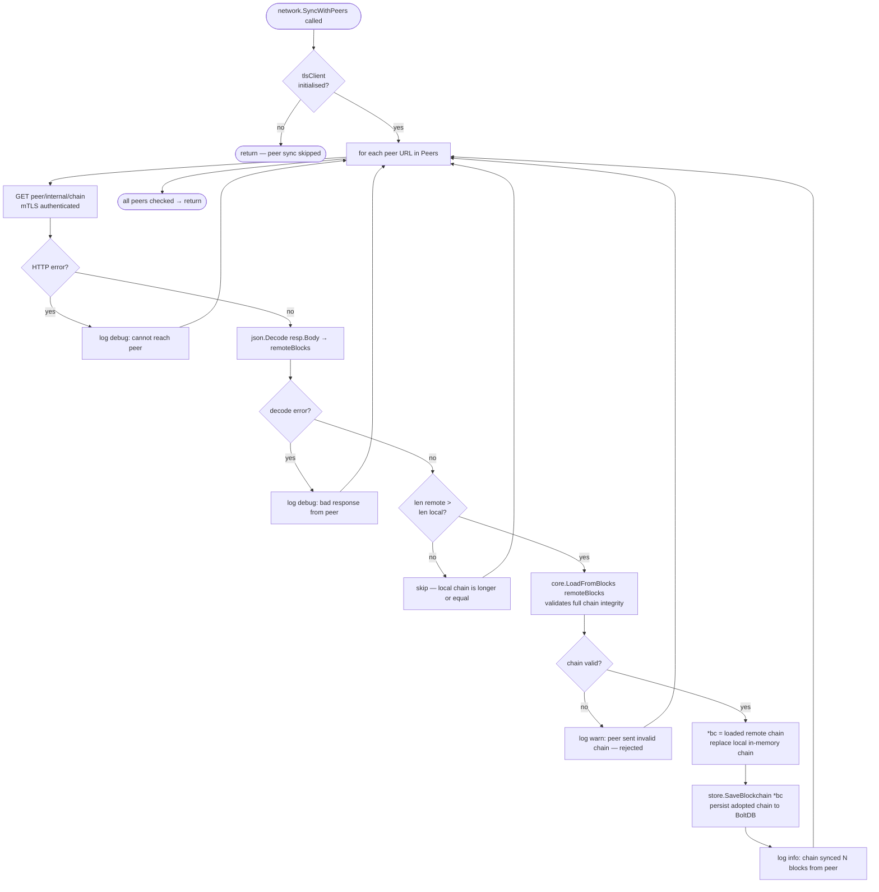
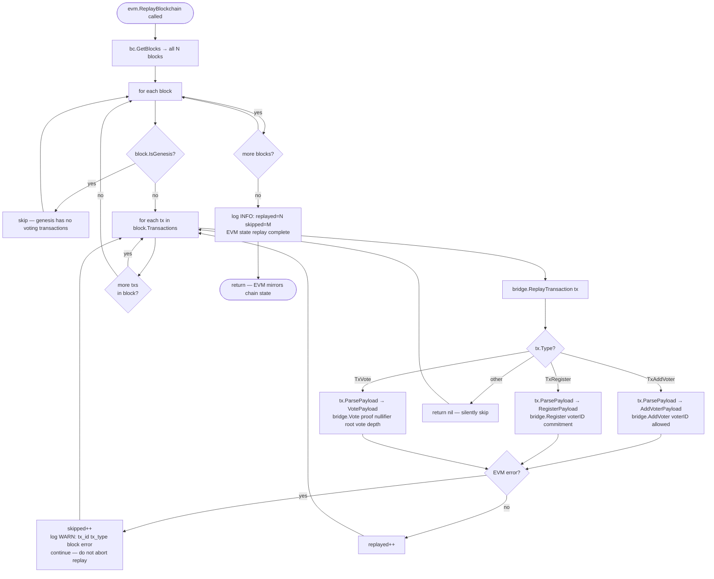
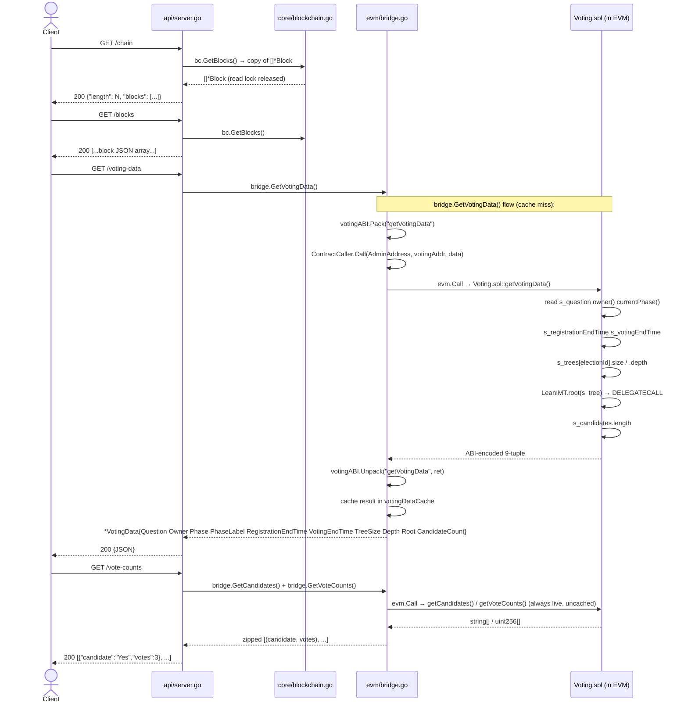

# ZK Voting Blockchain — Complete Codebase Overview

This document covers every source file in `packages/blockchain`: what each file does, every function in it, and annotated flow diagrams for each use case the system handles.

---

## Architecture at a Glance

The node is a single Go binary composed of six packages plus one entry-point.

```
packages/blockchain/
├── cmd/node/main.go          ← entry point — wires all packages together
│
└── internal/
    ├── core/                 ← chain data structures: transactions, blocks, blockchain
    ├── evm/                  ← embedded Geth EVM + Solidity contract bridge
    ├── api/                  ← HTTP handlers + middleware stack
    ├── network/              ← peer list, mTLS broadcast, chain sync
    ├── persistence/          ← BoltDB on-disk block storage
    └── security/             ← RSA admin auth + mTLS certificate loading
```

### Layer Diagram

```
┌─────────────────────────────────────────────────────────────────┐
│  Browser / Admin Client                                          │
│  POST /register  POST /vote  POST /add-voter  GET /chain        │
└────────────────────────┬────────────────────────────────────────┘
                         │ HTTPS (mTLS enforced on P2P routes)
┌────────────────────────▼────────────────────────────────────────┐
│  internal/api  (server.go + middleware.go)                       │
│  CORS · Rate limiting · Admin RSA auth · Request logging        │
└──────┬─────────────────┬──────────────────────────┬────────────┘
       │                 │                          │
┌──────▼──────┐   ┌──────▼──────┐          ┌───────▼──────┐
│ internal/   │   │ internal/   │          │ internal/    │
│ core/       │   │ evm/        │          │ network/     │
│             │   │             │          │              │
│ Blockchain  │   │ Geth EVM    │          │ P2P broadcast│
│ Block       │   │ Voting.sol  │          │ Chain sync   │
│ Transaction │   │ HonkVerifier│          │ mTLS client  │
└──────┬──────┘   └─────────────┘          └──────────────┘
       │
┌──────▼──────┐   ┌─────────────┐
│ internal/   │   │ internal/   │
│ persistence/│   │ security/   │
│ BoltDB      │   │ RSA + TLS   │
└─────────────┘   └─────────────┘
```

### Key design choices

| Property | How it is achieved |
|---|---|
| No mining / no gas | Authority model — admin commits blocks on-demand |
| Anonymous voting | ZK proof (Noir UltraHonk) is the only auth on `/vote` — no voter ID |
| Tamper detection | SHA-256 hash chain; every block commits all tx hashes |
| Double-vote prevention | Nullifier hash stored in Solidity contract; rejected on reuse |
| Deterministic EVM state | `ReplayBlockchain` re-runs every block after restart |
| Sybil resistance | Poseidon commitment in LeanIMT Merkle tree; one leaf per voter |
| ZK proof verification | Embedded Geth EVM runs `HonkVerifier.sol` using BN254 precompile `0x08` |

---

## File Reference

---

### `cmd/node/main.go`

**Purpose:** Application entry point. Boots every subsystem in the correct dependency order and blocks indefinitely on the HTTP/TLS server.

| Function | Signature | Description |
|---|---|---|
| `main` | `func main()` | Full boot sequence: logger → storage → EVM → TLS → auth → network sync → contract bridge → state replay → API server |
| `genesisQuestion` | `func genesisQuestion(bc *core.Blockchain) string` | Reads the voting question from the genesis block's `GenesisPayload`; falls back to `"Do you support this proposal?"` if the genesis is unreadable |

**Startup order (order is required by dependencies):**

1. `persistence.NewFileStore` — BoltDB must exist before blockchain can load
2. `store.LoadBlockchain` / `core.NewBlockchain` — chain in memory before EVM
3. `evm.NewStateManager` + `evm.CreateStatelessEVM` — EVM ready before contract bridge
4. `security.LoadTLSConfig` — TLS config ready before network client
5. `api.InitAuth` — RSA public key loaded (non-fatal if missing)
6. `network.InitNetworkClient` — mTLS HTTP client built before peer sync
7. `network.SyncWithPeers` — adopt longest chain before deploying contracts
8. `evm.NewContractBridge` — deploy 4 contracts into fresh EVM
9. `evm.ReplayBlockchain` — replay all persisted blocks into EVM state
10. `api.InitServer` + `api.StartServer` — begin accepting requests last

---

### `internal/core/types.go`

**Purpose:** Defines all transaction types and their payloads. Every operation that can be recorded on the chain is expressed as one of these structs.

| Symbol | Kind | Description |
|---|---|---|
| `TxType` | `type string` | Enum alias for transaction type names |
| `TxAddVoter` | `const "ADD_VOTER"` | Admin adds or revokes a voter from the allowlist |
| `TxRegister` | `const "REGISTER"` | Voter records their Poseidon commitment into the Merkle tree |
| `TxVote` | `const "VOTE"` | Anonymous vote submission — carries ZK proof, no voter identity |
| `Transaction` | `struct` | A single chain operation: `ID`, `Type`, `Timestamp`, `Payload` (raw JSON), `Hash` |
| `NewTransaction` | `func(TxType, interface{}) (*Transaction, error)` | Marshals `payload` to JSON, computes SHA-256 hash over `type:timestamp:compact_payload`, assigns `ID = Hash[:16]` |
| `computeHash` | `func(*Transaction) string` | SHA-256 of `"type:timestamp:compacted_payload"` — payload is whitespace-normalised via `json.Compact` for determinism across round-trips |
| `VerifyHash` | `func(*Transaction) bool` | Re-derives hash and compares; returns `false` if any field was tampered with |
| `ParsePayload` | `func(*Transaction, interface{}) error` | `json.Unmarshal` of the raw JSON payload into a typed struct |
| `AddVoterPayload` | `struct` | `VoterID string`, `Allowed bool` |
| `RegisterPayload` | `struct` | `VoterID string`, `Commitment string` (hex Poseidon), `LeafIndex uint64` |
| `VotePayload` | `struct` | `Proof string`, `NullifierHash string`, `Root string`, `Vote bool`, `Depth uint32` — NO voter identity field |
| `GenesisPayload` | `struct` | `Action string`, `Question string`, `Version string` — embedded in block 0 only |

---

### `internal/core/block.go`

**Purpose:** Defines the `Block` structure and its hash-chaining logic. Each block is a tamper-evident container of transactions cryptographically linked to the previous block.

| Function | Signature | Description |
|---|---|---|
| `NewBlock` | `func(index uint64, transactions []Transaction, prevHash string) *Block` | Creates a block at `time.Now()`, links it to `prevHash`, computes and stores the block hash |
| `computeHash` | `func(*Block) string` | SHA-256 of `"index:timestamp:prevHash:tx1.Hash,tx2.Hash,..."` — any change to any transaction propagates to the block hash |
| `VerifyHash` | `func(*Block) bool` | Re-derives hash and compares — detects any modification after creation |
| `HasTransactions` | `func(*Block) bool` | `len(Transactions) > 0` |
| `IsGenesis` | `func(*Block) bool` | `Index == 0 && PrevHash == GenesisBlockPrevHash` |
| `TransactionCount` | `func(*Block) int` | `len(Transactions)` |
| `GetTransactionsByType` | `func(*Block, TxType) []Transaction` | Filters and returns only transactions of the given type |

**Constants:**
- `GenesisBlockPrevHash` — 64-character zero string; the sentinel value marking block 0 as having no predecessor

---

### `internal/core/genesis.go`

**Purpose:** Creates block 0 — the immutable root of the chain. Records the voting question and protocol version so every node can derive the same contract state.

| Function | Signature | Description |
|---|---|---|
| `CreateGenesisBlock` | `func(question string) *Block` | Builds a `GenesisPayload{Action:"GENESIS", Question:question, Version:"1.0.0"}`, wraps it in a `TxAddVoter` transaction, creates block at index 0 with the all-zeros `PrevHash` |

> `TxAddVoter` is reused for the genesis transaction as a container of convenience. The `Action: "GENESIS"` field distinguishes it semantically. `ReplayBlockchain` skips genesis blocks entirely.

---

### `internal/core/blockchain.go`

**Purpose:** Thread-safe, append-only chain manager. The single authoritative in-memory store for the current blockchain state.

| Function | Signature | Description |
|---|---|---|
| `NewBlockchain` | `func(question string) *Blockchain` | Creates genesis block via `CreateGenesisBlock` and returns a new `Blockchain` |
| `LoadFromBlocks` | `func([]*Block) (*Blockchain, error)` | Reconstructs a `Blockchain` from a persisted slice; runs `validateChainInternal` before returning — rejects corrupted data |
| `AddBlock` | `func(*Blockchain, []Transaction) (*Block, error)` | Write-locks the chain, verifies all tx hashes, creates a new block linked to the tip, appends it |
| `AddTransaction` | `func(*Blockchain, *Transaction) (*Block, error)` | Convenience wrapper: calls `AddBlock` with a single transaction |
| `GetLatestBlock` | `func(*Blockchain) *Block` | Returns the last block (read lock) |
| `GetBlock` | `func(*Blockchain, uint64) (*Block, error)` | Returns block at given index (read lock); errors if out of range |
| `GetBlocks` | `func(*Blockchain) []*Block` | Returns a shallow copy of the block slice (safe for the caller to iterate without affecting the chain) |
| `Len` | `func(*Blockchain) int` | Total block count including genesis |
| `Height` | `func(*Blockchain) uint64` | Index of the latest block (`Len - 1`) |
| `GetAllTransactions` | `func(*Blockchain, TxType) []Transaction` | Scans every block for matching transactions; pass `""` to get all types |
| `ValidateChain` | `func(*Blockchain) error` | Full integrity check (acquires read lock, delegates to `validateChainInternal`) |
| `validateChainInternal` | `func(*Blockchain) error` | Validates: genesis sentinel, each block's hash, PrevHash linkage, sequential indices, non-decreasing timestamps, each tx hash — used by both `ValidateChain` and `LoadFromBlocks` |
| `AppendExternalBlock` | `func(*Blockchain, *Block) error` | Accepts a block received from a peer; validates hash, PrevHash match, sequential index, timestamp order, and all tx hashes before appending — does NOT re-create the block so the original hash is preserved |
| `PrintChain` | `func(*Blockchain)` | Debug utility: prints a formatted table of all blocks and transactions to stdout |

---

### `internal/persistence/store.go`

**Purpose:** Durable ACID storage for the blockchain using BoltDB (bbolt). Blocks are stored as JSON-encoded values keyed by their 8-byte big-endian index, guaranteeing correct sequential ordering on disk.

| Function | Signature | Description |
|---|---|---|
| `NewFileStore` | `func(dataDir string) (*FileStore, error)` | Opens (or creates) `blockchain.db` inside `dataDir`; creates the `"blocks"` bucket if it does not exist |
| `Close` | `func(*FileStore) error` | Safely closes the BoltDB file handle |
| `itob` | `func(uint64) []byte` | Converts a block index to 8-byte big-endian — BoltDB sorts keys lexicographically, so big-endian encoding preserves numeric order |
| `SaveBlock` | `func(*FileStore, *core.Block) error` | Marshals one block to JSON and writes it under key `itob(block.Index)` in a single ACID transaction |
| `SaveBlockchain` | `func(*FileStore, *core.Blockchain) error` | Batch-writes every block in the chain within a single BoltDB transaction; used for genesis save and chain-sync adoption |
| `LoadBlockchain` | `func(*FileStore) (*core.Blockchain, error)` | Iterates all keys in the bucket in ascending order, deserialises each block, then calls `core.LoadFromBlocks` which validates the entire chain before returning |

---

### `internal/security/tls.go`

**Purpose:** Loads mutual-TLS certificates for securing all node-to-node communication.

| Function | Signature | Description |
|---|---|---|
| `LoadTLSConfig` | `func(certFile, keyFile, caFile string) (*tls.Config, error)` | Loads the node's certificate + private key and the CA certificate; sets `ClientAuth: tls.RequireAndVerifyClientCert` so only nodes holding valid certificates from the same CA can connect |

---

### `internal/security/rsa.go`

**Purpose:** Verifies RSA signatures on admin requests. Prevents unauthorised calls to `/add-voter` — the private key never leaves the admin's machine.

| Function | Signature | Description |
|---|---|---|
| `LoadPublicKey` | `func(path string) (*rsa.PublicKey, error)` | Reads a PEM file and parses the PKIX-encoded RSA public key |
| `VerifySignature` | `func(pub *rsa.PublicKey, data []byte, signature []byte) error` | SHA-256 hashes `data`, verifies against `signature` using PKCS1v15; returns non-nil error if the signature is invalid or the key does not match |

---

### `internal/network/peers.go`

**Purpose:** Loads the peer URL list from the environment at package init time, making it available to both `broadcast.go` and `sync.go`.

| Symbol | Kind | Description |
|---|---|---|
| `Peers` | `var []string` | Slice of peer base URLs (e.g. `"https://node2:3002"`) populated from the `PEERS` env var (comma-separated) at `init` time |
| `init` | `func()` | Runs automatically on import; splits `PEERS` on commas, trims whitespace, discards empty entries |

---

### `internal/network/broadcast.go`

**Purpose:** Fans out a newly minted block to all known peers over mTLS immediately after a local commit.

| Symbol | Kind | Description |
|---|---|---|
| `tlsClient` | `var *http.Client` | Shared mTLS HTTP client; `nil` until `InitNetworkClient` is called |
| `InitNetworkClient` | `func(*tls.Config)` | Constructs the mTLS `http.Client` using the node's own certificate for outbound connections |
| `BroadcastBlock` | `func(core.Block)` | Marshals the block to JSON and POSTs it to `{peer}/internal/block` for every peer in `Peers`; each peer gets its own goroutine (fire-and-forget — failures are logged, not retried) |

---

### `internal/network/sync.go`

**Purpose:** On startup, fetches the chain from each peer and adopts the longest valid one — the Nakamoto longest-chain rule applied to a single-admin chain.

| Function | Signature | Description |
|---|---|---|
| `SyncWithPeers` | `func(bc **core.Blockchain, store interface{SaveBlockchain(*core.Blockchain) error})` | Iterates `Peers`; GETs `/internal/chain` from each; if the remote chain is longer than the local chain, validates it with `core.LoadFromBlocks` and replaces `*bc`; persists the adopted chain to BoltDB |

---

### `internal/api/middleware.go`

**Purpose:** HTTP middleware stack. Every middleware is a function that wraps an `http.HandlerFunc` and returns a new `http.HandlerFunc`.

| Function | Signature | Description |
|---|---|---|
| `RequestLogger` | `func(http.HandlerFunc) http.HandlerFunc` | Logs method, path, remote IP, and latency (via zerolog) for every request |
| `InitAuth` | `func(pubKeyPath string) error` | Calls `security.LoadPublicKey` and stores the result in the package-level `adminPubKey`; returns error (non-fatal to the caller) if the file is missing |
| `AdminAuthMiddleware` | `func(http.HandlerFunc) http.HandlerFunc` | Extracts `X-Admin-Signature` header, base64-decodes it, reads + restores the request body, calls `security.VerifySignature`; returns 503 if auth not configured, 401 if header missing, 403 if signature invalid |
| `getIPLimiter` | `func(ip string) *rate.Limiter` | Returns (creating if needed) a token-bucket rate limiter for the given IP address — 1 request/second sustained, burst of 5 |
| `RateLimitMiddleware` | `func(http.HandlerFunc) http.HandlerFunc` | Extracts client IP, calls `getIPLimiter`, returns 429 if the bucket is empty |
| `CORSMiddleware` | `func(allowedOrigin string, http.Handler) http.Handler` | Adds `Access-Control-Allow-*` response headers; short-circuits `OPTIONS` preflight requests with 200 without reaching any handler |

---

### `internal/api/server.go`

**Purpose:** HTTP route registration and all request handlers. Every write handler follows the same pattern: validate input → call EVM (if bridge available) → commit to chain → persist → broadcast → respond.

**Package-level state (set by `InitServer`):**

| Variable | Type | Description |
|---|---|---|
| `bc` | `*core.Blockchain` | The live in-memory chain |
| `store` | `*persistence.FileStore` | BoltDB handle for durable writes |
| `bridge` | `*evm.ContractBridge` | Nil in Stage 1/2 mode (no artifacts); non-nil enables EVM validation |
| `registrationMu` | `sync.Mutex` | Serialises all `/register` requests so `LeafIndex` assignment and block append are atomic — prevents two concurrent registrations claiming the same Merkle leaf index |

| Function | Signature | Description |
|---|---|---|
| `InitServer` | `func(*core.Blockchain, *persistence.FileStore, *evm.ContractBridge)` | Stores shared state in package-level variables used by all handlers |
| `StartServer` | `func(port string, tlsConfig *tls.Config)` | Registers all routes on a `ServeMux`, wraps it in `CORSMiddleware`, starts the TLS server |
| `handleHealth` | handler | `GET /health` — returns `{"status":"ok"}` |
| `handleGetChain` | handler | `GET /chain` — returns `{length, blocks}` JSON |
| `handleGetBlocks` | handler | `GET /blocks` — returns bare `[]*Block` array |
| `handleAddVoter` | handler | `POST /add-voter` (requires `AdminAuthMiddleware`) — creates `TxAddVoter` block, persists, broadcasts, then calls `bridge.AddVoter` as best-effort EVM update |
| `handleRegister` | handler | `POST /register` (requires `RateLimitMiddleware`) — acquires `registrationMu`, calls `bridge.Register` first (EVM is the gatekeeper), then creates the `TxRegister` block with the correct `LeafIndex` |
| `handleVote` | handler | `POST /vote` (requires `RateLimitMiddleware`) — calls `bridge.Vote` to verify the ZK proof via the EVM; only if the EVM accepts does it create and commit the `TxVote` block |
| `handleReceiveBlock` | handler | `POST /internal/block` (P2P, mTLS) — calls `bc.AppendExternalBlock`, persists, then replays each transaction via `bridge.ReplayTransaction` to keep local EVM state in sync |
| `handleSendChain` | handler | `GET /internal/chain` (P2P, mTLS) — returns raw `[]*Block` for peer sync |

---

### `internal/evm/vm.go`

**Purpose:** Creates and configures the embedded Geth EVM instance. The specific hardfork combination is critical for both ZK proof verification and correct DELEGATECALL gas handling.

| Function | Signature | Description |
|---|---|---|
| `NewStateManager` | `func() (*StateManager, error)` | Creates an in-memory `rawdb.MemoryDatabase`, initialises an empty `state.StateDB` with zero root |
| `GetStateDB` | `func(*StateManager) *state.StateDB` | Accessor for the underlying Geth `StateDB` |
| `CreateStatelessEVM` | `func(*state.StateDB) *vm.EVM` | Constructs `BlockContext` (spoofed values, zero base fee, 1B gas limit), `TxContext` (zero gas price), `ChainConfig` (see table below), and returns `vm.NewEVM(...)` with `NoBaseFee: true` |

**Chain config (`params.ChainConfig`) — every fork is deliberate:**

| Fork | Field | Why required |
|---|---|---|
| Homestead | `HomesteadBlock: 0` | Introduces `DELEGATECALL` opcode used by Solidity external libraries |
| **EIP-150** | **`EIP150Block: 0`** | **Tangerine Whistle: 63/64 gas forwarding rule for CALL/DELEGATECALL. Without it, `callGas()` forwards ALL available gas; combined with EIP-2929's cold-account base cost (2600 gas, Berlin), this causes `baseCost + forwardedGas > available` → OOG before LeanIMT runs a single opcode** |
| EIP-155/158 | `EIP155Block: 0`, `EIP158Block: 0` | Replay protection and state clearing |
| Byzantium | `ByzantiumBlock: 0` | Adds `REVERT` opcode (needed for Solidity custom errors) + `ecAdd`/`ecMul`/`ecPairing` precompiles |
| Constantinople | `ConstantinopleBlock: 0` | `CREATE2`, bit-shift opcodes |
| Petersburg | `PetersburgBlock: 0` | Removes broken `PUSHJUMPDEST` check |
| **Istanbul** | **`IstanbulBlock: 0`** | **EIP-1108: reduces BN254 `ecPairing` precompile (address `0x08`) cost from 100,000 to 45,000 gas per pairing — required for the UltraHonk ZK verifier to complete within budget** |
| **Berlin** | **`BerlinBlock: 0`** | **EIP-2929: access-list gas schedule — matches what Solidity 0.8+ compiles for SLOAD/SSTORE/CALL** |
| London | *(omitted)* | EIP-1559 BASEFEE and fee market are irrelevant in an authority model with no fee pressure |

---

### `internal/evm/contract.go`

**Purpose:** Low-level wrapper over the Geth EVM that exposes `Call` and `Deploy` with a fixed, effectively unlimited gas budget.

| Symbol | Kind | Description |
|---|---|---|
| `ContractCaller` | `struct` | Holds the `*vm.EVM` instance |
| `NewContractCaller` | `func(*vm.EVM) *ContractCaller` | Constructor |
| `gasLimit` | `const uint64 = 1_000_000_000` | 1 billion gas — no fee market in this authority-model chain so gas is not an economic constraint |
| `Call` | `func(*ContractCaller, from, to common.Address, data []byte) ([]byte, uint64, error)` | Calls `evm.Call(AccountRef(from), to, data, gasLimit, 0)` — executes a deployed contract function and returns raw ABI-encoded output bytes |
| `Deploy` | `func(*ContractCaller, from common.Address, initCode []byte) (common.Address, []byte, error)` | Calls `evm.Create(AccountRef(from), initCode, gasLimit, 0)` — runs the constructor and installs the runtime bytecode at the deterministic `CREATE` address |
| `InstallRuntimeCode` | `func(*ContractCaller, addr common.Address, runtimeCode []byte)` | Writes bytecode directly to `StateDB` without running a constructor; escape hatch for runtime-only scenarios |

---

### `internal/evm/artifacts.go`

**Purpose:** Loads and parses Hardhat JSON artifacts; performs Solidity library placeholder substitution before hex-decoding bytecode.

| Symbol | Kind | Description |
|---|---|---|
| `contractArtifact` | `struct` | Subset of a Hardhat JSON artifact: `ABI json.RawMessage`, `Bytecode string` (0x-prefixed hex) |
| `loadArtifact` | `func(assetsDir, filename string) (*contractArtifact, error)` | Reads and JSON-parses an artifact file; returns error if ABI or bytecode is empty (catches missing or incompletely compiled files) |
| `parsedABI` | `func(*contractArtifact) (abi.ABI, error)` | Parses the raw ABI JSON into a Geth `abi.ABI` object used for encoding function calls and decoding return values |
| `decodedBytecode` | `func(*contractArtifact) ([]byte, error)` | Strips the `0x` prefix and hex-decodes; will fail with `invalid byte` if any unresolved library placeholders remain (indicating a missing linking step) |
| `decodedLinkedBytecode` | `func(*contractArtifact, map[string]string) ([]byte, error)` | Iterates the `libraries` map and replaces each `__$<34-hex>$__` placeholder with the 40-char lowercase address hex using `strings.ReplaceAll`, then hex-decodes the result |

**Library placeholder format** (exactly 40 chars — same width as an Ethereum address in hex):
```
Voting.json  contains: __$99c94127c8f73905b08f2d52133ba9abca$__  ← LeanIMT
LeanIMT.json contains: __$75f79a42d9bcbdbb69ad79ebd80f556f39$__  ← PoseidonT3
```
These are `keccak256(import_path)[0:17]` values embedded by the Hardhat compiler. Substitution replaces them with the deployed library's address so the bytecode can be hex-decoded cleanly.

---

### `internal/evm/bridge.go`

**Purpose:** High-level typed Go interface to `Voting.sol`. Deploys all four contracts in a deterministic order and exposes one method per Solidity function. This is the single integration point between the Go blockchain and Solidity.

| Symbol | Kind | Description |
|---|---|---|
| `AdminAddress` | `var common.Address` | `0x0000…1337` — fixed authority address used as `msg.sender` for all admin EVM calls and as deployer so contract addresses are identical across sessions |
| `leanIMTPlaceholder` | `const` | `__$99c94127c8f73905b08f2d52133ba9abca$__` — Hardhat-generated hash of the LeanIMT import path |
| `poseidonT3Placeholder` | `const` | `__$75f79a42d9bcbdbb69ad79ebd80f556f39$__` — Hardhat-generated hash of the PoseidonT3 import path |
| `ContractBridge` | `struct` | Holds `caller *ContractCaller`, `votingAddr common.Address`, `votingABI abi.ABI`, `mu sync.Mutex`, `votingDataCache *VotingData`, `voterDataCache map[string]*VoterData` |
| `Phase` | `type uint8` | Mirrors `Voting.sol`'s `Phase` enum: `PhaseSetup`, `PhaseRegistration`, `PhaseVoting`, `PhaseEnded`; `String()` returns the label used by `PHASE_LABELS` in the admin UI |
| `VotingData` | `struct` | Mirror of `getVotingData()` return: `Question`, `Owner`, `Phase`, `PhaseLabel`, `RegistrationEndTime`, `VotingEndTime`, `TreeSize`, `Depth`, `Root`, `CandidateCount` |
| `VoterData` | `struct` | Mirror of `getVoterData()` return: `Allowed bool`, `Registered bool` |

**`NewContractBridge` — 4-step deterministic deployment:**

| Step | Nonce | Contract | Linking needed |
|---|---|---|---|
| 1 | 0 | `HonkVerifier` | none |
| 2 | 1 | `PoseidonT3` | none |
| 3 | 2 | `LeanIMT` | replace `poseidonT3Placeholder` with `poseidonAddr` |
| 4 | 3 | `Voting` | replace `leanIMTPlaceholder` with `leanIMTAddr`; append constructor args `(admin, verifier, question, candidates)` |

Because `AdminAddress` and the nonce are fixed, the four addresses are identical on every node and after every restart.

**Methods on `ContractBridge`:**

| Method | Calls Solidity | Description |
|---|---|---|
| `VotingAddress()` | — | Returns the deployed `Voting.sol` address |
| `VoterIDToAddress(voterID)` | — | `keccak256(voterID)[12:]` → deterministic 20-byte address; same voter ID always maps to the same address |
| `AddVoter(voterID, allowed)` | `addVoters([addr], [bool])` | Marks voter eligible (or revoked); Setup phase only |
| `Register(voterID, commitment)` | `register(uint256)` | Inserts the Poseidon commitment into the on-chain LeanIMT Merkle tree; caller is the voter's derived address so `msg.sender` checks pass; Registration phase only; returns the leaf's index |
| `Vote(proof, nullifier, root, candidateIndex, depth)` | `vote(bytes, bytes32, bytes32, bytes32, bytes32)` | EVM runs `HonkVerifier.verify()` using BN254 precompile `0x08`; also checks root validity, nullifier uniqueness, and candidate index bounds; Voting phase only |
| `SetQuestion(question)` | `setQuestion(string)` | Updates the ballot question; Setup phase only |
| `SetCandidates(candidates)` | `setCandidates(string[])` | Replaces the entire candidate list; Setup phase only |
| `StartRegistration(durationSec)` | `startRegistration(uint256)` | Setup → Registration, opens a window of `durationSec` |
| `StartVoting(durationSec)` | `startVoting(uint256)` | Registration → Voting, opens a window of `durationSec` |
| `EndElection()` | `endElection()` | Ends early (Registration or Voting → Ended) |
| `ResetElection()` | `resetElection()` | Clears all state, bumps the contract's internal `electionId`, returns to Setup; fully clears `voterDataCache` |
| `GetVotingData()` | `getVotingData()` | Returns question, owner, phase, deadlines, tree state, and candidate count (cached) |
| `GetVoterData(voterID)` | `getVoterData(addr)` | Returns allowlisted + registered status for a voter (cached per voterID) |
| `GetCandidates()` | `getCandidates()` | Returns the current candidate list (always live, not cached) |
| `GetVoteCounts()` | `getVoteCounts()` | Returns per-candidate vote counts, indexed the same as `GetCandidates()` (always live, not cached) |
| `wrapErr(evmErr, ret, callSite)` | — | Decodes ABI-encoded revert reasons: standard `Error(string)`, `Panic(uint256)`, or custom Solidity errors defined in the ABI |
| `hexToBigInt(h)` | — | Hex string (±`0x`) → `*big.Int` |
| `hexToBytes(h)` | — | Hex string (±`0x`) → `[]byte` |
| `hexToBytes32(h)` | — | Hex string → right-aligned `[32]byte` (big-endian) |
| `normalizeHex(h)` | — | Pads a hex string with a leading `0` if it has odd length |

---

### `internal/evm/replay.go`

**Purpose:** Reconstructs the EVM state deterministically from the blockchain after a restart, and provides the single-transaction replay method used by the P2P receive handler.

| Function | Signature | Description |
|---|---|---|
| `ReplayBlockchain` | `func(bc *core.Blockchain, bridge *ContractBridge)` | Iterates every non-genesis block; for each transaction calls `bridge.ReplayTransaction`; errors are logged as warnings and do not abort — pre-Stage-3 blocks may lack valid ZK proofs |
| `ReplayTransaction` | `func(*ContractBridge, core.Transaction) error` | Switches on `tx.Type`: dispatches to `AddVoter`, `Register`, `Vote`, `SetQuestion`, `SetCandidates`, `StartRegistration`, `StartVoting`, `EndElection`, or `ResetElection` on the bridge; genesis and unknown types return `nil` silently |

---

## Use Case Flow Diagrams

---

### UC-1: Node Startup

Complete initialisation sequence from `main.go` to the moment the server is ready for requests.

```mermaid
flowchart TD
    A([go run cmd/node/main.go]) --> B[Load .env · configure zerolog\nNODE_ID → port & dataDir]
    B --> C[persistence.NewFileStore\nopen BoltDB data_NODE_ID/blockchain.db]

    C --> D{blockchain.db\nhas blocks?}
    D -- yes --> E[store.LoadBlockchain\ndeserialise + ValidateChain]
    D -- no --> F[core.NewBlockchain\ncreate genesis block with question]
    F --> G[store.SaveBlockchain\npersist genesis to BoltDB]
    E --> H
    G --> H

    H[evm.NewStateManager\nrawdb.NewMemoryDatabase + state.StateDB]
    H --> I[evm.CreateStatelessEVM\nHomestead+EIP150+Istanbul+Berlin\n1B gas limit · NoBaseFee]
    I --> J[evm.NewContractCaller\nwrap EVM instance]

    J --> K[security.LoadTLSConfig\nload server.crt + server.key + CA]
    K --> L{admin_public.pem\npresent?}
    L -- yes --> M[api.InitAuth\nload RSA public key into adminPubKey]
    L -- no --> N[WARN: /add-voter will return 503]
    M --> O
    N --> O

    O[network.InitNetworkClient\nbuild mTLS http.Client with node cert]
    O --> P[network.SyncWithPeers\nfor each peer: GET /internal/chain\nadopt longest valid chain\npersist if adopted]

    P --> Q{assets/ has\nVoting.json etc?}
    Q -- yes --> R[evm.NewContractBridge\nassetsDir question]
    Q -- no --> S[WARN: running in storage-only mode\nbridge = nil]
    S --> W

    R --> R1[Deploy HonkVerifier nonce=0]
    R1 --> R2[Deploy PoseidonT3 nonce=1]
    R2 --> R3[Deploy LeanIMT nonce=2\nlink PoseidonT3 addr]
    R3 --> R4[Deploy Voting nonce=3\nlink LeanIMT addr\nconstructor: admin verifier question]
    R4 --> V[evm.ReplayBlockchain\nreplay every non-genesis block into EVM]
    V --> W

    W[api.InitServer\nset bc · store · bridge]
    W --> X[api.StartServer\nregister routes · TLS listen :NODE_ID]
    X --> Y([Server accepting requests])
```



---

### UC-2: Add Voter (Admin)

Admin registers a new voter via `POST /add-voter`. Requires a valid RSA signature over the request body.



---

### UC-3: Voter Registration

Voter submits a Poseidon commitment. The EVM validates eligibility **before** the block is written — invalid registrations never touch the chain.



---

### UC-4: Anonymous Vote with ZK Proof

The vote endpoint carries no voter identity. The ZK proof is the only authentication. The embedded EVM runs the full UltraHonk verifier before any block is written.



---

### UC-5: Receiving a Block from a Peer (P2P)

When a peer commits a block it broadcasts it here. This keeps all nodes on the same chain and the same EVM state.

```mermaid
sequenceDiagram
    actor PeerNode
    participant API as api/server.go
    participant Core as core/blockchain.go
    participant DB as persistence/store.go
    participant Replay as evm/replay.go
    participant Bridge as evm/bridge.go

    PeerNode->>API: POST /internal/block\n{block JSON}\n(mTLS — peer must present valid cert)

    API->>API: json.Decode → core.Block

    API->>Core: bc.AppendExternalBlock(&block)
    Core->>Core: write lock acquired
    Core->>Core: block.VerifyHash() ← SHA-256(idx:ts:prevHash:txHashes)
    Core->>Core: block.PrevHash == latestBlock.Hash ?
    Core->>Core: block.Index == latestIdx + 1 ?
    Core->>Core: block.Timestamp >= latestTimestamp ?
    Core->>Core: for each tx: tx.VerifyHash()
    alt any check fails
        Core-->>API: error message
        API-->>PeerNode: 409 Conflict
    end
    Core->>Core: blocks = append(blocks, &block)
    Core-->>API: nil

    API->>DB: store.SaveBlock(&block)
    DB->>DB: bbolt.Put(itob(block.Index), json)

    loop for each tx in block.Transactions
        API->>Replay: bridge.ReplayTransaction(tx)
        Replay->>Replay: switch tx.Type
        alt TxAddVoter
            Replay->>Bridge: bridge.AddVoter(voterID, allowed)
        else TxRegister
            Replay->>Bridge: bridge.Register(voterID, commitment)
        else TxVote
            Replay->>Bridge: bridge.Vote(proof, nullifier, root, vote, depth)
        end
        Note over Replay: errors logged as WARN — not propagated\n(chain is already committed; EVM sync is best-effort)
    end

    API-->>PeerNode: 200 {"status":"block accepted"}
```

---

### UC-6: Chain Sync on Startup (Longest-Chain Rule)

Before deploying contracts or serving requests, the node fetches chains from all peers and adopts the longest valid one.



---

### UC-7: State Replay on Restart

After deploying fresh contracts, the node re-executes every committed transaction to rebuild the EVM state deterministically.



---

### UC-8: Reading Chain Data

Any client can read the full chain or its current EVM state. No authentication required.



---

### UC-9: Contract Deployment in Detail

Expansion of the NewContractBridge step from startup — showing how library linking and constructor encoding work.

```mermaid
flowchart TD
    A([NewContractBridge called]) --> B

    subgraph S1 [Step 1 — HonkVerifier  nonce=0]
        B[loadArtifact HonkVerifier.json\nno library placeholders]
        B --> C[decodedBytecode\nstrip 0x · hex.DecodeString]
        C --> D[ContractCaller.Deploy AdminAddress initCode\nevm.Create → run constructor → install runtime]
        D --> E[verifierAddr = 0x03F1B438...73F5]
    end

    E --> F

    subgraph S2 [Step 2 — PoseidonT3  nonce=1]
        F[loadArtifact PoseidonT3.json\nno library placeholders]
        F --> G[decodedBytecode → hex.DecodeString]
        G --> H[ContractCaller.Deploy]
        H --> I[poseidonAddr = 0x910cBd66...64d8]
    end

    I --> J

    subgraph S3 [Step 3 — LeanIMT  nonce=2]
        J[loadArtifact LeanIMT.json\nbytecode contains:\n__$75f79a42d9bcbdbb69...39$__]
        J --> K["decodedLinkedBytecode(\n  poseidonT3Placeholder → hex.EncodeToString(poseidonAddr)\n)"]
        K --> L[strings.ReplaceAll replaces 40-char placeholder\nwith 40-char address hex → hex.DecodeString]
        L --> M[ContractCaller.Deploy]
        M --> N[leanIMTAddr = 0x008326...8741]
    end

    N --> O

    subgraph S4 [Step 4 — Voting  nonce=3]
        O[loadArtifact Voting.json\nbytecode contains:\n__$99c94127c8f739...ca$__]
        O --> P["decodedLinkedBytecode(\n  leanIMTPlaceholder → hex.EncodeToString(leanIMTAddr)\n)"]
        P --> Q[parsedABI → votingABI abi.ABI]
        Q --> R["votingABI.Pack(\"\", AdminAddress, verifierAddr, question, candidates)\n→ ABI-encoded constructor args"]
        R --> S[initCode = votingBytecode + constructorArgs]
        S --> T[ContractCaller.Deploy]
        T --> U[votingAddr = 0x9531b3F7...9469]
    end

    U --> V[return ContractBridge{caller votingAddr votingABI voterDataCache}]
```

---

## Data Flow Summary

```
WRITE PATH  (register / vote)
──────────────────────────────────────────────────────────────────

 Client
   │  POST /register or /vote
   ▼
 api/middleware.go
   │  RequestLogger → RateLimitMiddleware
   ▼
 api/server.go  (handleRegister / handleVote)
   │
   ├─► evm/bridge.go → evm/contract.go → vm.EVM (Geth)
   │     Solidity validates: allowlist · uniqueness · ZK proof
   │     EVM REJECTS → 400 error returned  (no block written)
   │     EVM ACCEPTS ─────────────────────────────────────────┐
   │                                                          │
   ├─► core/blockchain.go                                     │
   │     NewTransaction → AddTransaction                      │
   │     NewBlock → hash chain updated in memory              │
   │                                                          │
   ├─► persistence/store.go                                   │
   │     SaveBlock → BoltDB ACID write                        │
   │                                                          │
   └─► network/broadcast.go                                   │
         goroutine per peer: POST /internal/block             │
                                                              ▼
                                                   200 {block JSON}


READ PATH  (chain / blocks)
──────────────────────────────────────────────────────────────────

 Client
   │  GET /chain  or  GET /blocks
   ▼
 api/server.go
   └─► core/blockchain.go → GetBlocks() → copy of in-memory slice
         (no DB hit — full chain is always in memory)
         └─► 200 {blocks[]}


P2P PATH  (peer broadcasts a block)
──────────────────────────────────────────────────────────────────

 Peer Node
   │  POST /internal/block  (mTLS authenticated)
   ▼
 api/server.go → handleReceiveBlock
   ├─► core/blockchain.go → AppendExternalBlock
   │     validate hash · PrevHash · index · timestamps · tx hashes
   ├─► persistence/store.go → SaveBlock
   └─► evm/replay.go → ReplayTransaction per tx in block
         └─► evm/bridge.go → AddVoter / Register / Vote
```

---

## Dependencies

| Package | Library | Version | Role |
|---|---|---|---|
| `core` | stdlib only | — | Chain data structures; no external deps |
| `persistence` | `go.etcd.io/bbolt` | v1.4.3 | Embedded ACID key-value store for blocks |
| `evm` | `github.com/ethereum/go-ethereum` | v1.13.14 | Embedded EVM engine, ABI codec, state DB |
| `evm` | `github.com/holiman/uint256` | v1.3.2 | 256-bit integer type used by Geth APIs |
| `api` | `golang.org/x/time/rate` | v0.15.0 | Per-IP token-bucket rate limiter |
| `api`, `network` | `github.com/rs/zerolog` | v1.35.1 | Structured JSON/console logging |
| `cmd/node` | `github.com/joho/godotenv` | v1.5.1 | `.env` file loader for local development |

---

## Stage 3 Hardening Pass (2026-07-01)

A correctness review of the Stage 3 diff (contract bridge + state replay, plus the
`server.go`/`main.go` wiring that shipped alongside it) found three issues — one
critical, one moderate, one minor. All three are fixed below, with new regression
tests. `go build ./...`, `go vet ./...`, and `go test ./... -race` are all clean
after these changes (27 tests, 0 failures, 0 race reports).

### 🔴 Critical — no synchronization around the shared EVM state

**Problem.** `ContractBridge` wraps a single `*vm.EVM` / `*state.StateDB` shared by
the whole node. Geth's `state.StateDB` is built for single-threaded, one-call-at-a-time
execution and is explicitly not safe for concurrent use. But `internal/api/server.go`
calls into it from multiple goroutines with no lock at all:

- `handleVote` → `bridge.Vote(...)`
- `handleAddVoter` → `bridge.AddVoter(...)`
- `handleReceiveBlock` → `bridge.ReplayTransaction(...)` for every peer-broadcast block
- `handleRegister` → `bridge.Register(...)`, protected only by a local `registrationMu`
  that serialized `/register` against itself — not against `/vote`, `/add-voter`, or
  incoming P2P block replay touching the same `StateDB`.

Go's `net/http` runs each request in its own goroutine, so any two of the above firing
at once (which will happen the moment real voters hit `/vote` and `/register`
concurrently, or a P2P block arrives mid-request) could corrupt the trie/journal,
silently drop a mutation, or panic.

**Fix.** Added an unexported `mu sync.Mutex` field to `ContractBridge`
(`internal/evm/bridge.go`). Every exported method that touches the EVM —
`AddVoter`, `Register`, `Vote`, `GetVotingData`, `GetVoterData` — now locks `mu` for
the duration of its call. Internal call chains that need to read state without
re-entering the lock (Go's `sync.Mutex` is not reentrant) use an unexported
`*Locked` helper that assumes the caller already holds it — e.g. `Register` calls
`getVotingDataLocked()` directly instead of calling the public `GetVotingData()`.

No changes were needed in `server.go`'s handlers themselves: they already call
straight into `bridge.*`, so they inherited the new serialization for free.
`registrationMu` in `server.go` was kept — it still matters for ordering block
commits consistently with EVM insertion order and for the Stage 1/2 fallback path
(see below) — but it is no longer the only thing standing between concurrent EVM
calls and a corrupted state trie.

**Verification.** Added `TestBridge_ConcurrentAccess` (`internal/evm/bridge_test.go`):
20 goroutines interleave `AddVoter`/`GetVotingData`, then 20 more concurrently call
`Register` with distinct commitments. Run under `go test -race`, this reliably
tripped the race detector before the fix; it now passes clean, and every returned
leaf index is verified unique (proving calls are fully serialized, not just
individually race-free).

### 🟡 Moderate — `LeafIndex` could drift from the real Merkle index

**Problem.** `handleRegister` computed the commitment's leaf index as
`len(bc.GetAllTransactions(core.TxRegister))` — a count of every REGISTER
transaction ever committed to the chain. This is only correct if every REGISTER
transaction that was ever committed also successfully inserted into the EVM's
Merkle tree. That invariant can break in two ways:
1. A legacy Stage 1/2 REGISTER transaction that fails EVM replay validation (already
   handled gracefully — see `replay.go`'s skip-with-warning behavior) still counts
   toward this total even though it never became a real tree leaf, inflating the
   index for every registration after it.
2. The count-then-append was only guarded by `registrationMu`, which does not block
   a concurrent `/internal/block` receipt (from `handleReceiveBlock`) from appending
   another REGISTER transaction in between the count and the commit — a race between
   nodes, not just within one node.

**Fix.** `ContractBridge.Register` (`internal/evm/bridge.go`) now returns
`(leafIndex uint64, err error)` instead of just `error`. On success, it reads the
Voting contract's `TreeSize` via `getVotingDataLocked()` **inside the same critical
section as the insert** (same `mu` lock held throughout) and returns `TreeSize - 1`
— the exact index the contract itself assigned (mirrors the leaf index the contract
emits in its own `NewLeaf` event). This value is authoritative and cannot drift,
because it's read from the EVM after the mutation completes, still holding the lock
that serializes it against every other concurrent EVM call.

`handleRegister` (`internal/api/server.go`) now uses this returned index directly
when the bridge is available, and only falls back to the old transaction-count
approximation when `bridge == nil` (Stage 1/2 mode, where there is no EVM tree to
query — see below). `ReplayTransaction`'s `TxRegister` case (`internal/evm/replay.go`)
was updated to discard the new return value, since replay doesn't need it.

**Verification.** Added `TestRegister_LeafIndexIsSequential`
(`internal/evm/bridge_test.go`): registers three voters in sequence and asserts the
returned leaf index is exactly `0, 1, 2`. `TestBridge_ConcurrentAccess` (above) also
covers this under concurrency — 20 simultaneous registrations, no duplicate indices.

### 🟢 Minor — silent Stage 1/2 fallback had no way to become a hard failure

**Problem.** If `assets/*.json` (compiled Voting/HonkVerifier artifacts) are missing
or fail to load at startup, `main.go` logs a warning and continues in "storage-only
mode" — `bridge` stays `nil`, and `handleVote`/`handleRegister` skip EVM verification
entirely, accepting **any** proof or commitment with zero cryptographic checking.
This is useful for local development before artifacts are compiled, but there was no
way to make a misconfigured production deployment fail loudly instead of silently
accepting unverified votes.

**Fix.** `cmd/node/main.go` now reads a `REQUIRE_EVM` environment variable. When
`REQUIRE_EVM=true` and contract bridge deployment fails, the node now calls
`log.Fatal()` (refusing to start) instead of `log.Warn()` and continuing. The default
behavior (`REQUIRE_EVM` unset) is unchanged, so local dev workflows that don't have
artifacts compiled yet still work as before. The warning-path log message was also
expanded to explicitly say `/vote` and `/register` will accept unverified requests,
so the risk is visible even for operators not using `REQUIRE_EVM`.

**Verification.** Build/vet/test pass; this is a startup-path change with no
existing coverage, exercised manually by toggling `REQUIRE_EVM` with an invalid
`ASSETS_DIR` and confirming `log.Fatal` triggers.

### 📝 Documentation — `PLAN.md` status was stale

The diff that shipped alongside Stage 3 (`server.go`, `main.go`) already implements
meaningful parts of Stage 4 (EVM read calls gating `/vote` and `/register`, revert
decoding) and Stage 5 (full REST server, CORS, per-IP rate limiting, all endpoints
except a dedicated `/voting-data` read route) — but `PLAN.md`'s checklist still
listed both as entirely unstarted. Updated `PLAN.md`'s Stage 4/5 deliverable lists
and the "Current Status" checklist to mark what's actually done (`[x]`), what's
partially done (`[~]`), and what's still open, so the plan reflects the real state
of the code.

### Files touched in this pass

| File | Change |
|---|---|
| `internal/evm/bridge.go` | Added `mu sync.Mutex`; locked all EVM-touching methods; `Register` now returns `(uint64, error)` with the EVM-authoritative leaf index |
| `internal/evm/replay.go` | Updated `ReplayTransaction`'s `TxRegister` case for `Register`'s new two-value return |
| `internal/evm/bridge_test.go` | Added `TestRegister_LeafIndexIsSequential` and `TestBridge_ConcurrentAccess`; updated existing `Register` call sites for the new signature |
| `internal/api/server.go` | `handleRegister` uses the EVM-returned leaf index instead of a transaction count when the bridge is available |
| `cmd/node/main.go` | Added `REQUIRE_EVM` env var to turn a missing/broken contract bridge into a startup failure instead of a silent fallback |
| `PLAN.md` | Updated Stage 4/5 deliverables and Current Status to match actual implementation state |

---

## Stage 4: EVM-Powered API & Queries (2026-07-01)

Stage 4's remaining deliverables — dedicated read endpoints and state caching —
are now complete, on top of the read calls (`GetVotingData`/`GetVoterData`) and
revert decoding that already existed from Stage 3's wiring.

### New endpoints

| Method | Path | Auth | Description |
|---|---|---|---|
| GET | `/voting-data` | None | Live election tally + Merkle tree state: `question`, `owner`, `yes_votes`, `no_votes`, `tree_size`, `depth`, `root` |
| GET | `/voter/{voter_id}` | None | A single voter's on-chain status: `allowed`, `registered` |

Both are registered in `internal/api/server.go` using Go 1.22+'s method-and-path-
parameter `http.ServeMux` patterns (`"GET /voter/{voter_id}"`), which is why route
registration was pulled out of `StartServer` into a new `newMux()` function —
`StartServer` still builds the same route table, but `newMux()` alone can now be
driven through `httptest` without opening a real TLS listener, which is what the
new `internal/api/server_test.go` does.

Both handlers return `503 Service Unavailable` if the contract bridge is `nil`
(Stage 1/2 storage-only mode — there is no EVM state to query). `GET /voter/{voter_id}`
never reverts on an unknown voter; the contract's `getVoterData` simply returns the
Solidity mapping's zero values (`allowed: false, registered: false`) for an address
that was never added, so an unrecognized `voter_id` is a normal `200` response, not
a `404`.

`VotingData`/`VoterData` (`internal/evm/bridge.go`) gained `json:"..."` struct tags
(`snake_case`, matching the rest of the API's request/response bodies) so the
handlers can `json.Encode()` them directly with no separate DTO. `*big.Int` fields
(`yes_votes`, `tree_size`, `root`, etc.) are encoded as bare JSON numbers via
`encoding/json`'s default `big.Int` marshaling — simplest option, chosen knowingly
over stringifying them; a client parsing `root` (a ~254-bit field element) as a
JS `number` will lose precision, so any future frontend integration should parse
that field with a bignum-aware JSON parser rather than `JSON.parse`.

### State caching

`ContractBridge` (`internal/evm/bridge.go`) now memoizes read results instead of
issuing a live EVM `Call` on every `GetVotingData`/`GetVoterData` invocation:

- `votingDataCache *VotingData` — one cached snapshot of the whole election state.
- `voterDataCache map[string]*VoterData` — one entry per `voterID` actually queried.

Both live directly on `ContractBridge` and are guarded by the same `mu` mutex that
already serializes every EVM call (see the Stage 3 hardening pass above) — no
separate cache lock, no extra contention, and no risk of the cache and the EVM
state ever being read inconsistently relative to each other.

**Invalidation is per-write-method, not a blanket "clear everything on any write,"**
because each Solidity function only touches a known subset of the cached fields:

| Write | Invalidates | Why |
|---|---|---|
| `AddVoter(voterID, allowed)` | `voterDataCache[voterID]` only | Only changes `s_voters[addr]` (`Allowed`); doesn't touch tally/tree state, so `votingDataCache` stays valid |
| `Register(voterID, commitment)` | `voterDataCache[voterID]` + `votingDataCache` | Changes `s_hasRegistered[addr]` (`Registered`) *and* `s_tree` (`TreeSize`/`Depth`/`Root`, part of `VotingData`) |
| `Vote(...)` | `votingDataCache` only | Changes `s_yesVotes`/`s_noVotes`; not tied to any single `voterID` (anonymous by design), so no per-voter entry to invalidate |

`Register` invalidates `votingDataCache` and then immediately re-populates it
(it already needs the fresh `TreeSize` to compute the returned leaf index — see
the Stage 3 hardening pass), so the very next `GET /voting-data` after a
registration is itself a cache hit. `Vote` invalidates lazily — nothing in `Vote`
needs the fresh tally, so the cache is simply left empty until the next read.

**Verification.** `go test ./... -race` — 31 tests, 0 failures, 0 races. New tests:
- `TestGetVotingData_Cached` / `TestGetVoterData_Cached` (`internal/evm/bridge_test.go`)
  — two reads with no writes in between return the *same pointer* (a real cache
  hit, not just equal values from two independent fetches).
- `TestGetVotingData_InvalidatedByRegister` / `TestGetVoterData_InvalidatedByAddVoter`
  — a write in between two reads returns a *different pointer* with the updated
  value, proving invalidation isn't silently stuck serving stale data.
- `TestHandleGetVotingData` / `TestHandleGetVoterData` / `TestHandleGetVoterData_MissingIDNotRoutable`
  / `TestHandleGetVotingData_NoBridge` (`internal/api/server_test.go`) — exercise
  the actual HTTP route table via `httptest`, confirming `GET /voter/{voter_id}`
  path-parameter matching, JSON response shape, the `503` no-bridge path, and that
  `GET /voter/` (no ID segment) 404s at the router before the handler even runs.

### Still open from the original Stage 4 sketch

- No response-level caching (HTTP `Cache-Control`/ETag) — the cache added here is
  purely internal to `ContractBridge`, not visible to HTTP clients.
- No cache size bound on `voterDataCache` — it grows by one entry per distinct
  `voterID` ever queried or written, for the lifetime of the process. Not a concern
  at current scale (one entry per registered voter, in-memory only, rebuilt on
  restart), but worth revisiting if voter counts get very large.

---

## Multi-Candidate & Phased Election Alignment (2026-07-01)

### Why this happened

`packages/hardhat/contracts/Voting.sol` was independently rewritten in commit
`37634cf "Multi Candidate system"` (merged into `main` well before this branch's
Stage 3/4 work began) from a binary Yes/No referendum into an arbitrary-candidate
election with an admin-driven phase lifecycle (`Setup → Registration → Voting →
Ended`). `packages/circuits` and `packages/nextjs` were updated to match at the
same time. `packages/blockchain` was never touched — worse, its compiled artifact
(`assets/Voting.json`) was a stale build of the *old* contract shape, so the Go
bridge deployed and its whole test suite passed against a contract that no longer
existed anywhere else in the codebase. Pointed at a freshly compiled copy of the
real contract, every `register()` call would have reverted forever
(`Voting__WrongPhase`), because nothing in the Go code ever advanced the contract
out of `Phase.Setup`.

The instruction for this pass was explicit: don't invent a new design — replicate
exactly how `packages/hardhat` + `packages/nextjs` already drive the real contract,
since replacing that reference implementation is the whole point of this custom
blockchain. The reference behavior was extracted from:
`packages/hardhat/contracts/Voting.sol` (the contract itself),
`packages/hardhat/deploy/00_deploy_your_contract.ts` (constructor is called with
`[owner, verifier, question, ["Yes", "No"]]` — candidates are seeded at deploy time,
defaulting to `["Yes", "No"]`), and
`packages/nextjs/app/voting/admin/page.tsx` (the six admin actions: edit
question/candidates during Setup, `addVoters` during Setup, `startRegistration`,
`startVoting`, `endElection`, `resetElection`).

### What changed

**Compiled artifacts.** Ran `npx hardhat compile` fresh and recopied all four
artifacts (`Voting.json`, `HonkVerifier.json`, `PoseidonT3.json`, `LeanIMT.json`)
into `packages/blockchain/assets/`. The previous copies — and even
`packages/hardhat/artifacts/` itself — predated the contract rewrite.

**`internal/core/types.go`.** Six new `TxType` constants
(`SET_QUESTION`, `SET_CANDIDATES`, `START_REGISTRATION`, `START_VOTING`,
`END_ELECTION`, `RESET_ELECTION`) with matching payload structs, one per admin
lifecycle action the contract now exposes. `VotePayload.Vote bool` became
`VotePayload.CandidateIndex uint64` — a vote is no longer yes/no, it's an index
into the candidate list. `GenesisPayload` gained `Candidates []string`, seeded the
same way the hardhat deploy script seeds the constructor
(`core.NewBlockchain(question, candidates)` → `CreateGenesisBlock`). Old persisted
genesis blocks without this field unmarshal it as `nil` — non-breaking; the node
just starts with zero candidates until an admin calls `SetCandidates`.

**`internal/evm/bridge.go`** — the core of the change:
- `NewContractBridge` now packs a 4-arg constructor (`admin, verifier, question,
  candidates`) instead of 3, matching the deploy script exactly.
- `VotingData` was rebuilt to match the real 9-value `getVotingData()` return:
  `Question, Owner, Phase, RegistrationEndTime, VotingEndTime, TreeSize, Depth,
  Root, CandidateCount`. `YesVotes`/`NoVotes` are gone — vote tallies now live in
  the separate `getVoteCounts()` call. A new `Phase uint8` type mirrors the
  contract's enum, with a `String()`/`PhaseLabel` matching the frontend's
  `PHASE_LABELS` array (`Setup/Registration/Voting/Ended`) so JSON responses carry
  both the raw number and a human label.
- New write methods, one per admin action, each following the existing
  lock-then-call-then-invalidate-cache pattern established in the Stage 3
  hardening pass: `SetQuestion`, `SetCandidates`, `StartRegistration`,
  `StartVoting`, `EndElection`. `ResetElection` is special-cased: because the
  contract bumps an internal `electionId` and clears everything, it invalidates
  the *entire* `voterDataCache` map (`= make(map[string]*VoterData)`), not a
  single key — every previously cached voter's allowed/registered flags belong to
  a now-dead election.
- New read methods `GetCandidates()` and `GetVoteCounts()`, deliberately **not**
  cached (unlike `VotingData`/`VoterData`) — candidates change only during a
  narrow Setup window, and vote counts are the one thing where a stale cache would
  be directly visible on a results page, so both are cheap, always-live EVM calls.
- `Vote(...)` now takes `candidateIndex uint64` instead of `vote bool`, encoded
  into the same `bytes32` slot the old boolean used, the same way `depth` is
  already encoded (`binary.BigEndian.PutUint64`).

**`internal/evm/replay.go`.** One new `case` per new `TxType`, dispatching to the
matching bridge method — identical shape to the existing `ADD_VOTER`/`REGISTER`/
`VOTE` cases.

**`internal/api/server.go`** — six new admin endpoints mirroring the admin page's
six actions exactly, all `AdminAuthMiddleware`-protected (RSA signature, same as
`/add-voter`) and **not** rate-limited (matching `/add-voter` — only the public
voter-facing `/register` and `/vote` are rate-limited):

| Method | Path | Description |
|---|---|---|
| POST | `/set-question` | Update the ballot question (Setup only) |
| POST | `/set-candidates` | Replace the candidate list (Setup only) |
| POST | `/start-registration` | Setup → Registration, opens a window of `duration_sec` |
| POST | `/start-voting` | Registration → Voting, opens a window of `duration_sec` |
| POST | `/end-election` | End early (Registration or Voting → Ended) |
| POST | `/reset-election` | Clear everything, bump electionId, back to Setup |

Plus two new read endpoints: `GET /candidates` and `GET /vote-counts` (the latter
zips `GetCandidates()` + `GetVoteCounts()` into `[{"candidate": "Yes", "votes": 12},
...]`, mirroring how `VotingStats.tsx` zips the two contract reads together
client-side today).

Every new write handler calls the bridge method **before** committing the block —
the same `handleRegister`/`handleVote` ordering established in the Stage 3
hardening pass — because every one of these can now genuinely fail on phase
gating, and a rejected transition must never become a permanent chain entry. This
also **fixed a pre-existing ordering bug** in `handleAddVoter`: its old doc comment
claimed "addVoters never reverts" and called the EVM *after* committing the block.
That assumption was only ever true against the old contract — `addVoters` is now
Setup-phase-gated, so calling it outside Setup genuinely reverts.  `handleAddVoter`
was reordered to match the others (EVM first, commit only on success).

**`cmd/node/main.go`.** Default genesis candidates are `["Yes", "No"]`, matching
the hardhat deploy script. A new `genesisCandidates(bc)` helper mirrors the
existing `genesisQuestion(bc)`, reading `GenesisPayload.Candidates` and passing it
through to `NewContractBridge`.

### Verification

`go build ./...`, `go vet ./...`, and `go test ./... -race` are all clean. New
tests added in `internal/evm/bridge_test.go`:
- `TestRegister_WrongPhase` / `TestVote_WrongPhase` — confirm phase gating is
  actually enforced (register/vote rejected outside their required phase).
- `TestResetElection_ClearsVoterCache` — confirms the full-cache-clear behavior
  described above: a voter allowed before a reset reads back as not-allowed after,
  proving the cache doesn't leak state across elections.
- `TestElectionLifecycle_FullCycle` — drives one complete election through every
  bridge method in sequence (`SetCandidates → AddVoter → StartRegistration →
  Register → StartVoting → EndElection`), asserting the phase and candidate/vote
  data at each step — the closest thing to an end-to-end test achievable without
  a real Noir proof.

All pre-existing tests that call `Register`/`Vote` were updated to call
`StartRegistration`/`StartVoting` first (previously not required, since the old
contract had no phase gating at all) — see `newTestBridge`'s doc comment in
`bridge_test.go` for the fixture's exact phase-transition contract.

Full-proof `Vote()` happy path remains untestable at the Go unit level (needs the
Noir/bb.js proving toolchain) — same limitation as before this pass.
