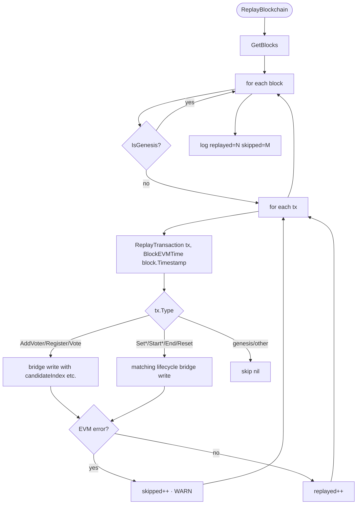
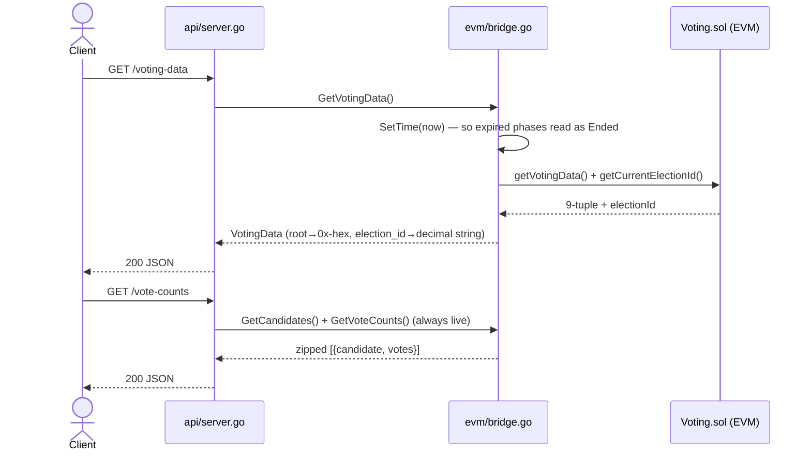
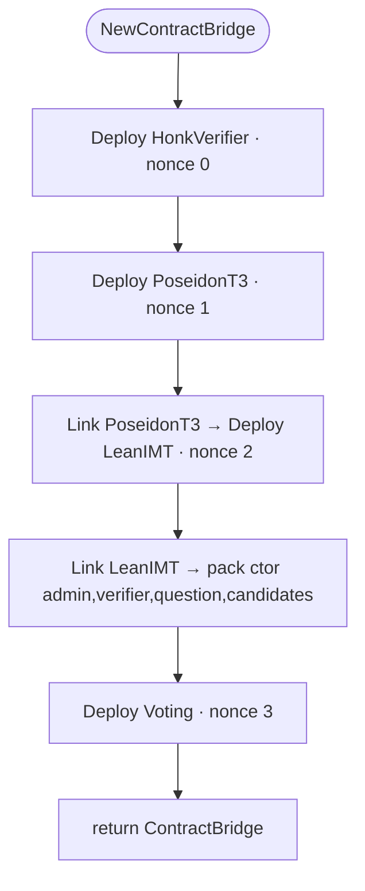

# ZK Voting Blockchain — Complete Codebase Overview

This document covers every source file in `packages/blockchain`: what each file does,
its functions, and annotated flow diagrams for each use case the node handles.

> **Scope & source of truth.** This overview describes the node as currently
> implemented (multi-candidate phased election, split public/P2P listeners,
> deterministic EVM clock). For the exact REST request/response contract the
> frontend codes against, `API.md` is authoritative. A condensed change history is
> at the end.

---

## Architecture at a Glance

The node is a single Go binary composed of six internal packages plus one entry-point.

```
packages/blockchain/
├── cmd/node/main.go          ← entry point — wires all packages together
│
└── internal/
    ├── core/                 ← chain data structures: transactions, blocks, blockchain
    ├── evm/                  ← embedded Geth EVM + Solidity contract bridge
    ├── api/                  ← HTTP handlers + middleware stack (two listeners)
    ├── network/              ← peer list, mTLS broadcast, periodic chain sync
    ├── persistence/          ← BoltDB on-disk block storage
    └── security/             ← RSA admin auth + mTLS certificate loading
```

### Layer Diagram

```
┌─────────────────────────────────────────────────────────────────┐
│  Browser / Admin Client                                          │
│  Public API — plain HTTP :3001 (voter reads/writes + admin)      │
└────────────────────────┬────────────────────────────────────────┘
                         │  HTTP (or optional HTTPS, no client cert)
┌────────────────────────▼────────────────────────────────────────┐
│  internal/api  (server.go + middleware.go)                       │
│  CORS · Rate limiting · Admin RSA auth · Request logging         │
│  Public listener (newPublicMux)   P2P listener (newP2PMux, mTLS)  │
└──────┬─────────────────┬──────────────────────────┬─────────────┘
       │                 │                          │
┌──────▼──────┐   ┌──────▼──────┐          ┌────────▼─────┐
│ internal/   │   │ internal/   │          │ internal/    │
│ core/       │   │ evm/        │          │ network/     │
│             │   │             │          │              │
│ Blockchain  │   │ Geth EVM    │          │ P2P broadcast│
│ Block       │   │ Voting.sol  │          │ Periodic sync│
│ Transaction │   │ HonkVerifier│          │ mTLS client  │
└──────┬──────┘   └─────────────┘          └──────────────┘
       │
┌──────▼──────┐   ┌─────────────┐
│ internal/   │   │ internal/   │
│ persistence/│   │ security/   │
│ BoltDB      │   │ RSA + TLS   │
└─────────────┘   └─────────────┘
```

Two listeners with different trust models:
- **Public API** (`:NODE_ID`, default `:3001`) — browser-facing. Plain HTTP by
  default; `API_TLS=true` serves HTTPS with **no** client-certificate requirement.
  Serves every endpoint in `API.md`.
- **P2P** (`:P2P_PORT`, default `NODE_ID+1000`) — node-to-node only
  (`/internal/block`, `/internal/chain`), mTLS with client certs **required**.
  Only started when certificates exist in `data_<NODE_ID>/certs/`.

### Key design choices

| Property | How it is achieved |
|---|---|
| No mining / no gas | Authority model — the node commits blocks on-demand |
| Multi-candidate, phased election | `Voting.sol` enforces `Setup → Registration → Voting → Ended`; a vote is an index into the candidate list |
| Anonymous voting | ZK proof (Noir UltraHonk) is the only auth on `/vote` — no voter ID sent |
| Tamper detection | SHA-256 hash chain; every block commits all tx hashes |
| Double-vote prevention | Nullifier hash stored in `Voting.sol`; reused nullifier reverts |
| Deterministic EVM state | Every write executes the EVM **before** the block commits; `ReplayBlockchain` re-runs every block after restart |
| Deterministic phase deadlines | EVM `block.timestamp` is stamped from the block's own timestamp on write/replay, and from wall-clock on reads (see `ContractCaller.SetTime`) |
| Sybil resistance | Poseidon commitment in a LeanIMT Merkle tree; one leaf per voter |
| ZK proof verification | Embedded Geth EVM runs `HonkVerifier.sol` using BN254 precompile `0x08` |

---

## File Reference

---

### `cmd/node/main.go`

**Purpose:** Application entry point. Boots every subsystem in dependency order,
starts the two listeners, and blocks.

| Function | Signature | Description |
|---|---|---|
| `main` | `func main()` | Full boot sequence (see below) |
| `genesisQuestion` | `func(bc *core.Blockchain) string` | Reads the question from the genesis `GenesisPayload`; falls back to `"Do you support this proposal?"` |
| `genesisCandidates` | `func(bc *core.Blockchain) []string` | Reads the initial candidate list from the genesis `GenesisPayload` (mirrors the Hardhat deploy script's `["Yes","No"]` default) |

**Startup order (dependency-driven):**

1. Load `.env`, configure zerolog. `NODE_ID` (default `3001`) → public port + `data_<NODE_ID>/`.
2. `persistence.NewFileStore` — open BoltDB before loading the chain.
3. `store.LoadBlockchain` or `core.NewBlockchain(question, candidates)` — chain in memory.
4. `evm.NewStateManager` + `evm.CreateStatelessEVM` + `evm.NewContractCaller` — EVM ready.
5. `security.LoadTLSConfig` — optional; nil (P2P disabled) when no certs and no `PEERS`.
6. `api.InitAuth(data_<NODE_ID>/keys/admin_public.pem)` — non-fatal if the key is missing.
7. If TLS configured: `network.InitNetworkClient` + `network.SyncWithPeers` (adopt longest chain).
8. `evm.NewContractBridge` — deploy the 4 contracts. **Fatal** unless `ALLOW_STORAGE_ONLY=true` (running without the EVM means votes are accepted with no ZK verification). On success, logs `voting_contract` + `voting_code_hash`.
9. `evm.ReplayBlockchain` — replay every non-genesis block into the fresh EVM.
10. `network.StartPeriodicSync` — background ticker re-running `SyncWithPeers` (`SYNC_INTERVAL_SEC`, default 30s); its `onSync` re-replays into the EVM after adopting a peer chain.
11. `api.InitServer` → `api.StartP2PServer` (goroutine, mTLS, only if TLS configured) → `api.StartPublicServer` (blocks).

---

### `internal/core/types.go`

**Purpose:** Defines every transaction type and its payload. Each recordable
operation is one of these.

| Symbol | Kind | Description |
|---|---|---|
| `TxType` | `type string` | Enum alias for transaction type names |
| `TxAddVoter` | `const "ADD_VOTER"` | Admin adds/revokes a voter (Setup only) |
| `TxRegister` | `const "REGISTER"` | Voter records their Poseidon commitment (Registration only) |
| `TxVote` | `const "VOTE"` | Anonymous vote — ZK proof, no identity (Voting only) |
| `TxSetQuestion` | `const "SET_QUESTION"` | Update the ballot question (Setup only) |
| `TxSetCandidates` | `const "SET_CANDIDATES"` | Replace the candidate list (Setup only) |
| `TxStartRegistration` | `const "START_REGISTRATION"` | Setup → Registration |
| `TxStartVoting` | `const "START_VOTING"` | Registration → Voting |
| `TxEndElection` | `const "END_ELECTION"` | End early → Ended |
| `TxResetElection` | `const "RESET_ELECTION"` | Clear all state, bump electionId, → Setup |
| `Transaction` | `struct` | `ID`, `Type`, `Timestamp` (unix **ms**), `Payload` (raw JSON), `Hash` |
| `NewTransaction` | `func(TxType, interface{}) (*Transaction, error)` | Marshals payload, hashes `type:timestamp:compact_payload`, `ID = Hash[:16]` |
| `VerifyHash` | `func(*Transaction) bool` | Re-derives hash and compares |
| `ParsePayload` | `func(*Transaction, interface{}) error` | Unmarshals raw payload into a typed struct |
| `AddVoterPayload` | `struct` | `VoterID string`, `Allowed bool` |
| `RegisterPayload` | `struct` | `VoterID string`, `Commitment string`, `LeafIndex uint64` |
| `VotePayload` | `struct` | `Proof`, `NullifierHash`, `Root string`, **`CandidateIndex uint64`**, `Depth uint32` — NO voter identity |
| `SetQuestionPayload` | `struct` | `Question string` |
| `SetCandidatesPayload` | `struct` | `Candidates []string` |
| `StartRegistrationPayload` / `StartVotingPayload` | `struct` | `DurationSec uint64` |
| `GenesisPayload` | `struct` | `Action`, `Question string`, **`Candidates []string`**, `Version string` — block 0 only |

> `EndElection`/`ResetElection` carry an empty payload (`struct{}{}`).

---

### `internal/core/block.go`

**Purpose:** The `Block` structure and its hash-chaining logic.

| Function | Signature | Description |
|---|---|---|
| `NewBlock` | `func(index uint64, txs []Transaction, prevHash string) *Block` | Block at `time.Now()`, linked to `prevHash` |
| `NewBlockAt` | `func(index uint64, txs []Transaction, prevHash string, timestampMs int64) *Block` | Same, with an explicit timestamp so the persisted block time equals the instant the EVM executed at (makes replay deterministic) |
| `computeHash` | `func(*Block) string` | SHA-256 of `index:timestamp:prevHash:tx1.Hash,tx2.Hash,…` |
| `VerifyHash` | `func(*Block) bool` | Re-derives and compares |
| `IsGenesis` | `func(*Block) bool` | `Index == 0 && PrevHash == GenesisBlockPrevHash` |
| `HasTransactions` / `TransactionCount` / `GetTransactionsByType` | — | Convenience accessors |

**Constant:** `GenesisBlockPrevHash` — 64 zeros, marks block 0 as having no predecessor.

---

### `internal/core/genesis.go`

| Function | Signature | Description |
|---|---|---|
| `CreateGenesisBlock` | `func(question string, candidates []string) *Block` | Builds `GenesisPayload{Action:"GENESIS", Question, Candidates, Version:"1.0.0"}`, wraps it in a `TxAddVoter` transaction, creates block 0 with the all-zeros `PrevHash` |

> `TxAddVoter` is reused as a container of convenience for genesis; `Action:"GENESIS"` distinguishes it and `ReplayBlockchain` skips genesis blocks.

---

### `internal/core/blockchain.go`

**Purpose:** Thread-safe, append-only chain manager — the single authoritative
in-memory store.

| Function | Signature | Description |
|---|---|---|
| `NewBlockchain` | `func(question string, candidates []string) *Blockchain` | Creates genesis via `CreateGenesisBlock` |
| `LoadFromBlocks` | `func([]*Block) (*Blockchain, error)` | Reconstructs + validates a persisted chain (new object) |
| `ReplaceBlocks` | `func(*Blockchain, []*Block) error` | **In-place** validated swap of the block list under the existing lock — every package holding the pointer sees the update (safe for periodic sync); restores originals on validation failure |
| `AddBlock` / `AddBlockAt` | `func(...) (*Block, error)` | Verify tx hashes, link to tip, append. `…At` takes an explicit timestamp, clamped to the tip's time so the non-decreasing rule holds under races |
| `AddTransaction` / `AddTransactionAt` | `func(...) (*Block, error)` | Single-transaction convenience wrappers over `AddBlock`/`AddBlockAt` |
| `AppendExternalBlock` | `func(*Block) error` | Accepts a peer block, preserving its original hash/index/timestamp; validates before appending |
| `GetLatestBlock` / `GetBlock` / `GetBlocks` / `Len` / `Height` | — | Read-locked accessors (`GetBlocks` returns a shallow copy) |
| `GetAllTransactions` | `func(TxType) []Transaction` | Scans all blocks; `""` returns every type |
| `ValidateChain` / `validateChainInternal` | — | Full integrity check: genesis sentinel, per-block hash, PrevHash linkage, sequential indices, non-decreasing timestamps, all tx hashes |
| `PrintChain` | — | Debug table to stdout |

---

### `internal/persistence/store.go`

**Purpose:** Durable ACID block storage via BoltDB (bbolt). Blocks are JSON,
keyed by 8-byte big-endian index (preserves numeric order).

| Function | Signature | Description |
|---|---|---|
| `NewFileStore` | `func(dataDir string) (*FileStore, error)` | Opens `data_<NODE_ID>/blockchain.db`; creates the `blocks` bucket |
| `SaveBlock` | `func(*core.Block) error` | Writes one block under `itob(index)` in one transaction |
| `SaveBlockchain` | `func(*core.Blockchain) error` | Batch-writes the whole chain (genesis save, sync adoption) |
| `LoadBlockchain` | `func() (*core.Blockchain, error)` | Iterates keys ascending, deserialises, then `core.LoadFromBlocks` (validates) |
| `Close` | `func() error` | Closes the BoltDB handle |

---

### `internal/security/tls.go` & `rsa.go`

| Function | Signature | Description |
|---|---|---|
| `LoadTLSConfig` | `func(cert, key, ca string) (*tls.Config, error)` | Loads the node cert/key + CA; sets `ClientAuth: RequireAndVerifyClientCert` — the mTLS config used **only** on the P2P listener |
| `LoadPublicKey` | `func(path string) (*rsa.PublicKey, error)` | Parses a PKIX RSA public key PEM |
| `VerifySignature` | `func(pub *rsa.PublicKey, data, sig []byte) error` | SHA-256 + PKCS1v15 verify; non-nil error on bad signature |

---

### `internal/network/peers.go`, `broadcast.go`, `sync.go`

| Symbol | Signature | Description |
|---|---|---|
| `Peers` | `var []string` | Peer P2P base URLs from `PEERS` (comma-separated), parsed at `init` |
| `InitNetworkClient` | `func(*tls.Config)` | Builds the shared mTLS `http.Client` for outbound P2P |
| `BroadcastBlock` | `func(core.Block)` | POSTs the block to `{peer}/internal/block` per peer, one goroutine each (fire-and-forget) |
| `SyncWithPeers` | `func(bc *core.Blockchain, store …) bool` | GETs `/internal/chain` from each peer; adopts a longer valid chain via `bc.ReplaceBlocks` (in place); returns whether any chain was adopted |
| `StartPeriodicSync` | `func(bc, store, interval, onSync func()) (stop func())` | Runs `SyncWithPeers` on a ticker in a goroutine; calls `onSync` whenever a chain is adopted; `stop()` blocks until the goroutine has fully exited. `interval <= 0` disables it |

---

### `internal/api/middleware.go`

| Function | Signature | Description |
|---|---|---|
| `RequestLogger` | `func(HandlerFunc) HandlerFunc` | Logs method, path, remote IP, latency |
| `InitAuth` | `func(pubKeyPath string) error` | Loads the admin RSA public key into `adminPubKey` (error is non-fatal to the caller) |
| `AdminAuthMiddleware` | `func(HandlerFunc) HandlerFunc` | Verifies `X-Admin-Signature` (base64 RSA over the exact body): `503` if no key configured, `401` if header missing, `403` on bad signature |
| `RateLimitMiddleware` / `getIPLimiter` | — | Per-IP token bucket (1 req/s sustained, burst 5) → `429` |
| `CORSMiddleware` | `func(allowedOrigin string, http.Handler) http.Handler` | Adds `Access-Control-Allow-*`; short-circuits `OPTIONS` with 200 |

---

### `internal/api/server.go`

**Purpose:** Route registration (two muxes) and all request handlers. Every write
handler follows: validate → call EVM **first** (if bridge available) → commit block
→ persist → broadcast → respond with a small client contract (never the raw block).

**Package-level state (set by `InitServer`):** `bc *core.Blockchain`,
`store *persistence.FileStore`, `bridge *evm.ContractBridge` (nil in storage-only
mode), `registrationMu sync.Mutex` (serialises `/register` so block-append order
matches EVM insertion order).

**Response types:** `TxResponse{tx_id, block_index}` (every accepted write);
`RegisterResponse` extends it with `leaf_index` + `election_id`.
Helper `nowBlockTime()` returns one instant as `(ms for the block, seconds for the EVM)`.

| Function | Route | Description |
|---|---|---|
| `newPublicMux` / `newP2PMux` | — | Build the public and P2P route tables separately |
| `StartPublicServer` | — | Browser listener; `nil` tlsConfig → plain HTTP, non-nil → HTTPS without client certs |
| `StartP2PServer` | — | mTLS node-to-node listener (goroutine) |
| `handleHealth` | `GET /health` | `{"status":"ok"}` |
| `handleGetChain` | `GET /chain` | `{length, blocks}` |
| `handleGetBlocks` | `GET /blocks` | Full block array, or `{total,page,limit,blocks}` with `?page&limit` |
| `handleGetVotingData` | `GET /voting-data` | Live election state (`503` if no bridge) |
| `handleGetVoterData` | `GET /voter/{voter_id}` | `{allowed, registered}` (path-param routed) |
| `handleGetCandidates` | `GET /candidates` | Candidate list |
| `handleGetVoteCounts` | `GET /vote-counts` | `[{candidate, votes}]` (zips candidates + counts) |
| `handleGetCommitments` | `GET /commitments` | Current-election commitments in insertion order (pure chain read, reset-scoped) |
| `handleGetVoters` | `GET /voters` | Current-election allowlist from the `ADD_VOTER` log (reset-scoped, last-write-wins) |
| `handleAddVoter` | `POST /add-voter` (admin) | EVM `addVoters` first, then commit — reverts on non-Setup phase |
| `handleSetQuestion` … `handleResetElection` | `POST /set-question`, `/set-candidates`, `/start-registration`, `/start-voting`, `/end-election`, `/reset-election` (admin) | Six lifecycle handlers; each calls the bridge first via shared `commitAdminTx` tail |
| `handleRegister` | `POST /register` (rate-limited) | EVM `register` first; leaf index read back from the EVM; `201 RegisterResponse` |
| `handleVote` | `POST /vote` (rate-limited) | EVM verifies the ZK proof first; `200 TxResponse` |
| `handleReceiveBlock` | `POST /internal/block` (P2P) | `AppendExternalBlock`, persist, then replay each tx at the block's timestamp |
| `handleSendChain` | `GET /internal/chain` (P2P) | Raw block array for peer sync |
| `commitAdminTx` | — | Shared tail: create tx, `AddTransactionAt`, persist, broadcast, respond `TxResponse` |

---

### `internal/evm/vm.go`

**Purpose:** Creates and configures the embedded Geth EVM. The fork combination is
critical for ZK verification and DELEGATECALL gas handling.

| Function | Signature | Description |
|---|---|---|
| `NewStateManager` | `func() (*StateManager, error)` | In-memory `rawdb.MemoryDatabase` + empty `state.StateDB` |
| `GetStateDB` | `func(*StateManager) *state.StateDB` | Accessor |
| `CreateStatelessEVM` | `func(*state.StateDB) *vm.EVM` | Builds `BlockContext` (`BlockNumber:1`, `Time:1` initial — later advanced per call via `ContractCaller.SetTime`, zero base fee, 1B gas), `TxContext` (zero gas price), `ChainConfig` (below), `NoBaseFee:true` |

**Chain config (`params.ChainConfig`) — every fork deliberate:**

| Fork | Field | Why required |
|---|---|---|
| Homestead | `HomesteadBlock:0` | `DELEGATECALL` opcode (Solidity external libraries) |
| **EIP-150** | `EIP150Block:0` | 63/64 gas-forwarding rule; without it + EIP-2929 cold cost → OOG before LeanIMT runs |
| EIP-155/158 | `EIP155Block:0`, `EIP158Block:0` | Replay protection + state clearing |
| Byzantium | `ByzantiumBlock:0` | `REVERT` (custom errors) + `ecAdd`/`ecMul`/`ecPairing` precompiles |
| Constantinople / Petersburg | `…Block:0` | `CREATE2`, bit-shift opcodes; Petersburg fixes a broken check |
| **Istanbul** | `IstanbulBlock:0` | EIP-1108: BN254 `ecPairing` (`0x08`) 100k→45k gas — required for UltraHonk to fit budget |
| **Berlin** | `BerlinBlock:0` | EIP-2929 access-list gas schedule matching Solidity 0.8+ |
| London | *(omitted)* | EIP-1559 fee market irrelevant to an authority chain |

---

### `internal/evm/contract.go`

**Purpose:** Low-level wrapper over the Geth EVM with a fixed, effectively unlimited
gas budget, plus the clock and code-hash controls.

| Symbol | Signature | Description |
|---|---|---|
| `ContractCaller` | `struct` | Holds the `*vm.EVM` |
| `gasLimit` | `const uint64 = 1_000_000_000` | 1B gas — no fee market, so gas is not a constraint |
| `Call` | `func(from, to common.Address, data []byte) ([]byte, uint64, error)` | Executes a deployed function; returns raw ABI output |
| `Deploy` | `func(from common.Address, initCode []byte) (common.Address, []byte, error)` | Runs the constructor and installs runtime bytecode at the deterministic CREATE address |
| `SetTime` | `func(unixSec uint64)` | Sets `evm.Context.Time` for the next call — the mechanism behind deterministic phase deadlines. Not concurrency-safe; only ever called under the bridge mutex |
| `CodeHash` | `func(addr common.Address) common.Hash` | keccak256 of the deployed runtime bytecode (logged at startup to catch stale artifacts) |
| `InstallRuntimeCode` | `func(addr, runtimeCode)` | Escape hatch: write bytecode with no constructor |

---

### `internal/evm/artifacts.go`

**Purpose:** Loads Hardhat JSON artifacts and performs Solidity library-placeholder
substitution before hex-decoding bytecode.

| Symbol | Description |
|---|---|
| `contractArtifact` | Subset of a Hardhat artifact: `ABI json.RawMessage`, `Bytecode string` |
| `loadArtifact` | Reads + parses an artifact; errors if ABI or bytecode is empty |
| `parsedABI` | Parses raw ABI into a Geth `abi.ABI` |
| `decodedBytecode` | Strips `0x`, hex-decodes; fails if unresolved library placeholders remain |
| `decodedLinkedBytecode` | Replaces each `__$<34hex>$__` placeholder with a 40-char address hex, then hex-decodes |

Placeholders are `keccak256(import_path)[0:17]`, exactly 40 hex chars wide:
`Voting.json` embeds the LeanIMT placeholder; `LeanIMT.json` embeds the PoseidonT3 one.

---

### `internal/evm/bridge.go`

**Purpose:** The single typed Go interface to `Voting.sol`. Deploys all four
contracts deterministically and exposes one method per Solidity function, serialised
by a mutex.

| Symbol | Description |
|---|---|
| `AdminAddress` | `0x0000…1337` — fixed deployer/owner, so CREATE addresses are identical every session |
| `leanIMTPlaceholder` / `poseidonT3Placeholder` | The two Hardhat library placeholders |
| `ContractBridge` | `caller`, `votingAddr`, `votingABI`, `mu sync.Mutex`, `voterDataCache map[string]*VoterData`. **`VotingData` is deliberately NOT cached** — the EVM clock advances, so a phase can flip to `Ended` with no write to invalidate a cache |
| `Phase` | `type uint8` mirroring the contract enum (`PhaseSetup`/`Registration`/`Voting`/`Ended`); `String()` gives the frontend `PHASE_LABELS`; `MarshalJSON` emits the raw number |
| `VotingData` | Mirror of `getVotingData()` + `getCurrentElectionId()`: `Question, Owner, Phase, PhaseLabel, RegistrationEndTime, VotingEndTime, TreeSize, Depth, Root, CandidateCount, ElectionID`. Its `MarshalJSON` emits `root` as `0x`-hex and `election_id` as a decimal string (both exceed 2^53); other numerics stay plain |
| `VoterData` | `{Allowed, Registered bool}` |

**`NewContractBridge` — 4-step deterministic deployment:**

| Step | Nonce | Contract | Linking |
|---|---|---|---|
| 1 | 0 | `HonkVerifier` | none |
| 2 | 1 | `PoseidonT3` | none |
| 3 | 2 | `LeanIMT` | link `poseidonT3Placeholder` → PoseidonT3 addr |
| 4 | 3 | `Voting` | link `leanIMTPlaceholder` → LeanIMT addr; constructor `(admin, verifier, question, candidates)` |

**Methods** (every write takes a `blockTime uint64` and calls `SetTime(blockTime)` first):

| Method | Solidity | Notes |
|---|---|---|
| `VotingAddress()` / `VotingCodeHash()` | — | Deployed address / runtime-code keccak256 |
| `VoterIDToAddress(id)` | — | `keccak256(id)[12:]` → deterministic address |
| `AddVoter(id, allowed, t)` | `addVoters([addr],[bool])` | Setup only; invalidates that voter's cache entry |
| `Register(id, commitment, t)` | `register(uint256)` | Registration only; **returns the leaf index** read from `TreeSize-1` under the lock |
| `Vote(proof, nullifier, root, candidateIndex, depth, t)` | `vote(bytes, bytes32, bytes32, bytes32, bytes32)` | Runs HonkVerifier (`0x08`); checks root/nullifier/candidate bounds; Voting only. `candidateIndex` encoded into the `bytes32 _vote` slot |
| `SetQuestion` / `SetCandidates` / `StartRegistration` / `StartVoting` / `EndElection` / `ResetElection` | matching functions | Lifecycle writes; `ResetElection` clears the **entire** `voterDataCache` (electionId bump) |
| `GetVotingData()` → `fetchVotingDataLocked` | `getVotingData` + `getCurrentElectionId` | Live (uncached); reads stamp wall-clock time so expired phases report `Ended` |
| `GetCandidates()` / `GetVoteCounts()` | `getCandidates` / `getVoteCounts` | Always live (uncached) |
| `GetVoterData(id)` | `getVoterData(addr)` | Cached per voterID |
| `wrapErr` | — | Decodes `Error(string)`, `Panic(uint256)`, or custom Voting errors from revert data |
| `hexToBigInt` / `hexToBytes` / `hexToBytes32` / `normalizeHex` | — | Hex conversion helpers |

---

### `internal/evm/replay.go`

| Function | Signature | Description |
|---|---|---|
| `ReplayBlockchain` | `func(bc *core.Blockchain, bridge *ContractBridge)` | Replays every non-genesis block; each tx executes at `BlockEVMTime(block.Timestamp)`; failures are logged and skipped (pre-verification data may not pass) |
| `BlockEVMTime` | `func(blockTimestampMs int64) uint64` | Converts a block's unix-ms timestamp to the EVM's unix-seconds clock (one central rounding rule) |
| `ReplayTransaction` | `func(*ContractBridge, core.Transaction, blockTime uint64) error` | Switches on `tx.Type` and dispatches to the matching bridge method for all nine write types; genesis/unknown return nil |

---

## Use Case Flow Diagrams

---

### UC-1: Node Startup

```mermaid
flowchart TD
    A([./zk-node]) --> B[Load .env · zerolog\nNODE_ID → port & data_NODE_ID]
    B --> C[persistence.NewFileStore\nopen BoltDB]

    C --> D{blockchain.db\nhas blocks?}
    D -- yes --> E[store.LoadBlockchain\ndeserialise + validate]
    D -- no --> F[core.NewBlockchain question,candidates\ncreate genesis]
    F --> G[store.SaveBlockchain]
    E --> H
    G --> H

    H[evm.NewStateManager + CreateStatelessEVM\nHomestead+EIP150+Istanbul+Berlin · 1B gas]
    H --> J[evm.NewContractCaller]

    J --> K[security.LoadTLSConfig\noptional — nil disables P2P]
    K --> L{admin_public.pem?}
    L -- yes --> M[api.InitAuth]
    L -- no --> N[WARN: admin endpoints → 503]
    M --> O
    N --> O

    O{TLS configured?}
    O -- yes --> P[InitNetworkClient + SyncWithPeers\nadopt longest chain]
    O -- no --> Q
    P --> Q

    Q{assets/ artifacts present?}
    Q -- yes --> R[evm.NewContractBridge\ndeploy 4 contracts · log voting_code_hash]
    Q -- no --> S{ALLOW_STORAGE_ONLY?}
    S -- no --> SF([FATAL — refuse to start unverified])
    S -- yes --> T[WARN: storage-only, no ZK verification\nbridge = nil]

    R --> V[evm.ReplayBlockchain\nreplay every block at its own timestamp]
    V --> W
    T --> W

    W[network.StartPeriodicSync\nticker: re-sync + re-replay on adopt]
    W --> X[api.InitServer]
    X --> Y[StartP2PServer mTLS goroutine\n(only if TLS)]
    Y --> Z[StartPublicServer :NODE_ID\nplain HTTP (or HTTPS if API_TLS)]
    Z --> ZZ([Accepting requests])
```

---

### UC-2: Add Voter (Admin)

`POST /add-voter`, RSA-signed. EVM is called **before** the block is committed, so a
phase-rejected call never becomes a permanent chain entry.

```mermaid
sequenceDiagram
    actor Admin
    participant API as api/server.go
    participant MW as api/middleware.go
    participant Bridge as evm/bridge.go
    participant Core as core/blockchain.go
    participant DB as persistence/store.go
    participant Net as network/broadcast.go

    Admin->>API: POST /add-voter {voter_id[,allowed]}\nX-Admin-Signature: <base64 RSA>
    API->>MW: AdminAuthMiddleware — verify signature over exact body
    alt bad/missing signature or no key
        MW-->>Admin: 401 / 403 / 503
    end
    API->>API: nowBlockTime() → (tsMs, evmTime)
    API->>Bridge: AddVoter(voter_id, allowed, evmTime)
    Bridge->>Bridge: SetTime(evmTime); addVoters([addr],[allowed])
    alt EVM reverts (e.g. Voting__WrongPhase)
        Bridge-->>API: decoded error
        API-->>Admin: 400 "add-voter rejected: ..."
    end
    API->>Core: commitAdminTx → AddTransactionAt(tx, tsMs)
    API->>DB: SaveBlock
    API->>Net: BroadcastBlock (goroutine per peer)
    API-->>Admin: 200 {tx_id, block_index}
```

The six lifecycle endpoints (`/set-question` … `/reset-election`) follow this exact
shape via the shared `commitAdminTx` tail.

---

### UC-3: Voter Registration

`POST /register`. EVM validates eligibility + uniqueness **before** the block is
written; the leaf index comes from the EVM, not a transaction count.

```mermaid
sequenceDiagram
    actor Voter
    participant API as api/server.go
    participant Bridge as evm/bridge.go
    participant Sol as Voting.sol (EVM)
    participant IMT as LeanIMT + PoseidonT3 (EVM)
    participant Core as core/blockchain.go

    Voter->>API: POST /register {voter_id, commitment}
    API->>API: RateLimitMiddleware; registrationMu.Lock()
    API->>API: nowBlockTime() → (tsMs, evmTime)
    API->>Bridge: Register(voter_id, commitment, evmTime)
    Bridge->>Sol: SetTime; register(commitment) as voter's derived address
    Sol->>Sol: require allowed · !registered · !commitmentUsed · phase==Registration
    Sol->>IMT: LeanIMT.insert (DELEGATECALL → Poseidon hash)
    IMT-->>Sol: new root; size/depth updated
    alt EVM reverts
        Bridge-->>API: decoded error
        API-->>Voter: 400 "registration rejected: ..."
    end
    Bridge->>Bridge: read TreeSize under lock → leafIndex = size-1
    Bridge-->>API: leafIndex ; election_id via GetVotingData
    API->>Core: AddTransactionAt(TxRegister{...,leafIndex}, tsMs) → persist → broadcast
    API-->>Voter: 201 {tx_id, block_index, leaf_index, election_id}
```

---

### UC-4: Anonymous Vote with ZK Proof

`POST /vote` carries no identity. The embedded EVM runs the full UltraHonk verifier
before any block is written. A vote selects a candidate by index.

```mermaid
sequenceDiagram
    actor Voter
    participant API as api/server.go
    participant Bridge as evm/bridge.go
    participant Sol as Voting.sol (EVM)
    participant Honk as HonkVerifier (EVM)
    participant BN254 as precompile 0x08

    Voter->>API: POST /vote {proof, nullifier_hash, root, candidate_index, depth}
    API->>API: RateLimit; validate required fields; nowBlockTime()
    API->>Bridge: Vote(proof, nullifier, root, candidateIndex, depth, evmTime)
    Bridge->>Bridge: encode candidateIndex & depth into bytes32 slots
    Bridge->>Sol: SetTime; vote(proof, nullifier, root, voteB32, depthB32)
    Sol->>Sol: require root == LeanIMT.root · !nullifiers[nh] · candidate in range · phase==Voting
    Sol->>Honk: verify(proof, publicInputs)
    Honk->>BN254: ecPairing(...)
    BN254-->>Honk: result
    alt proof invalid / nullifier used / stale root
        Sol-->>Bridge: REVERT (e.g. Voting__NullifierHashAlreadyUsed)
        Bridge-->>API: decoded error
        API-->>Voter: 400 "vote rejected: ..."
    end
    Sol->>Sol: nullifiers[nh]=true; s_voteCounts[candidateIndex]++
    API->>Core: AddTransactionAt(TxVote{...}, tsMs) → persist → broadcast
    API-->>Voter: 200 {tx_id, block_index}
```

---

### UC-5: Receiving a Block from a Peer (P2P)

```mermaid
sequenceDiagram
    actor PeerNode
    participant API as api/server.go
    participant Core as core/blockchain.go
    participant DB as persistence/store.go
    participant Bridge as evm/bridge.go

    PeerNode->>API: POST /internal/block {block} (mTLS — cert required)
    API->>Core: AppendExternalBlock(block)
    Core->>Core: verify hash · PrevHash · index · timestamp · tx hashes
    alt any check fails
        Core-->>API: error → 409 Conflict
    end
    API->>DB: SaveBlock
    loop each tx in block
        API->>Bridge: ReplayTransaction(tx, BlockEVMTime(block.Timestamp))
        Note over Bridge: executes at the block's OWN time so phase decisions match origin;\nerrors logged as WARN, not propagated
    end
    API-->>PeerNode: 200 {"status":"block accepted"}
```

---

### UC-6: Chain Sync (Startup + Periodic)

```mermaid
flowchart TD
    A([SyncWithPeers]) --> B{tlsClient ready?}
    B -- no --> Z([skip — WARN])
    B -- yes --> C[for each peer]
    C --> D[GET peer/internal/chain (mTLS)]
    D --> E{decode ok?}
    E -- no --> C
    E -- yes --> F{remote longer\nthan local?}
    F -- no --> C
    F -- yes --> G[bc.ReplaceBlocks remote\nin-place, validated]
    G --> H{valid?}
    H -- no --> I[WARN reject] --> C
    H -- yes --> J[store.SaveBlockchain · synced=true] --> C
    C --> K([return synced])
    K --> L{periodic &&\nadopted?}
    L -- yes --> M[onSync → evm.ReplayBlockchain\nrebuild EVM state from adopted chain]
```

`StartPeriodicSync` runs this on a ticker for the life of the process, so a node that
missed a broadcast self-heals on the next interval.

---

### UC-7: State Replay on Restart



Because each tx replays at its **stored** block timestamp, replay reproduces the exact
phase-deadline decisions the original execution made — deterministic regardless of when
the node restarts.

---

### UC-8: Reading Election State



`GET /commitments` and `GET /voters` need no EVM call at all — they derive their
answer purely from the transaction log (reset-scoped), so they work even in
storage-only mode.

---

### UC-9: Contract Deployment Detail



Fixed `AdminAddress` + fixed nonce sequence ⇒ identical contract addresses on every
node and after every restart.

---

## Dependencies

| Package | Library | Version | Role |
|---|---|---|---|
| `core` | stdlib only | — | Chain data structures |
| `persistence` | `go.etcd.io/bbolt` | v1.4.3 | Embedded ACID block store |
| `evm` | `github.com/ethereum/go-ethereum` | v1.13.14 | Embedded EVM, ABI codec, state DB |
| `evm` | `github.com/holiman/uint256` | v1.3.2 | 256-bit integer type for Geth APIs |
| `api` | `golang.org/x/time/rate` | v0.15.0 | Per-IP token-bucket rate limiter |
| `api`, `network` | `github.com/rs/zerolog` | v1.35.1 | Structured logging |
| `cmd/node` | `github.com/joho/godotenv` | v1.5.1 | `.env` loader |

---

## Change History (condensed)

The node reached its current shape through several passes. Details below are kept as
rationale; where a later change superseded an earlier decision, it is noted inline.

**Stage 3 hardening (2026-07-01).**
- **EVM concurrency lock.** `state.StateDB` is single-threaded; concurrent handlers
  (vote/register/add-voter) and P2P replay racing on it could corrupt state. Added
  `ContractBridge.mu`, held for every EVM interaction (`*Locked` helpers assume it's held).
- **Authoritative leaf index.** `Register` returns `TreeSize-1` read from the EVM under
  the lock, instead of counting `REGISTER` transactions (which could include
  replay-rejected entries).
- **Storage-only guard.** A missing/broken bridge became a startup failure rather than a
  silent unverified mode. *(Originally an opt-in `REQUIRE_EVM=true`; **superseded
  2026-07-04** — inverted to opt-out `ALLOW_STORAGE_ONLY=true`, so verification is the
  default. See current `main.go`.)*

**Stage 4 — EVM reads & caching (2026-07-01).** Added `/voting-data` + `/voter/{id}`
and internal read caching. *(This pass emitted `root` as a bare JSON number with a
`bigField` regex workaround in the test client; **superseded 2026-07-04** — `root` is now
a `0x`-hex string and `election_id`/`votes` are decimal strings, so standard JSON parsing
is safe. `VotingData` caching was also **removed** once the EVM clock began advancing, since
a phase can expire with no write to invalidate a cache.)*

**Multi-candidate & phased election alignment (2026-07-01).** Brought the Go node to
parity with the independently-rewritten `Voting.sol`: six new `TxType`s + payloads,
`VotePayload.Vote bool` → `CandidateIndex uint64`, `GenesisPayload.Candidates`, a 4-arg
constructor, the `Phase` enum, `GetCandidates`/`GetVoteCounts`, six admin lifecycle
endpoints, and EVM-first ordering for every write (including a fix to `handleAddVoter`,
which is now Setup-gated and can genuinely revert).

**Periodic peer sync (2026-07-01).** `Blockchain.ReplaceBlocks` mutates the chain
in place (so `api`/`evm` holders of the pointer see updates), and `StartPeriodicSync`
re-runs `SyncWithPeers` on a ticker with an `onSync` EVM re-replay — fixing the
fire-and-forget broadcast drift gap.

**Stage 6 — integration test (2026-07-01).** `integration-test/run.mjs` plays the role
of a browser: generates a real UltraHonk proof and drives the full REST flow
(register → proof → vote → double-vote rejection → restart persistence). It surfaced the
need for `GET /commitments` (the REST replacement for Solidity's `NewLeaf` event logs).

**Custom-chain swap (2026-07-04, this branch).** The changes that make the node a
drop-in Hardhat replacement for the browser:
- **Split listeners** — public plain-HTTP (browsers can't do mTLS) + P2P mTLS, replacing
  the single `StartServer`/`newMux` with `StartPublicServer`/`StartP2PServer` +
  `newPublicMux`/`newP2PMux`.
- **Hex field-element encoding** — `root` as `0x`-hex, `election_id`/`votes` as decimal
  strings (JS-safe).
- **`election_id`** added to `/voting-data` (frontend scopes Voter Passes / localStorage by it).
- **Clean write responses** — `TxResponse`/`RegisterResponse` (+ `201` on register)
  instead of raw block JSON.
- **Deterministic EVM clock** — `SetTime`/`BlockEVMTime`: writes/replay stamp the block's
  timestamp, reads use wall-clock, so phase deadlines expire for real while replay stays
  deterministic.
- **`ALLOW_STORAGE_ONLY`** replaces `REQUIRE_EVM`; **`/voters`** and **`/blocks`**
  pagination added; **`VotingCodeHash`** logged at startup to catch stale artifacts.

For the step-by-step touchpoints when a contract or circuit changes, see
`CONTRACT_CHANGE_CHECKLIST.md`.
